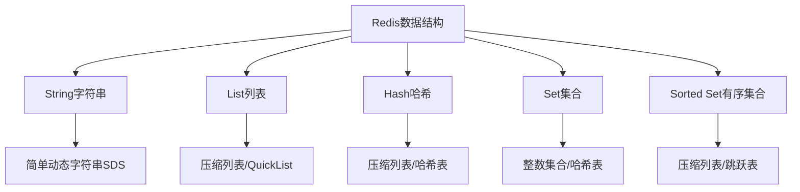
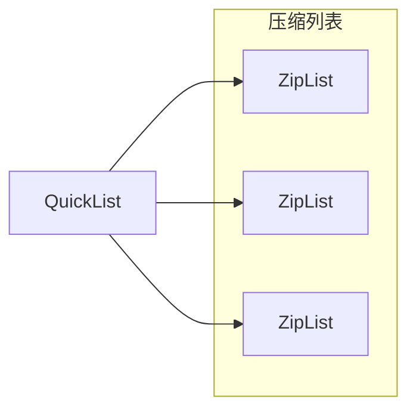
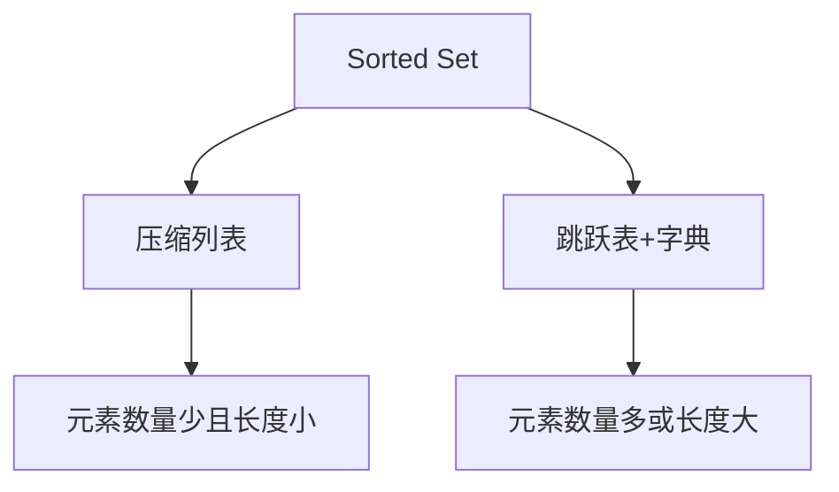

> **核心概念**：Redis 是一个开源的内存数据结构存储系统，可以用作数据库、缓存、消息代理和队列。它支持多种数据类型，每种类型都经过精心优化以适应不同的使用场景。

# 数据结构概览



# 1. String（字符串）

> **特点**：String 是 Redis 最基础的数据类型，可以存储文本或二进制数据，最大支持 512MB。

## 实现原理
- 基于简单动态字符串（SDS）实现
- 支持动态扩容
- 二进制安全

## 适用场景
1. 缓存对象
2. 计数器
3. 分布式锁
4. Session 存储

## 常用命令
```
SET key value           # 设置键值
GET key                 # 获取值
INCR key               # 计数器加1
DECR key               # 计数器减1
EXPIRE key seconds     # 设置过期时间
```

# 2. List（列表）


> **特点**：List 是一个双向链表，可以从两端压入或弹出数据，实现队列和栈的功能。

## 实现原理


## 适用场景
1. 消息队列
2. 最新消息列表
3. 任务队列

## 常用命令
```
LPUSH key value        # 左端添加元素
RPUSH key value        # 右端添加元素
LPOP key              # 左端弹出元素
RPOP key              # 右端弹出元素
LRANGE key start stop # 获取列表片段
```

# 3. Hash（哈希表）

> **特点**：Hash 是一个 field-value 对的集合，适合存储对象类型的数据。

## 实现原理
- 当元素较少时使用压缩列表（ziplist）
- 当元素较多时使用字典（dict）
- 触发条件：
  - 元素数量超过 512 个
  - 单个 element 大小超过 64 字节

## 适用场景
1. 存储对象属性
2. 购物车数据
3. 用户信息缓存

## 常用命令
```
HSET key field value   # 设置字段值
HGET key field        # 获取字段值
HMSET key f1 v1 f2 v2 # 设置多个字段值
HGETALL key           # 获取所有字段和值
HDEL key field        # 删除字段
```

# 4. Set（集合）

> **特点**：Set 是无序的字符串集合，支持并集、交集、差集等集合操作。

## 实现原理
- 基于哈希表实现
- 元素不重复
- 无序存储

## 适用场景
1. 标签系统
2. 用户关注/粉丝列表
3. 文章点赞用户集合
4. 去重计数

## 常用命令
```
SADD key member       # 添加成员
SMEMBERS key         # 获取所有成员
SISMEMBER key member # 判断是否是成员
SINTER key1 key2     # 交集运算
SUNION key1 key2     # 并集运算
```

# 5. Sorted Set（有序集合）

> **特点**：Sorted Set 是有序的字符串集合，每个元素关联一个分数，可以按分数排序。

## 实现原理


## 适用场景
1. 排行榜
2. 优先级队列
3. 带权重的消息队列
4. 时间线功能

## 常用命令
```
ZADD key score member  # 添加成员和分数
ZRANGE key start stop  # 按位置获取成员
ZRANK key member      # 获取成员排名
ZSCORE key member     # 获取成员分数
ZREM key member       # 删除成员
```

# 性能考虑

在选择数据结构时，需要考虑以下因素：

1. **内存使用效率**
   - String：$O(1)$ 空间复杂度
   - Hash：压缩列表情况下内存利用率最高
   - Sorted Set：需要额外的索引空间

2. **时间复杂度**
   - 基础操作（增删改查）：大多数为 $O(1)$
   - 集合操作：可能达到 $O(N)$ 或 $O(N×M)$
   - 有序集合：大多数操作为 $O(log N)$

3. **数据量级**
   - 小数据量（<512个元素）：优先使用压缩列表
   - 大数据量：自动转换为效率更高的数据结构

# 总结

Redis 的数据结构设计体现了空间和时间的权衡：

1. **渐进式转换**：数据结构会随着数据量增长自动升级
2. **内存优化**：对小数据量特别优化，使用压缩列表等紧凑结构
3. **性能均衡**：在不同场景下保持稳定的性能表现
4. **功能丰富**：提供丰富的原子操作和扩展命令

选择合适的数据结构需要考虑：
- 数据量大小
- 访问模式
- 内存限制
- 性能要求