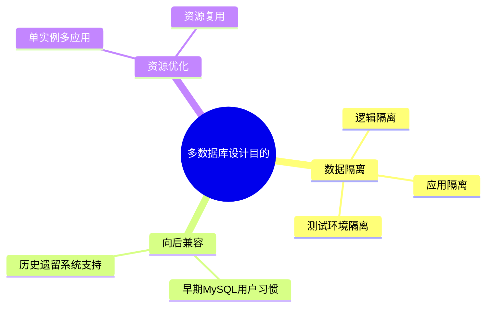
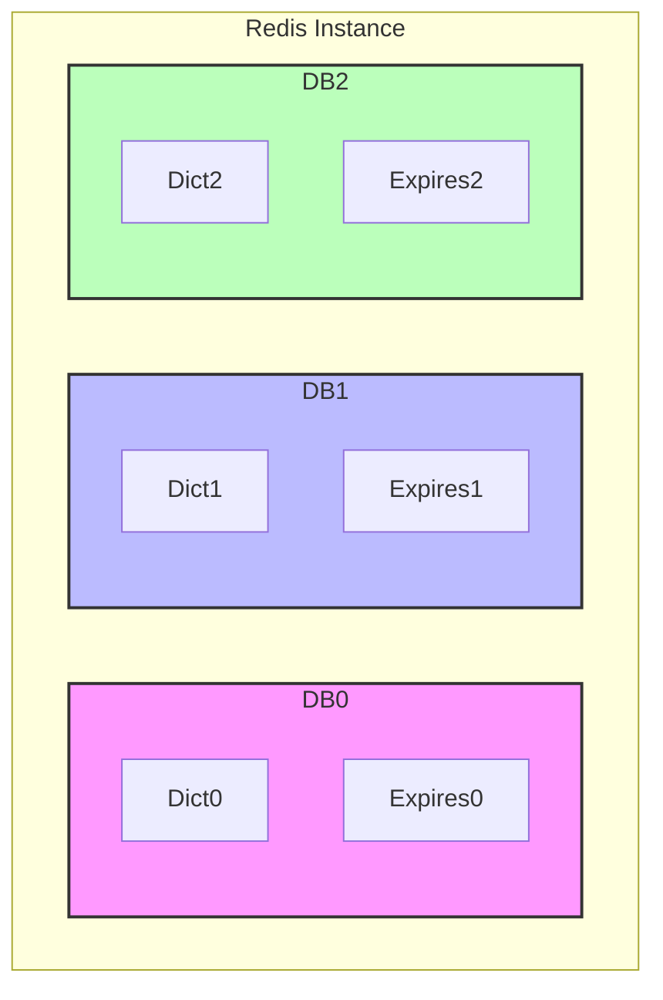
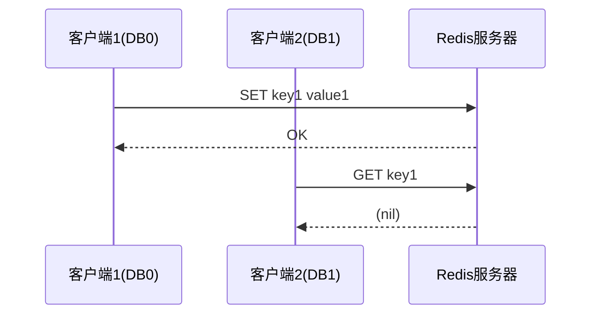
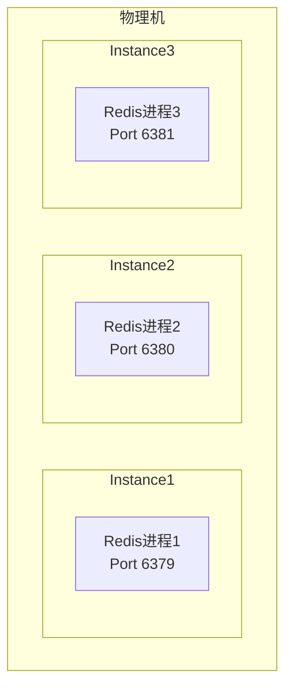
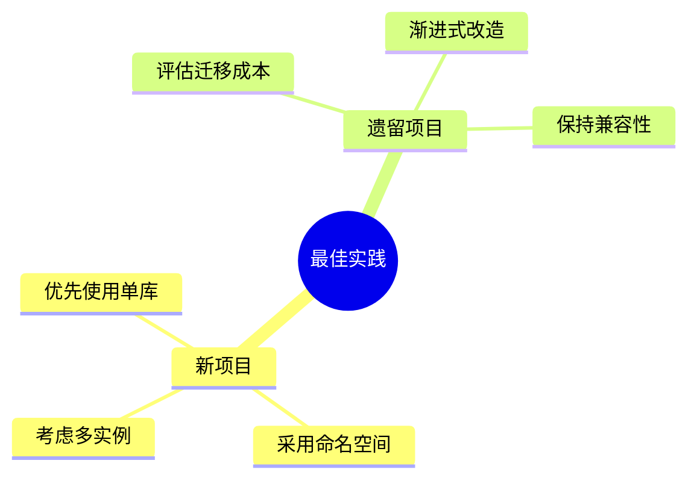

> **核心思想**: Redis多数据库设计是为了在单个Redis实例中提供数据隔离能力，但这种设计在现代Redis实践中正逐渐被多实例部署模式取代。本文将深入分析其设计初衷、实现机制和性能影响。

# 一、为什么设计多个数据库？

## 1. 设计初衷



## 2. 实际应用场景

1. **开发测试环境分离**
   ```python
   # 开发环境使用DB 0
   redis-cli -n 0 SET user:1 "dev_data"
   
   # 测试环境使用DB 1
   redis-cli -n 1 SET user:1 "test_data"
   ```

2. **应用数据隔离**
   ```python
   # 用户数据在DB 0
   redis-cli -n 0 SET user:1 "user_data"
   
   # 日志数据在DB 1
   redis-cli -n 1 SET log:1 "log_data"
   ```

# 二、数据库隔离机制

## 1. 内存层面的隔离



1. **键空间隔离**
   - 每个数据库维护独立的键空间字典
   - 不同数据库的键不会冲突
   
2. **过期时间隔离**
   - 每个数据库有独立的过期字典
   - 过期策略独立执行

## 2. 命令层面的隔离



# 三、多数据库对性能的影响

## 1. 内存影响

对于 n 个数据库，额外内存开销可以表示为：

$$
\text{Memory}_{\text{overhead}} = n \times (\text{size}_{\text{dict}} + \text{size}_{\text{expires}})
$$

其中：
- $\text{size}_{\text{dict}}$ 是空字典的基础大小
- $\text{size}_{\text{expires}}$ 是过期字典的基础大小

## 2. CPU影响

1. **命令执行开销**
   ```mermaid
   graph TD
       A[命令到达] --> B{检查当前DB}
       B --> C[查找键空间]
       C --> D[检查过期时间]
       D --> E[执行命令]
   ```

2. **后台任务影响**
   - 每个数据库都需要执行过期键清理
   - 增加了内存回收的复杂度

## 3. 性能测试数据

| 数据库数量 | 内存基础开销 | 命令延迟增加 |
|-----------|------------|-------------|
| 16 (默认)  | ~32KB      | < 1%        |
| 32        | ~64KB      | ~1%         |
| 64        | ~128KB     | ~2%         |

# 四、现代实践中的替代方案

## 1. 多实例部署



优势：
- 更好的隔离性
- 独立的资源控制
- 更容易扩展

## 2. 键命名空间

```python
# 使用冒号分隔的命名空间
SET user:profile:1 "data"
SET log:error:1 "error_data"
SET cache:temp:1 "temp_data"
```

优势：
- 更简单的管理
- 更好的可读性
- 无性能开销

# 五、实践建议

## 1. 使用建议



## 2. 监控指标

```python
# 监控每个数据库的键数量
INFO keyspace

# 监控内存使用
INFO memory
```

## 3. 优化策略

1. **合理使用数据库**
   - 避免过多数据库
   - 使用命名空间替代多数据库
   - 考虑迁移到多实例架构

2. **性能优化**
   - 定期清理过期键
   - 控制单个数据库大小
   - 监控内存使用

# 总结

Redis多数据库设计提供了一种简单的数据隔离方案，但在现代应用中：

1. **优势**
   - 简单的数据隔离
   - 易于使用
   - 向后兼容

2. **局限**
   - 隔离性不够强
   - 资源控制有限
   - 可能影响性能

3. **发展趋势**
   - 多实例部署
   - 命名空间方案
   - 容器化部署

> **最佳实践建议**：对于新项目，建议使用键命名空间或多实例方案替代多数据库设计。对于遗留系统，可以继续使用多数据库，但要注意控制数据库数量和大小。