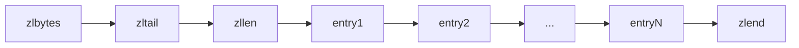
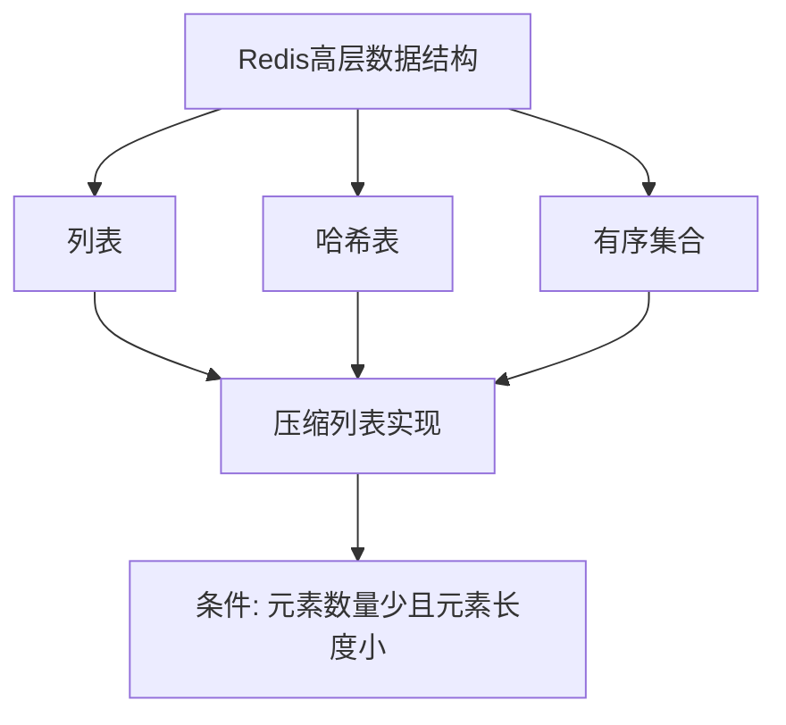

> **核心概念**：压缩列表(ziplist)是 Redis 为了节约内存而开发的一种特殊的双向链表数据结构。它可以存储字符串或整数，其特殊之处在于它是一块连续的内存空间，而不是像普通链表那样每个节点都是独立的内存块。

# 压缩列表的内存布局

压缩列表在内存中的总体布局如下：



## 各个字段详解

1. **zlbytes**（4字节）
   - 记录整个压缩列表占用的内存字节数
   - 包含zlbytes自身的4个字节

2. **zltail**（4字节）
   - 记录压缩列表表尾节点距离压缩列表的起始地址有多少字节
   - 通过这个偏移量，程序无须遍历整个压缩列表就可以确定表尾节点的地址

3. **zllen**（2字节）
   - 记录了压缩列表包含的节点数量
   - 当这个值小于$2^{16}-1$时，这个值就是压缩列表的节点数量
   - 如果zllen的值等于$2^{16}-1$，那么节点的真实数量需要遍历整个压缩列表才能计算得出

4. **entry**（不定长）
   - 压缩列表包含的各个节点，节点的长度由内容决定

5. **zlend**（1字节）
   - 特殊值0xFF，用于标记压缩列表的末端

# 内存效率分析

压缩列表的设计体现了空间和时间的权衡：

> **内存优化**：通过特殊的编码方式和连续的内存布局，压缩列表能够最大限度地节约内存。

让我们来计算一个简单的例子。假设我们存储一个包含3个小整数的列表：

```c
[1, 2, 3]
```

1. 传统链表需要的内存：
   - 每个节点需要：
     - 数据本身：至少 4 字节
     - 前向指针：8 字节
     - 后向指针：8 字节
   - 总计：$(4 + 8 + 8) \times 3 = 60$ 字节

2. 压缩列表需要的内存：
   - 头部固定开销：
     - zlbytes：4 字节
     - zltail：4 字节
     - zllen：2 字节
   - 每个节点（假设使用最小编码）：1 字节
   - 结束标记：1 字节
   - 总计：$4 + 4 + 2 + (1 \times 3) + 1 = 14$ 字节

# ==使用场景与限制==

压缩列表主要用于[[05 Redis 压缩列表：作为高层数据结构的基石|以下Redis数据结构]]的底层实现：

1. 小型列表（list）
2. 小型哈希表（hash）
3. 小型有序集合（sorted set）



## 使用限制

为了保持压缩列表的效率，Redis对其使用设置了以下限制：

1. 列表键的限制：
   - 当列表对象所保存的所有字符串元素的长度都小于64字节
   - 列表对象保存的元素数量小于512个

2. 哈希键的限制：
   - 哈希对象保存的所有键值对的键和值的字符串长度都小于64字节
   - 哈希对象保存的键值对数量小于512个

> **性能警告**：当压缩列表过大时，可能会导致连锁更新问题，这将在后续章节详细讨论。

# 小结

压缩列表是Redis中一个重要的内存优化数据结构，通过以下方式实现高效存储：

1. 连续内存布局
2. 灵活的编码方式
3. 特殊的头部设计
4. 针对小数据的优化