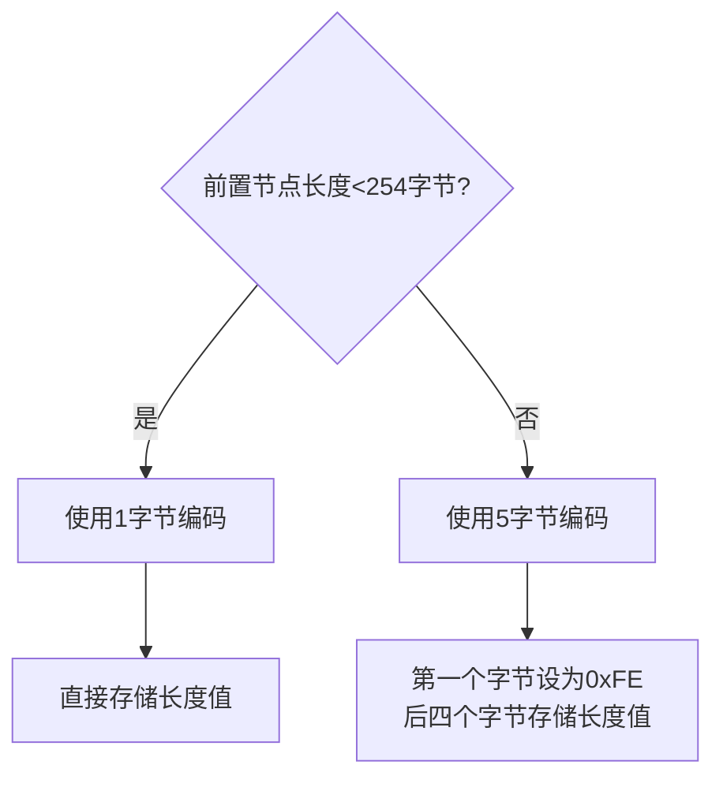
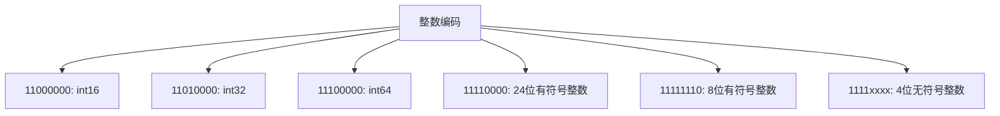
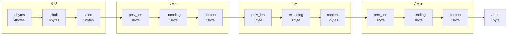

> **核心概念**：压缩列表节点(entry)是压缩列表中的基本存储单元，它使用了特殊的编码方式来优化不同类型数据的存储空间。每个节点可以保存一个字节数组或者一个整数值，并且会根据内容的不同采用不同的内部编码方式。

# 节点的内部构成

每个压缩列表节点都由三个部分组成：


## 1. previous_entry_length（前置节点长度）

前置节点长度的编码规则：



> **编码规则**：
> - 如果前一个节点的长度小于254字节，则用1个字节来保存这个长度值
> - 如果前一个节点的长度大于等于254字节，则用5个字节来保存这个长度值，其中第一个字节被设置为0xFE（254），之后的四个字节用于保存实际长度

## 2. encoding（编码）

节点的encoding保存了两种信息：
1. 数据的类型（字节数组或整数）
2. 数据的长度（字节数组）或者类型（整数）

### 字节数组编码

当保存字节数组时，encoding的编码方式如下：

| 编码方式     | 编码长度 | 字节数组长度范围 |
|------------|---------|----------------|
| 00bbbbbb   | 1字节   | $\leq 63$字节   |
| 01bbbbbb xxxxxxxx | 2字节 | $\leq 16383$字节 |
| 10______ xxxxxxxx xxxxxxxx xxxxxxxx xxxxxxxx | 5字节 | $\leq 2^{32}-1$字节 |

> **编码含义**：
> - `b`表示编码位，用于存储长度信息
> - `x`表示额外字节，用于存储更大的长度值
> - `_`表示未使用的位

### 整数编码

整数编码使用特殊的标识位来表示不同范围的整数：



## 3. content（数据内容）

content 区域存储实际的数据内容，可能是以下两种类型之一：
1. 字节数组：按原样存储
2. 整数：按照编码指定的方式存储

# 编码示例

让我们通过一些具体的例子来理解节点的编码过程：

1. 存储小整数 `5`：
```
previous_entry_length | encoding | content
        0x01         | 11111101 |   0x05
```

2. 存储字符串 "hello"：
```
previous_entry_length | encoding | content
        0x02         | 00000101 | 0x68656C6C6F
                     (长度5)     (ASCII码)
```

# 优化技术

压缩列表节点的设计体现了多种优化技术：

1. **变长编码**
   当存储较小的值时，使用更少的字节，例如：
   ```text
   小整数 5 仅需要：
   1字节(previous_length) + 1字节(encoding) + 1字节(content) = 3字节
   ```

2. **就地更新**
   对于定长数据（如整数），可以直接在原地进行修改，无需调整其他节点

3. **快速遍历**
   通过 previous_entry_length 字段，可以实现双向遍历：
   $$
   \text{前一节点地址} = \text{当前节点地址} - \text{previous\_entry\_length}
   $$

# 内存布局实例

考虑一个包含三个元素的压缩列表：`[5, "hello", 10]`



# 性能考虑

> **重要性能特征**：
> - 节点的大小是变长的，这有利于内存优化
> - previous_entry_length 的设计可能导致连锁更新问题
> - 整数的特殊编码可以显著减少内存使用

## 最佳实践

1. 对于小整数和短字符串，压缩列表的性能最优
2. 避免频繁地在中间位置进行插入和删除操作
3. 注意监控压缩列表的大小，防止出现性能问题

# 小结

压缩列表节点的设计体现了 Redis 在内存优化方面的深思熟虑：

1. 灵活的编码方案适应不同类型的数据
2. 节点间的紧密排列最大限度地减少内存碎片
3. 通过特殊的编码方式优化整数存储
4. previous_entry_length 的设计让双向遍历成为可能