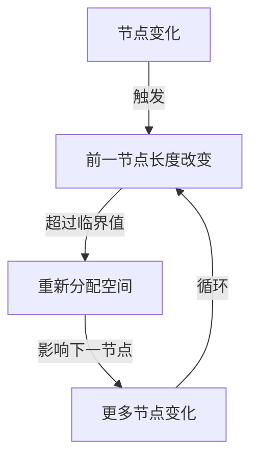
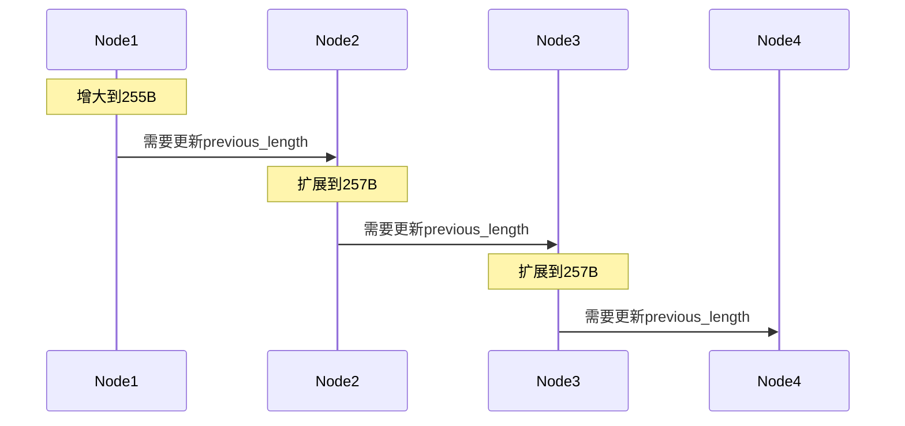

> **核心概念**：连锁更新（cascade update）是压缩列表在特定条件下出现的一种连续性空间扩展现象。当对压缩列表进行修改时，可能会触发一连串的节点空间重新分配，导致性能显著下降。

# 连锁更新的本质

压缩列表的连锁更新本质上是一个"多米诺骨牌效应"：一个节点的变化可能会引发后续节点的连续变化。这种现象的根源在于压缩列表节点的 `previous_entry_length` 字段的设计。



# 触发条件分析

连锁更新的触发需要满足以下条件：

1. **临界值条件**：
   $$
   \text{Node Size} \approx 254 \text{ bytes}
   $$

2. **连续性条件**：
   - 存在一系列连续节点
   - 每个节点的大小接近但小于254字节
   - 任一节点发生大小变化都可能触发连锁反应

# 连锁更新的详细过程

让我们通过一个具体示例来理解这个过程：

## 初始状态
假设我们有以下压缩列表结构（简化表示）：

```
[node1(253B)] -> [node2(253B)] -> [node3(253B)] -> [node4(253B)]
```

每个节点的 previous_entry_length 字段仅用1个字节存储。

## 更新过程演示

1. **触发阶段**：
   向node1插入数据，使其长度增加到255字节
   ```
   [node1(255B)] -> [node2(253B)] -> [node3(253B)] -> [node4(253B)]
   ```

2. **第一次级联**：
   node2需要5字节来存储node1的长度
   ```
   [node1(255B)] -> [node2(257B)] -> [node3(253B)] -> [node4(253B)]
   ```

3. **连锁反应**：
   node3需要5字节来存储node2的长度
   ```
   [node1(255B)] -> [node2(257B)] -> [node3(257B)] -> [node4(253B)]
   ```

4. **继续传播**：
   效应继续向后传播，直到某个节点能够承受这种变化



# 性能影响分析

连锁更新带来的性能开销可以通过以下公式估算：

$$
T_{total} = N \times (T_{realloc} + T_{copy})
$$

其中：
- $N$ 是受影响的节点数量
- $T_{realloc}$ 是内存重新分配的时间
- $T_{copy}$ 是数据复制的时间

## 最坏情况分析

在最坏情况下，连锁更新会影响到压缩列表中的所有后续节点：

```python
最坏时间复杂度 = O(N²)
空间复杂度 = O(N)
```

# 预防和优化策略

为了避免或减轻连锁更新带来的性能问题，Redis采取了以下策略：

1. **预分配策略**
   ```c
   // 预分配额外空间以减少重新分配
   new_size = size + size/4 + 4;
   ```

2. **限制条件**
   > **重要阈值**：
   > - 列表项数量 < 512
   > - 单个条目大小 < 64 字节

3. **自动转换**
   当压缩列表增长超过阈值时，自动转换为其他数据结构：
   - 列表转换为双向链表
   - 哈希转换为哈希表
   - 有序集合转换为跳表

# 实际应用建议

在使用压缩列表时，应遵循以下最佳实践：

1. **数据特征评估**
   - 评估数据的大小分布
   - 预估增长趋势
   - 分析更新模式

2. **监控指标**
   ```redis
   > INFO memory
   > MEMORY USAGE key
   ```

3. **预防性措施**
   - 避免接近临界值的数据大小
   - 合理设置转换阈值
   - 考虑预先使用其他数据结构

# 小结

连锁更新是压缩列表实现中的一个重要性能考虑因素：

1. 它反映了空间优化和性能之间的权衡
2. 在特定条件下可能导致显著的性能下降
3. 通过合理的使用策略可以有效规避
4. 是理解Redis内存优化机制的重要窗口

下一章，我们将探讨压缩列表的API设计，这些API是如何在保证功能的同时最小化连锁更新风险的。[[<% tp.file.title %>_flash_cards|<% tp.file.title %>_flash_cards]]