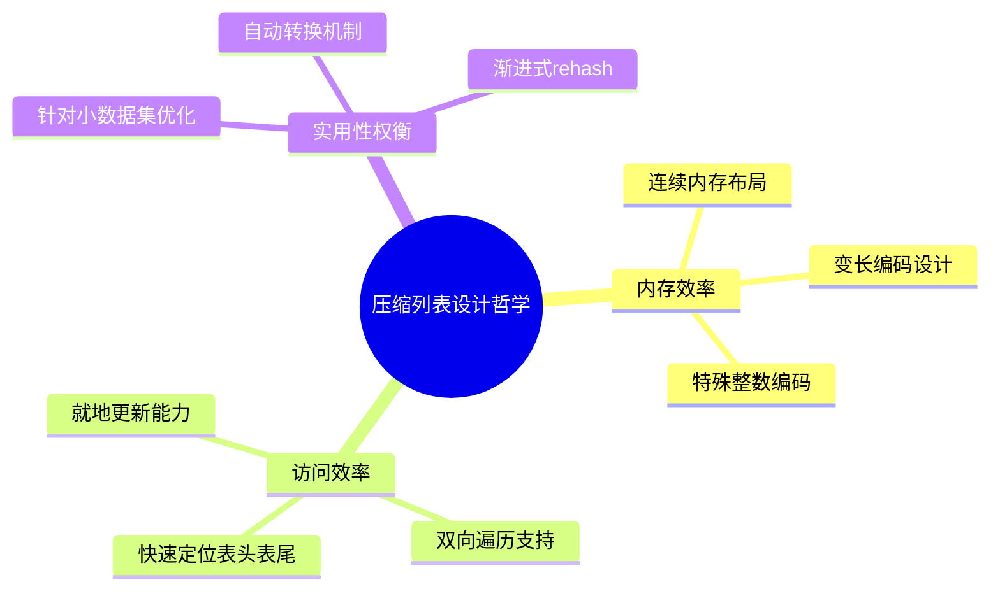

> **核心定义**: 压缩列表是Redis中一个精心设计的内存数据结构，它通过紧凑的内存布局和灵活的编码方案，在保证基本功能的同时实现了极致的内存优化。它是Redis处理小型数据集时的首选数据结构。

# 设计哲学与架构思想

压缩列表的设计体现了Redis在以下方面的深刻思考：



# 关键技术创新

## 1. 空间优化技术

> **变长编码**: 压缩列表通过灵活的编码方案，为不同大小的数据选择最优的存储方式。这种方案在保证功能的同时，将内存使用降到最低。

核心策略包括：
- 整数的特殊编码（最小仅需1字节）
- 前向长度的自适应存储（1或5字节）
- 尾部偏移量的快速访问

## 2. 实现精要

压缩列表的实现围绕三个关键点展开：

1. **内存布局**
   $$
   \text{ziplist} = \text{header} + \text{entries} + \text{end}
   $$
   其中header包含：
   - zlbytes：总字节数
   - zltail：尾部偏移量
   - zllen：节点数量

2. **节点编码**
   ```
   entry = previous_length + encoding + content
   ```
   
3. **连锁更新的控制机制**
   - 限制条件的设定
   - 预分配策略
   - 自动转换机制

# 实践启示与设计模式

压缩列表的设计给我们以下启示：

1. **权衡的艺术**
   > **设计思想**: 在内存效率和操作复杂度之间寻找最佳平衡点。压缩列表通过限制使用场景，在特定条件下实现了近乎完美的平衡。

2. **优化的边界**
   - 对小数据集的极致优化
   - 到达临界点时的优雅降级
   - 预分配策略对效率的影响

3. **实现的优雅**
   压缩列表展示了如何在简单的字节数组上构建复杂的数据结构，这种实现方式的优雅之处在于：
   - 最小化内存碎片
   - 最大化缓存利用
   - 灵活的编码适配

# 使用建议与最佳实践

> **实践准则**: 在使用压缩列表时，应当遵循"小而美"的原则，将其用于最适合的场景。

具体建议：

1. **适用场景**
   - 小型列表（<512个元素）
   - 短字符串（<64字节）
   - 小整数集合

2. **性能优化**
   - 避免触发连锁更新
   - 合理设置转换阈值
   - 监控内存使用情况

3. **设计考虑**
   - 预估数据增长趋势
   - 评估更新操作频率
   - 考虑备选数据结构

# 技术演进与未来展望

压缩列表的设计理念启发我们思考数据结构设计的更多可能：

1. **内存优化的新思路**
   - 混合编码策略
   - 自适应数据结构
   - 智能内存管理

2. **性能与效率的平衡**
   - 动态调整策略
   - 场景感知能力
   - 自动优化机制

# 结语

压缩列表是Redis中一个精妙的设计，它通过巧妙的编码和限制条件，在特定场景下实现了接近理想的内存使用效率。理解压缩列表不仅有助于更好地使用Redis，更为我们在进行系统设计时提供了宝贵的参考。其核心思想—简单而精确的取舍、明确的边界条件、优雅的降级机制，都值得我们在其他系统设计中借鉴。

> **设计真谛**: 压缩列表的精髓不在于其复杂的实现细节，而在于其简单而克制的设计理念。它告诉我们，优秀的数据结构设计不是要解决所有问题，而是要在特定场景下做到最好。