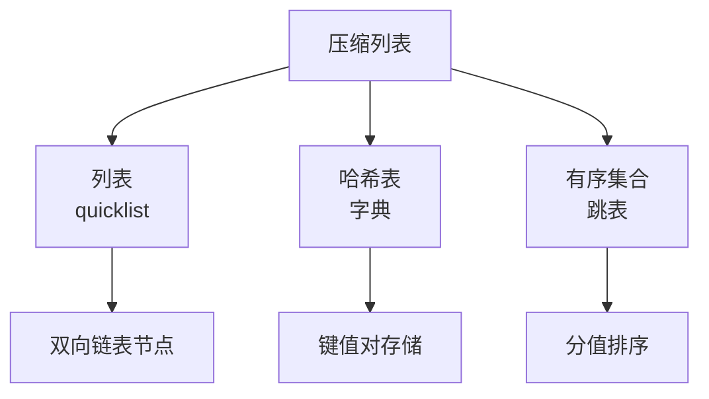
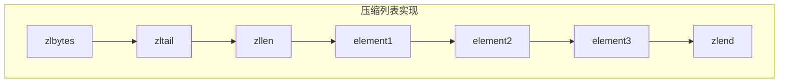
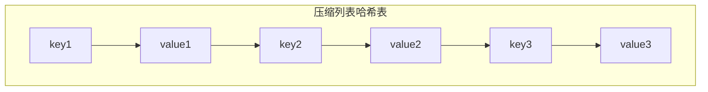
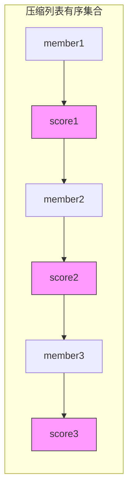
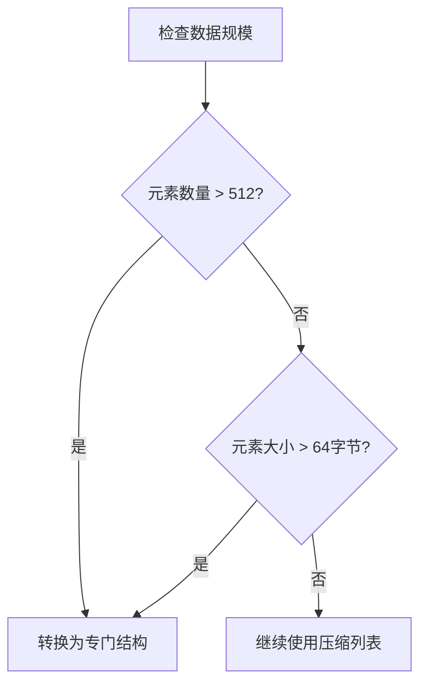

> **核心思想**：压缩列表作为Redis的基础数据结构，通过其紧凑的内存布局和灵活的编码方式，为多种高层数据结构提供了内存效率极高的实现方案。

# 基础实现原理

在深入具体实现之前，让我们先理解压缩列表如何作为基础结构支持不同的数据类型：



# 1. 列表(List)的实现

> **实现要点**：Redis的列表类型在数据量较小时直接使用压缩列表实现，当数据量增大时会转换为quicklist（一个由多个压缩列表组成的双向链表）。

## 基本结构


## 列表操作映射

| 列表操作 | 压缩列表实现 |
|---------|------------|
| LPUSH   | 在头部插入节点 |
| RPUSH   | 在尾部插入节点 |
| LPOP    | 删除头部节点 |
| RPOP    | 删除尾部节点 |
| LINDEX  | 按索引访问节点 |

# 2. 哈希表(Hash)的实现

> **实现要点**：压缩列表实现哈希表时，采用了键值对相邻存储的方式，每两个节点构成一个键值对。

## 基本结构



## 编码策略

对于哈希表中的每个键值对：
```python
entry_key = ziplist_entry(key)
entry_value = ziplist_entry(value)
# 确保键值对相邻存储
assert entry_value.offset == entry_key.offset + entry_key.length
```

## 操作实现

1. **HSET 操作**：
   ```python
   def hset(hash_key, field, value):
       # 查找field是否存在
       if field_exists:
           # 更新value
           update_entry(field_index + 1, value)
       else:
           # 添加新的键值对
           append_entry(field)
           append_entry(value)
   ```

2. **HGET 操作**：
   ```python
   def hget(hash_key, field):
       # 遍历压缩列表查找field
       index = find_field(field)
       if index != -1:
           return get_entry(index + 1)  # 返回下一个节点的值
   ```

# 3. 有序集合(Sorted Set)的实现

> **实现要点**：压缩列表实现有序集合时，同样采用相邻节点存储的方式，但是存储的是成员和分值对，并且需要保持按分值排序的特性。

## 基本结构



## 排序维护

1. **插入新元素**：
   ```python
   def zadd(key, score, member):
       # 二分查找插入位置
       position = binary_search(score)
       # 在正确位置插入成员和分值
       insert_entry(position, member)
       insert_entry(position + 1, score)
   ```

2. **分值更新**：
   ```python
   def zscore_update(key, member, new_score):
       # 找到成员位置
       member_pos = find_member(member)
       if member_pos != -1:
           # 删除原有的成员-分值对
           delete_pair(member_pos)
           # 重新插入新的成员-分值对
           zadd(key, new_score, member)
   ```

# 性能优化与转换策略

> **关键阈值**：Redis为这些数据结构设定了转换阈值，当数据量或元素大小超过阈值时，会自动转换为更适合的数据结构。

## 转换条件



## 不同数据类型的转换目标：

1. **列表**：
   - 转换为quicklist
   - 每个quicklist节点是一个压缩列表

2. **哈希表**：
   - 转换为[[01 Redis字典（Dictionary）详解|dict（字典）]]
   - 使用单独的哈希表实现

3. **有序集合**：
   - 转换为[[01 跳跃表(Skip List)深度剖析|skiplist]] + [[01 Redis字典（Dictionary）详解|dict]]
   - 跳表提供排序功能
   - 字典提供O(1)查找

# 实践建议

在使用这些数据结构时，需要注意以下几点：

1. **数据特征评估**
   - 预估数据量级
   - 评估单个元素的大小
   - 考虑访问模式

2. **性能优化**
   - 合理设置阈值
   - 避免频繁转换
   - 监控内存使用

3. **使用建议**
   - 小数据集优先使用压缩列表
   - 大数据集直接使用专门结构
   - 考虑使用MEMORY USAGE命令监控

# 总结

压缩列表作为Redis的基础数据结构，通过其灵活的设计为多种高层数据结构提供了高效的实现方案。理解这些实现细节不仅有助于更好地使用Redis，也为我们进行系统设计提供了宝贵的参考。关键是要根据实际场景选择合适的数据结构，并在必要时利用Redis的自动转换机制来优化性能。

> **设计启示**：压缩列表的多功能性展示了优秀的基础数据结构应该具有的特质 - 简单而灵活，能够作为构建块支持多种高层抽象，同时在性能和内存使用之间取得良好的平衡。