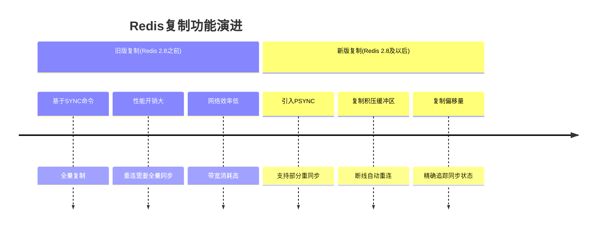
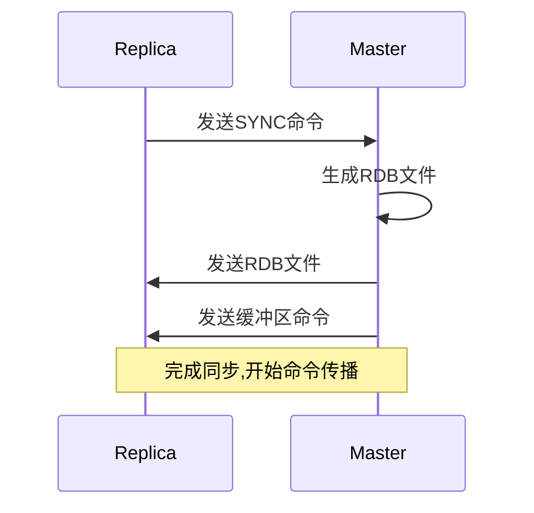
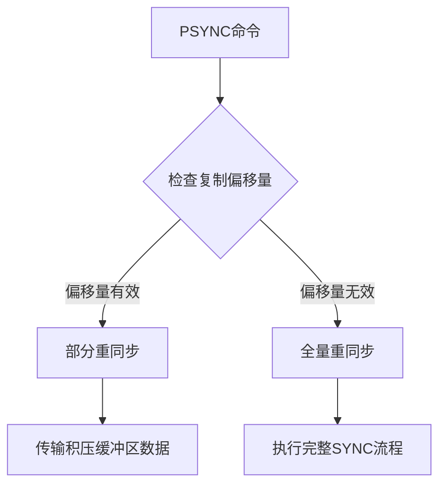
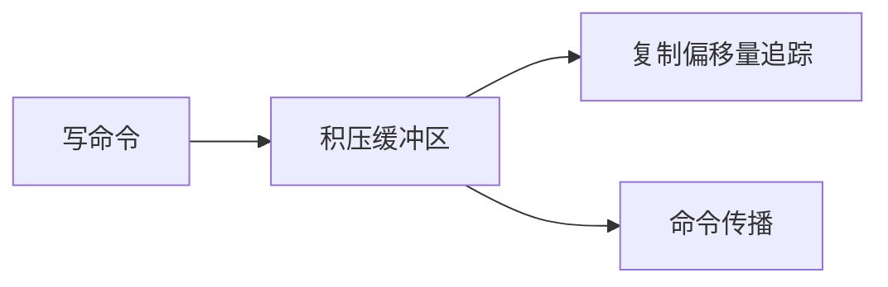
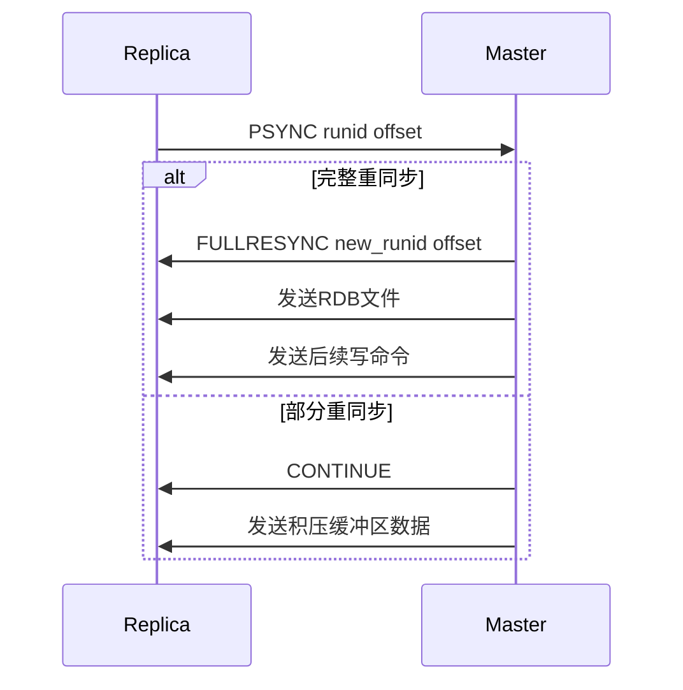

> **核心概念**: Redis的复制功能允许从服务器(replica)维护一个与主服务器(master)相同的数据副本。这个功能是Redis实现高可用性的基础,同时也为横向扩展读取性能提供了可能。

# 复制功能的演进历史

# 旧版复制功能的实现与缺陷

## 1. SYNC命令的工作流程

## 2. 主要缺陷分析

1. **全量重同步问题**
- 网络断开重连后需要重新执行SYNC
- 生成RDB文件耗费大量CPU和内存资源
- 传输RDB文件消耗大量网络带宽

2. **资源浪费**
$$
\text{浪费的网络流量} = \sum_{i=1}^{n} \text{RDB文件大小}_i \times \text{断线重连次数}_i
$$

# 新版复制功能的革新

## 1. PSYNC命令的实现原理

## 2. 部分重同步的关键组件

1. **复制积压缓冲区(replication backlog)**
- 固定大小的FIFO队列
- 默认大小为1MB
- 保存最近执行的写命令

2. **复制偏移量**
- 主服务器的复制偏移量计算:
$$
\text{master\_offset} = \text{initial\_offset} + \sum_{i=1}^{n} \text{command\_length}_i
$$
- 从服务器的复制偏移量计算:
$$
\text{replica\_offset} = \text{initial\_offset} + \sum_{i=1}^{m} \text{received\_length}_i
$$

3. **服务器运行ID**
- 40个随机十六进制字符
- 用于识别服务器身份
- 重启后会改变

## 3. PSYNC命令的执行流程

# 心跳检测机制

> **定义**: 心跳检测是Redis复制中确保主从服务器连接状态的关键机制。

## 1. REPLCONF ACK命令

## 2. 心跳检测的作用
1. **检测连接状态**
- 默认每秒一次
- 可通过repl-ping-replica-period配置

2. **网络延迟检测**
- 记录命令发送与ACK接收的时间差
- 通过INFO REPLICATION命令可查看延迟

3. **最小写入数量支持**
- 通过min-replicas-to-write配置
- 保证写命令在足够多的从服务器同步后才返回

# 复制功能的优化建议

1. **合理配置积压缓冲区大小**
$$
\text{建议大小} = \text{每秒写入量} \times \text{预期断线时间} \times 2
$$

2. **监控复制延迟**
- 通过INFO REPLICATION命令
- 设置合理的超时阈值

3. **网络优化**
- 主从服务器最好在同一个数据中心
- 使用高带宽低延迟的网络连接

> **最佳实践**: 在生产环境中,应该结合实际写入量和网络状况,合理配置积压缓冲区大小和超时参数,同时做好监控和告警。