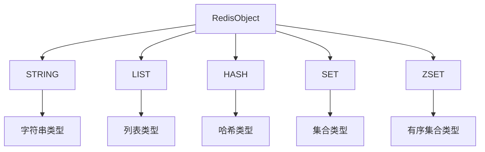
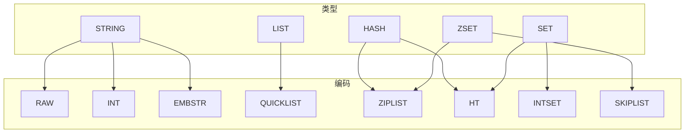
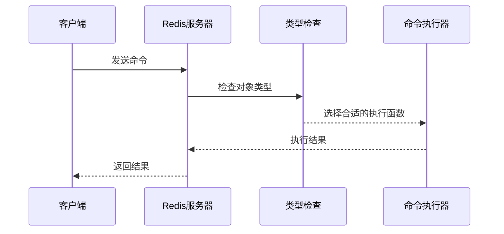

> **核心概念**：Redis对象系统是一个抽象层，它通过封装不同的数据结构实现，为上层提供统一的数据类型。这种设计允许Redis在不同场景下选择最优的内部表示方式，在性能和内存使用之间取得平衡。

# Redis对象的基础结构

Redis使用对象来表示数据库中的键和值，每个对象都由一个`redisObject`结构表示：

```c
typedef struct redisObject {
    unsigned type:4;      // 类型
    unsigned encoding:4;  // 编码
    unsigned lru:24;     // 对象最后一次访问的时间
    int refcount;        // 引用计数
    void *ptr;          // 指向实际数据结构的指针
} robj;
```

## 对象类型系统



# 类型与编码的对应关系

Redis对象的类型和编码形成了一个多对多的关系矩阵：



## 编码转换阈值

Redis会根据不同的条件自动在不同编码之间转换：

> **转换条件**：当数据满足特定条件时，Redis会自动选择最适合的编码方式。这种转换是透明的，不需要开发者干预。

1. 字符串对象的编码转换：
   
   $$
   \text{条件} = \begin{cases}
   \text{RAW}, & \text{字符串长度} > 44 \text{字节} \\
   \text{EMBSTR}, & \text{字符串长度} \leq 44 \text{字节} \\
   \text{INT}, & \text{可以表示为整数}
   \end{cases}
   $$

2. 列表对象的编码转换：
   ```mermaid
   graph LR
       A[ZIPLIST] -->|元素数量>512 or 元素大小>64字节| B[QUICKLIST]
   ```

3. 哈希对象的编码转换：
   ```mermaid
   graph LR
       A[ZIPLIST] -->|元素数量>512 or 元素大小>64字节| B[HASHTABLE]
   ```

# 内存优化策略

Redis通过灵活的编码方式实现内存优化：

4. **共享对象池**：
   - 对于整数范围内的字符串对象
   - 频繁使用的小对象

5. **内联存储**：
   - EMBSTR编码的字符串
   - 压缩列表存储的小集合

6. **紧凑编码**：
   ```mermaid
   graph TD
       A[内存优化策略] --> B[共享对象池]
       A --> C[内联存储]
       A --> D[紧凑编码]
       B --> E[减少内存分配]
       C --> F[减少内存碎片]
       D --> G[减少内存占用]
   ```

# 命令的多态性

Redis命令的执行过程：



> **设计哲学**：通过类型和编码的分离，Redis实现了优雅的多态性，使得相同的命令可以在不同的编码实现上高效运行。

# 实践建议

在使用Redis对象时，需要注意以下几点：

7. **类型选择**
   - 根据数据特征选择合适的类型
   - 考虑数据的访问模式

8. **内存优化**
   - 利用共享对象池
   - 注意编码转换阈值
   - 监控内存使用情况

9. **性能调优**
   - 合理设置阈值参数
   - 避免频繁的编码转换
   - 使用`OBJECT ENCODING`命令监控编码状态

# 总结

Redis对象系统通过类型和编码的分离实现了灵活而高效的数据存储。这种设计不仅提供了优雅的抽象，也为性能优化提供了充分的空间。理解对象的类型与编码机制，对于高效使用Redis至关重要。

> **核心要点**：Redis对象系统的精髓在于其灵活的编码转换机制，这使得Redis可以在不同场景下自动选择最优的存储方式，同时保持了简单统一的外部接口。