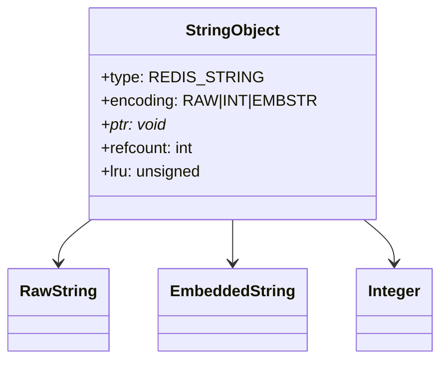
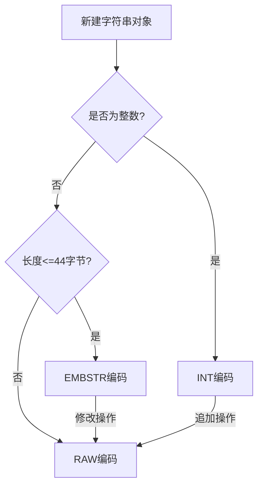
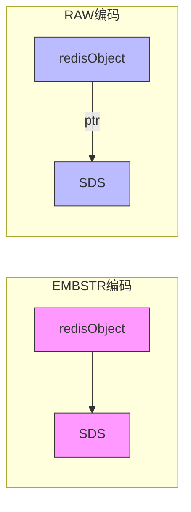
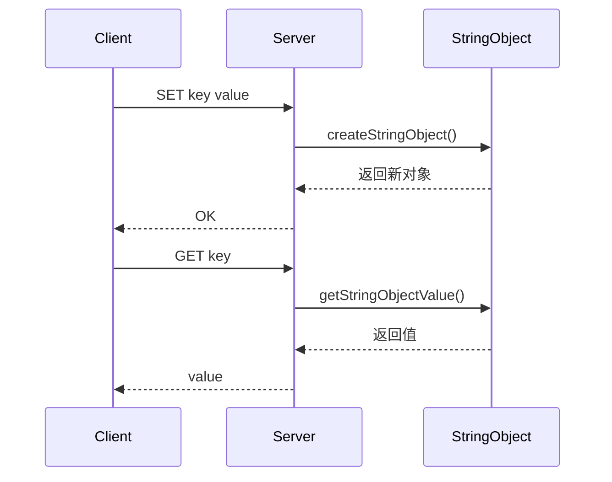

> **核心概念**：字符串对象（String）是Redis中最基础也最灵活的数据类型，它可以存储字符串、整数或者二进制数据。其内部实现采用了多种编码方式，以在不同场景下实现最优的存储效率。

# 结构设计与内存布局

字符串对象在Redis中的结构如下：



## 三种编码方式

> **编码类型**：Redis字符串对象支持三种不同的编码方式，每种都针对特定场景进行了优化

1. **INT编码**
   - 用于存储整数值
   - 直接将整数值存储在ptr指针中
   - 范围：$[-2^{63}, 2^{63}-1]$

2. **EMBSTR编码**
   - 用于存储短字符串（$\leq 44$ 字节）
   - 内存布局紧凑
   - 一次分配，一次释放

3. **RAW编码**
   - 用于存储长字符串（$> 44$ 字节）
   - 需要两次内存分配
   - 更灵活的内存管理

# 编码转换机制



## 编码选择逻辑

编码的选择遵循以下规则：

$$
\text{编码} = \begin{cases}
\text{INT}, & \text{当值为整数且在整数范围内} \\
\text{EMBSTR}, & \text{当值为字符串且长度} \leq 44 \text{字节} \\
\text{RAW}, & \text{其他情况}
\end{cases}
$$

# 内存优化策略

Redis针对字符串对象采用了多种内存优化策略：

## 1. EMBSTR优化



> **EMBSTR优势**：EMBSTR编码将redisObject和SDS放在同一块连续内存中，减少内存碎片，提高访问效率。

## 2. 整数共享池

Redis会预先创建一个整数对象池：

```c
// 整数范围：[0, 9999]
#define REDIS_SHARED_INTEGERS 10000
```

这些对象可以被多个键共享使用，显著减少内存占用。

# 主要命令实现

字符串对象支持的核心命令及其实现原理：



## 1. SET命令
```python
def SET(key, value):
    # 根据value类型选择编码
    if is_integer(value):
        encoding = REDIS_ENCODING_INT
    elif len(value) <= 44:
        encoding = REDIS_ENCODING_EMBSTR
    else:
        encoding = REDIS_ENCODING_RAW
        
    # 创建字符串对象
    obj = createStringObject(value, encoding)
    
    # 将对象关联到键
    db.dict[key] = obj
```

## 2. APPEND命令
```python
def APPEND(key, value):
    # 获取原对象
    obj = db.dict.get(key)
    if obj is None:
        # 键不存在，创建新对象
        SET(key, value)
    else:
        # 如果是EMBSTR编码，需要先转换为RAW
        if obj.encoding == REDIS_ENCODING_EMBSTR:
            convertToRaw(obj)
        # 追加值
        appendToStringObject(obj, value)
```

# 性能特征

字符串对象的各种操作的时间复杂度：

| 操作 | 时间复杂度 | 说明 |
|-----|-----------|------|
| SET | $O(1)$ | 设置字符串值 |
| GET | $O(1)$ | 获取字符串值 |
| APPEND | $O(N)$ | N为追加后的字符串长度 |
| INCR | $O(1)$ | 整数增量操作 |
| STRLEN | $O(1)$ | 获取字符串长度 |

# 实践建议

4. **编码选择**
   - 对于小整数，优先使用整数编码
   - 短字符串（≤44字节）自动使用EMBSTR
   - 避免频繁修改短字符串，防止EMBSTR转换为RAW

5. **内存优化**
   - 利用整数共享池减少内存使用
   - 合理设计键值大小，避免过大的字符串
   - 监控字符串对象的编码转换

6. **性能优化**
   - 使用STRLEN代替GET后计算长度
   - 批量操作使用MSET/MGET
   - 大字符串操作考虑使用APPEND

# 总结

Redis字符串对象通过灵活的编码方式和优化策略，实现了高效的字符串存储和操作。理解其内部实现原理，对于优化Redis应用至关重要。

> **设计哲学**：Redis字符串对象的设计展示了如何通过合理的抽象和编码选择，在保持接口简单的同时实现高效的内存使用和操作性能。这种设计思想值得在其他系统设计中借鉴。