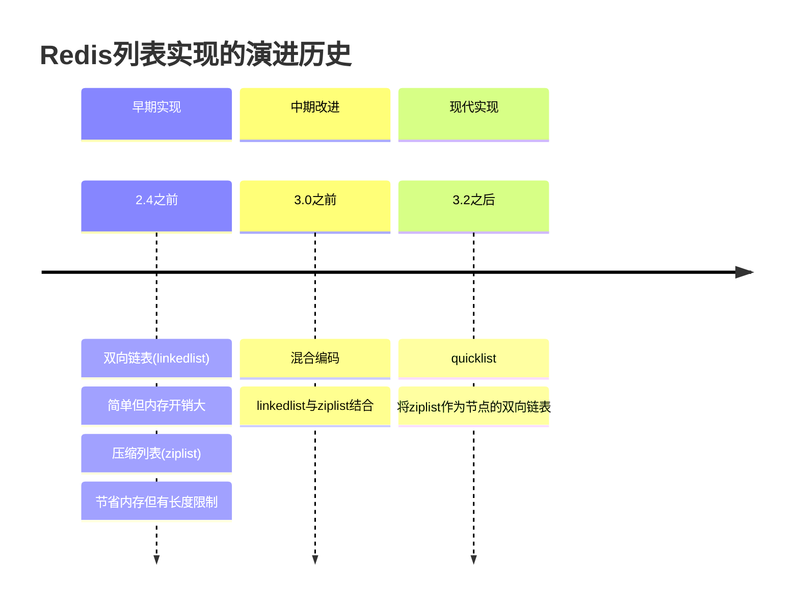
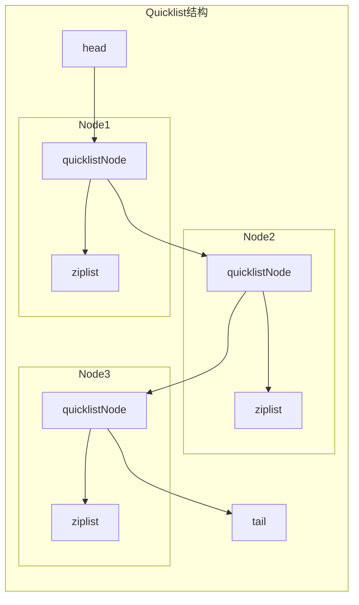
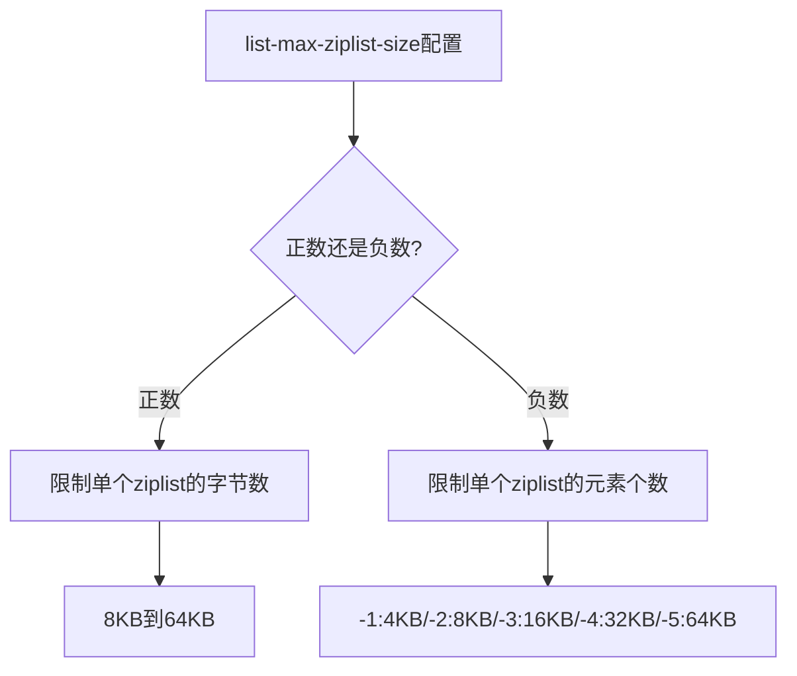
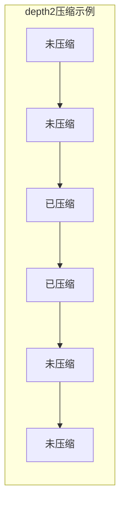
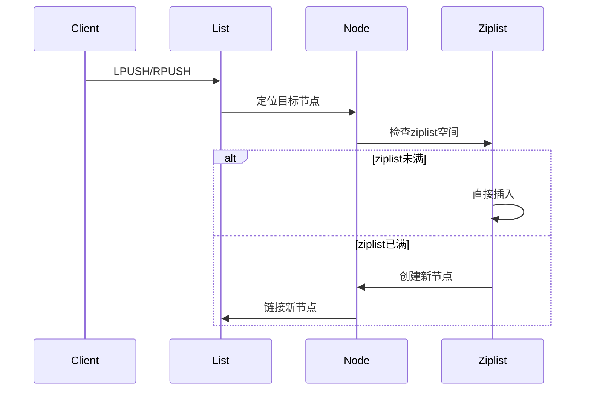

> **核心概念**：Redis列表对象是一个按照插入顺序排序的字符串序列，其内部实现经历了从最初的ziplist、linkedlist到现代的quicklist的演进过程。这种演进体现了Redis在性能与内存使用之间的精妙平衡。

# 实现演进与架构设计

Redis列表对象的实现架构经历了三个主要阶段：



## Quicklist的内部结构



# 数据结构设计

QuickList的核心结构定义：

```c
// quicklist结构
typedef struct quicklist {
    quicklistNode *head;    // 头节点指针
    quicklistNode *tail;    // 尾节点指针
    unsigned long count;    // 所有ziplist中的总元素数量
    unsigned long len;      // quicklistNodes的数量
    int fill : 16;         // ziplist大小限制，由list-max-ziplist-size决定
    unsigned int compress : 16; // 压缩深度，由list-compress-depth决定
} quicklist;

// quicklistNode结构
typedef struct quicklistNode {
    struct quicklistNode *prev;  // 前驱节点
    struct quicklistNode *next;  // 后继节点
    unsigned char *zl;          // 指向ziplist的指针
    unsigned int sz;           // ziplist的字节大小
    unsigned int count : 16;   // ziplist中的元素数量
    unsigned int encoding : 2; // RAW=1 or LZF=2
    unsigned int container : 2;// NONE=1 or ZIPLIST=2
    unsigned int recompress : 1;// 是否需要重新压缩
    unsigned int attempted_compress : 1; // 节点是否曾尝试过压缩
    unsigned int extra : 10;   // 预留字段
} quicklistNode;
```

# 内存优化策略

QuickList通过以下几个关键参数来优化内存使用：

## 1. 节点大小控制



## 2. 压缩策略

> **压缩深度**：通过`list-compress-depth`参数控制，表示首尾各有多少个节点不压缩，中间的节点采用LZF算法压缩。

压缩效果示意：


# 操作实现原理

## 1. 插入操作



## 2. 删除操作

对于删除操作的处理逻辑：

$$
\text{合并条件} = \begin{cases}
\text{合并相邻节点}, & \text{if size(node1) + size(node2)} \leq \text{max\_size} \\
\text{保持独立}, & \text{otherwise}
\end{cases}
$$

# 性能特征分析

列表对象的各种操作时间复杂度：

| 操作 | 时间复杂度 | 说明 |
|-----|-----------|------|
| LPUSH/RPUSH | $O(1)$ | 常数时间插入 |
| LPOP/RPOP | $O(1)$ | 常数时间删除 |
| LINDEX | $O(N)$ | 线性时间随机访问 |
| LRANGE | $O(S+N)$ | S为起始偏移量，N为范围长度 |
| LTRIM | $O(N)$ | N为被删除的元素数量 |

# 实践建议

1. **配置优化**
   - 根据实际数据特征调整`list-max-ziplist-size`
   - 权衡压缩深度与CPU使用率
   - 监控节点分裂与合并频率

2. **使用场景建议**
   - 消息队列：LPUSH + RPOP
   - 最新N条记录：LPUSH + LTRIM
   - 分页显示：LRANGE

3. **性能优化**
```python
# 优化示例：批量操作代替单个操作
# 不推荐
for item in items:
    redis.lpush("mylist", item)
    
# 推荐
redis.lpush("mylist", *items)
```

# 总结

Redis列表对象通过QuickList这一精妙的设计，成功平衡了访问效率与内存使用。其核心优势在于：

4. 灵活的内存管理
5. 可控的压缩策略
6. 高效的批量操作
7. 优秀的空间局部性

> **设计启示**：QuickList的设计展示了如何通过组合基础数据结构来创造出适应特定场景的复杂结构。这种渐进式优化的思路值得在系统设计中借鉴。

通过理解列表对象的内部实现，我们能够更好地利用这一数据结构，在实际应用中做出更优的选择。