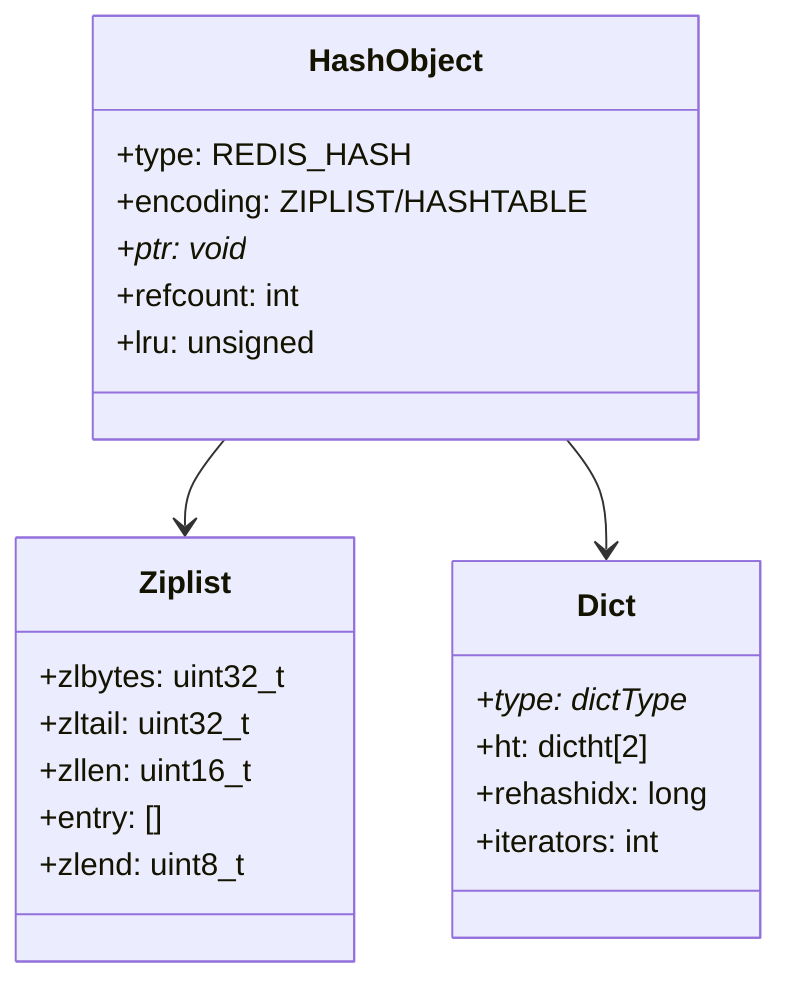
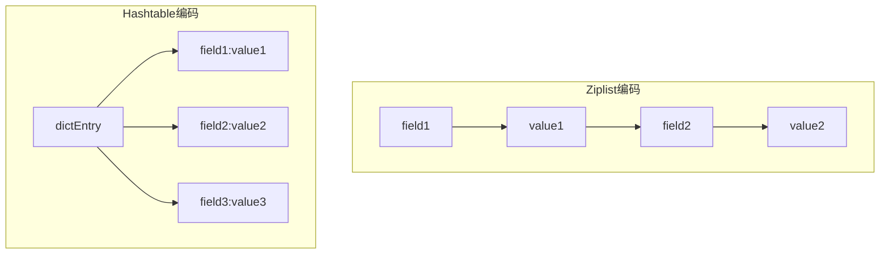
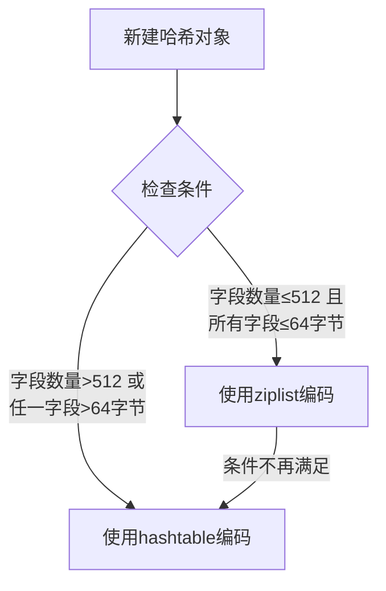
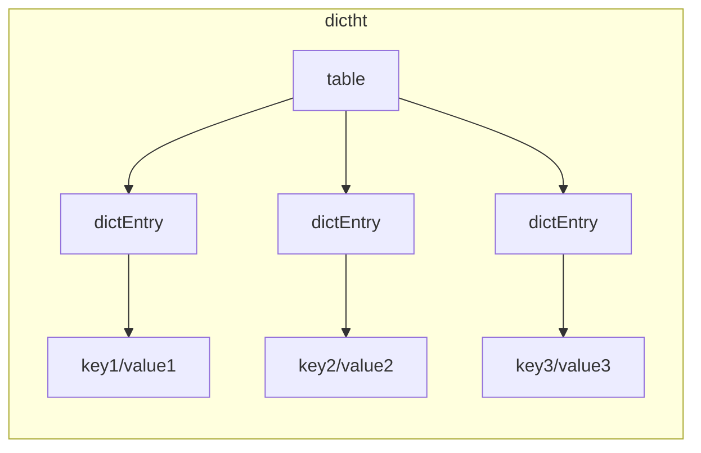
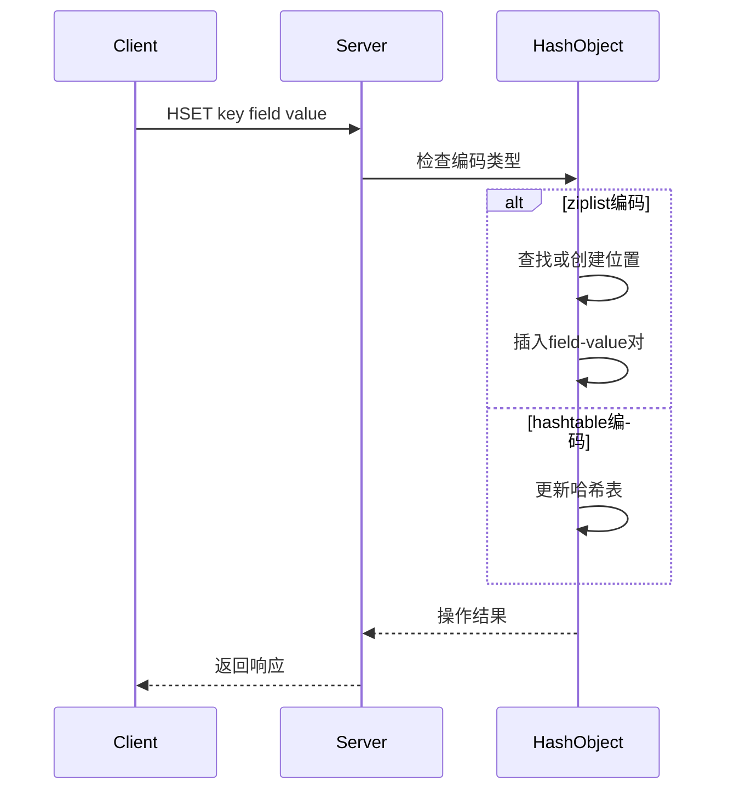
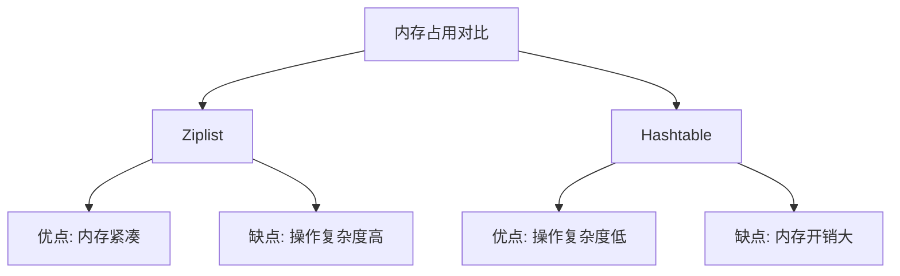

> **核心概念**：Redis的哈希对象是一个字符串键值对的集合，为了在不同场景下实现最优的存储效率，Redis会在压缩列表（ziplist）和哈希表（hashtable）这两种编码方式之间自动切换。

# 数据结构设计

## 基础结构



## 编码方式对比



# 编码转换机制

> **转换条件**：Redis会根据哈希对象中的键值对数量和键值的长度来决定使用哪种编码方式。

## 转换触发条件



转换条件可以表示为：

$$
\text{编码} = \begin{cases}
\text{ZIPLIST}, & \text{if } \text{size} \leq 512 \text{ and } \text{max\_entry\_size} \leq 64 \text{ bytes}\\
\text{HASHTABLE}, & \text{otherwise}
\end{cases}
$$

# 内部实现细节

## 1. Ziplist编码的实现

```c
// 使用ziplist存储时的结构
[field1]=[value1]=[field2]=[value2]...
```

键值对在ziplist中的存储特点：
- 相邻存储：field和value紧挨着存储
- 连续内存：整个ziplist在内存中连续存储
- 省略了指针开销：不需要额外的指针字段

## 2. Hashtable编码的实现



# 主要命令实现

## 1. HSET命令实现



## 2. HGET命令实现

```python
def HGET(key, field):
    hash_obj = get_object(key)
    if hash_obj.encoding == ZIPLIST:
        # 遍历ziplist查找field
        entry = ziplist_find(hash_obj.ptr, field)
        if entry:
            return entry.next.value  # 返回field后面的value
    else:  # HASHTABLE
        # 直接在哈希表中查找
        return dict_find(hash_obj.ptr, field)
```

# 性能特征分析

## 时间复杂度

| 命令 | Ziplist | Hashtable | 说明 |
|-----|---------|-----------|------|
| HSET | $O(N)$ | $O(1)$ | N为字段数量 |
| HGET | $O(N)$ | $O(1)$ | N为字段数量 |
| HDEL | $O(N)$ | $O(1)$ | N为字段数量 |
| HLEN | $O(1)$ | $O(1)$ | 直接从len字段获取 |

## 内存占用分析



# 实践建议

1. **编码选择建议**
   - 小数据量场景优先使用ziplist
   - 大数据量或频繁更新场景使用hashtable
   - 合理设置转换阈值

2. **性能优化**
   ```python
   # 批量操作优化
   # 不推荐
   for field, value in pairs.items():
       redis.hset("myhash", field, value)
   
   # 推荐
   redis.hmset("myhash", pairs)
   ```

3. **内存优化**
   - 合理设置字段名长度
   - 利用数字字段的优化编码
   - 监控内存使用情况

# 使用场景示例

4. **用户信息缓存**
```python
# 使用哈希存储用户信息
redis.hmset("user:1000", {
    "name": "Tom",
    "age": "25",
    "email": "tom@example.com"
})
```

5. **计数器集合**
```python
# 多个相关计数器组合
redis.hincrby("counter:daily", "visits", 1)
redis.hincrby("counter:daily", "unique_users", 1)
```

# 总结

Redis哈希对象通过灵活的编码方式和自动转换机制，在不同场景下都能提供较好的性能。其核心优势在于：

6. 自适应的编码选择
7. 高效的内存管理
8. 优秀的读写性能
9. 丰富的操作命令

> **设计启示**：Redis哈希对象的设计展示了如何通过不同编码的动态转换来平衡性能和内存使用。这种灵活的设计思路值得在其他系统设计中借鉴。