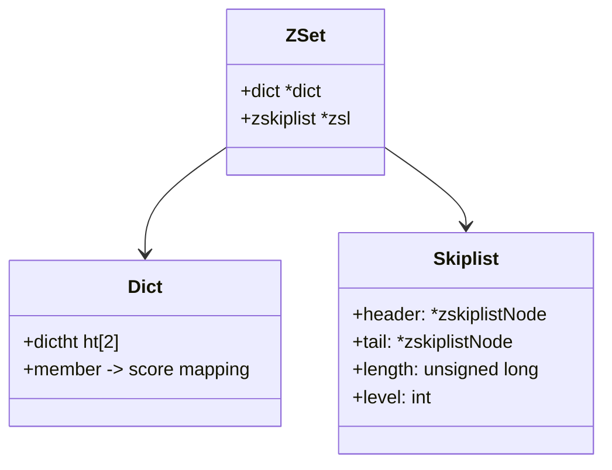
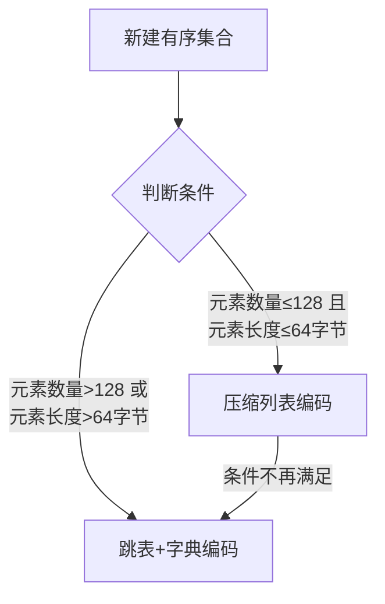
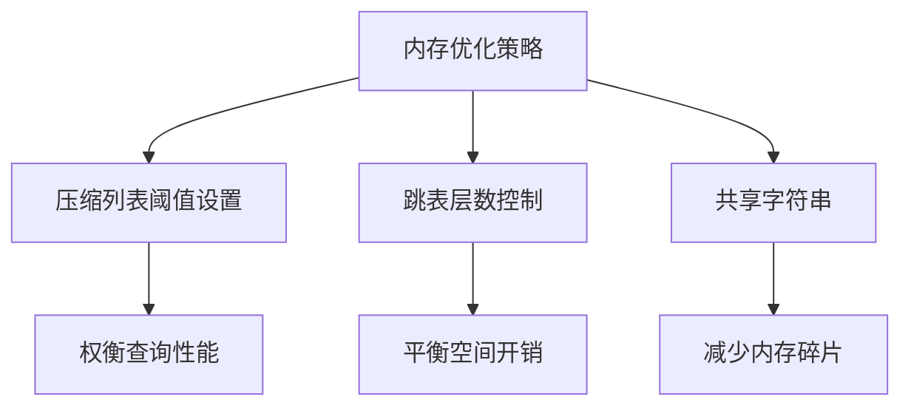

> **核心概念**：有序集合(Sorted Set)是Redis中一个独特的数据类型，它通过复合数据结构的设计，在保证元素有序性的同时提供高效的成员查询能力。每个成员关联一个分数，这个分数决定了成员在集合中的位置。

# 数据结构设计

Redis的有序集合采用了一个精妙的复合结构设计，根据数据规模可以在两种编码方式之间切换：

1. **压缩列表编码**：用于小规模数据
2. **跳表+字典复合结构**：用于大规模数据

## 跳表+字典的复合结构



> **复合设计原理**：使用跳表和字典的组合不是冗余，而是优雅的性能平衡。跳表保证有序性和范围查询效率，字典确保单点查询的高效性。

## 跳表节点结构

```c
typedef struct zskiplistNode {
    sds ele;                    // 成员对象
    double score;               // 分值
    struct zskiplistNode *backward;  // 后退指针
    struct zskiplistLevel {
        struct zskiplistNode *forward;  // 前进指针
        unsigned long span;             // 跨度
    } level[];                         // 层
} zskiplistNode;
```

# 编码转换机制

Redis采用了智能的编码转换策略：



编码选择的数学表达：

$$
\text{编码} = \begin{cases}
\text{ZIPLIST}, & \text{if } \text{size} \leq 128 \text{ and } \text{max\_entry\_size} \leq 64 \text{ bytes}\\
\text{SKIPLIST}, & \text{otherwise}
\end{cases}
$$

# 核心操作复杂度分析

让我们详细分析各个操作的复杂度：

| 命令 | 复杂度 | 实现原理 |
|-----|--------|---------|
| ZADD | O(log N) | 需要同时更新跳表和字典 |
| ZSCORE | O(1) | 直接通过字典查找 |
| ZRANK | O(log N) | 通过跳表查找排名 |
| ZRANGE | O(log N + M) | 跳表定位起点 + 遍历M个元素 |
| ZREM | O(log N) | 同时从跳表和字典中删除 |

## 命令实现细节

以ZSCORE命令为例，展示复合结构的优势：

```python
def ZSCORE(key, member):
    # 获取有序集合对象
    zset = get_zset(key)
    
    if zset.encoding == ZIPLIST:
        # 在压缩列表中查找，O(N)
        return ziplist_find_score(zset.ptr, member)
    else:
        # 在字典中查找，O(1)
        return zset.dict.get(member)
```

ZADD命令的实现展示了复合结构的维护：

```python
def ZADD(key, score, member):
    zset = get_zset(key)
    
    if zset.encoding == SKIPLIST:
        # 1. 更新字典
        old_score = zset.dict.get(member)
        zset.dict[member] = score
        
        # 2. 更新跳表
        if old_score is None:
            zset.zsl.insert(score, member)
        else:
            zset.zsl.update_score(member, old_score, score)
```

# 性能优化策略

## 1. 跳表层数优化

跳表的层数生成采用随机算法：

```python
def random_level():
    level = 1
    while random.random() < 0.25 and level < ZSKIPLIST_MAXLEVEL:
        level += 1
    return level
```

这个算法保证了：
- 节点的期望层数是 $\frac{1}{1-p} = \frac{1}{0.75} \approx 1.33$
- 层数分布遵循几何分布，保证了空间效率

## 2. 内存优化



# 应用场景与[[Redis有序集合：实战应用与最佳实践指南|最佳实践]]

1. **实时排行榜**
```python
# 游戏分数排行榜
redis.zadd("game:scores", {
    "player1": 1000,
    "player2": 2000,
    "player3": 1500
})

# 获取前十名 O(log N + 10)
top_players = redis.zrevrange("game:scores", 0, 9, withscores=True)

# 获取玩家分数 O(1)
player_score = redis.zscore("game:scores", "player1")
```

2. **带权重的任务队列**
```python
# 添加定时任务
redis.zadd("delayed:tasks", {
    "task:1": time.time() + 3600,  # 1小时后执行
    "task:2": time.time() + 1800   # 30分钟后执行
})

# 获取到期任务 O(log N + M)
now = time.time()
tasks = redis.zrangebyscore("delayed:tasks", 0, now)
```

# 总结

Redis有序集合通过精妙的复合数据结构设计，实现了多个重要特性：

1. O(1)的成员分数查询
2. O(log N)的有序性维护
3. 高效的范围操作
4. 灵活的编码转换

> **设计启示**：有序集合的实现展示了如何通过合理的数据结构组合来满足复杂的功能需求。这种复合设计思想在系统架构中具有普遍的参考价值。

这种设计也提醒我们：在处理复杂需求时，单一的数据结构往往难以同时满足所有性能目标，而精心设计的复合结构可以实现各个操作的性能平衡。