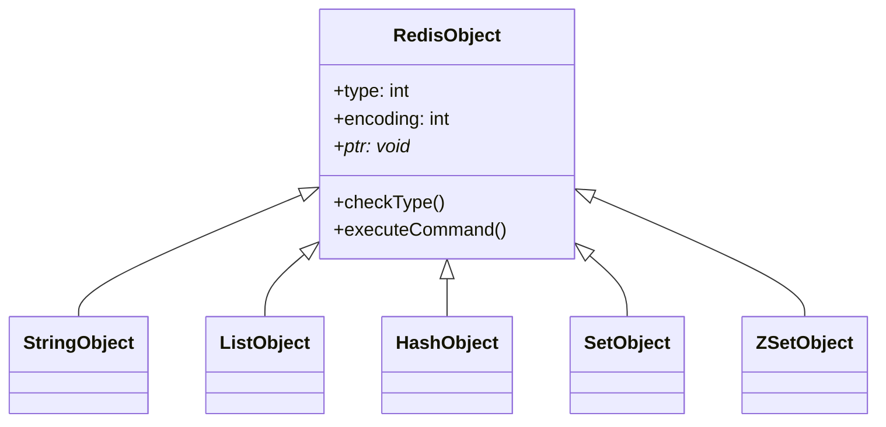
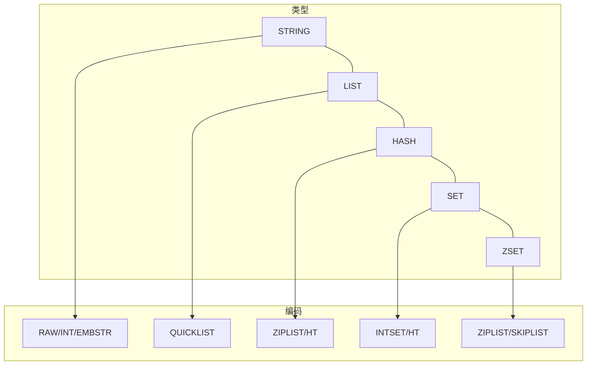
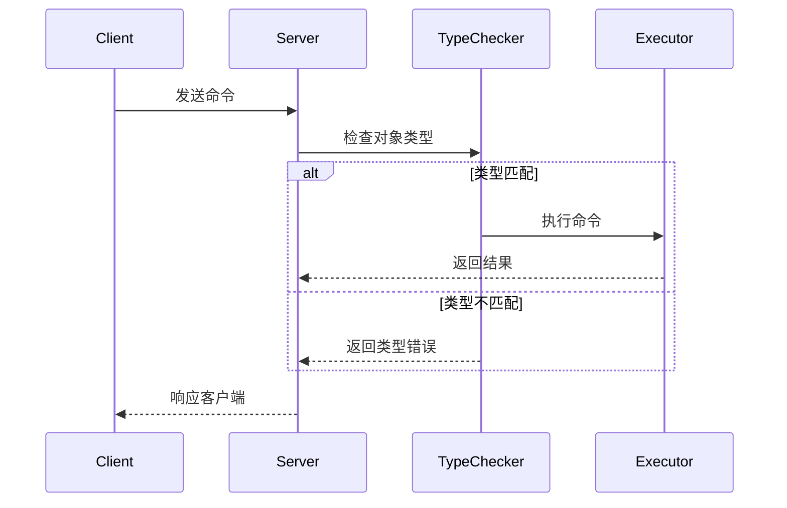
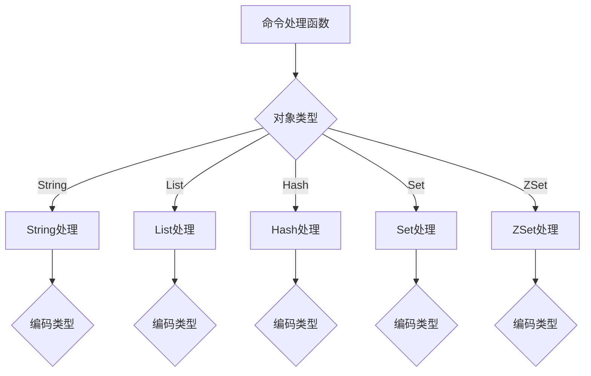
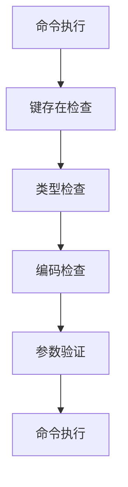
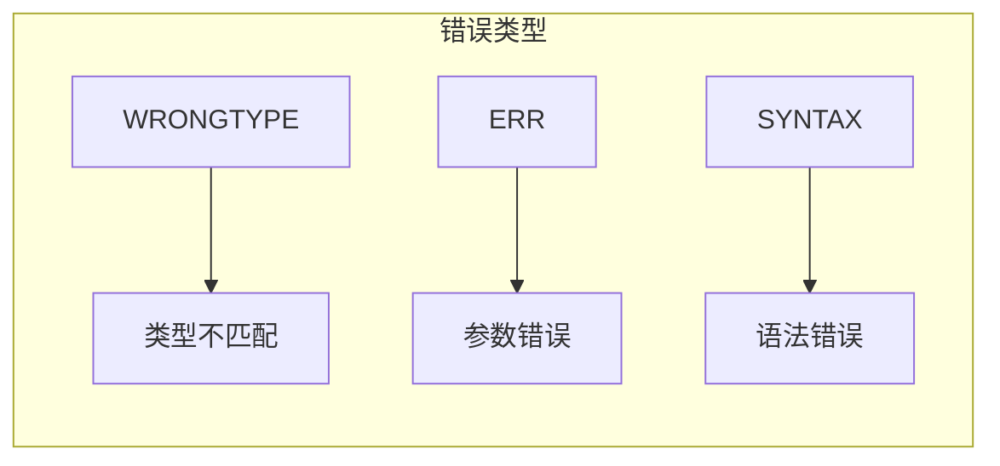

> **核心概念**：Redis通过类型检查机制确保命令在正确的数据类型上执行，并通过命令多态实现相同命令在不同编码上的差异化处理。这种设计既保证了类型安全，又提供了优秀的扩展性。

# 类型系统设计

## 对象类型层次



## 类型编码映射



# 类型检查机制

## 命令执行流程



## 类型检查实现

```c
int checkType(robj *o, int type) {
    if (o->type != type) {
        addReply(c, shared.wrongtypeerr);
        return 1;
    }
    return 0;
}
```

# 命令多态机制

## 多态分派结构



## 命令表结构

```c
struct redisCommand {
    char *name;                  // 命令名称
    redisCommandProc *proc;      // 命令实现函数
    int arity;                   // 参数个数
    uint64_t flags;             // 命令标志
    int firstkey;               // 第一个键的位置
    int lastkey;                // 最后一个键的位置
    int keystep;                // 键的步长
    long long microseconds;      // 统计信息
    long long calls;            // 调用次数
};
```

# 实现示例

## 1. GET命令的类型检查

```python
def GET(key):
    # 获取键对应的对象
    o = lookupKeyRead(db, key)
    if o is None:
        return None
        
    # 类型检查
    if o.type != REDIS_STRING:
        return TypeError("wrong type")
        
    # 根据编码调用相应的实现
    if o.encoding == REDIS_ENCODING_INT:
        return getIntValue(o)
    elif o.encoding == REDIS_ENCODING_EMBSTR:
        return getEmbstrValue(o)
    else:
        return getRawValue(o)
```

## 2. LPUSH命令的多态实现

```python
def LPUSH(key, value):
    # 获取或创建列表对象
    o = lookupKeyWrite(db, key)
    if o is None:
        o = createListObject()
        dbAdd(db, key, o)
    
    # 类型检查
    if o.type != REDIS_LIST:
        return TypeError("wrong type")
        
    # 根据编码调用相应的实现
    if o.encoding == REDIS_ENCODING_QUICKLIST:
        return quicklistPush(o.ptr, value, QUICKLIST_HEAD)
```

# 类型安全保证

## 类型检查层级



## 错误处理机制



# 性能优化

## 1. 命令查找优化

```c
// 命令表使用字典存储，实现O(1)查找
dict *commandTable;

// 命令查找
struct redisCommand *lookupCommand(sds name) {
    return dictFetchValue(server.commands, name);
}
```

## 2. 类型检查开销

命令执行时间分布：
$$T_{total} = T_{lookup} + T_{type\_check} + T_{execution}$$

其中：
- $T_{lookup}$: 命令查找时间，O(1)
- $T_{type\_check}$: 类型检查时间，O(1)
- $T_{execution}$: 实际执行时间，与命令复杂度相关

# 实践建议

1. **类型安全编程**
   - 始终进行类型检查
   - 使用合适的错误处理
   - 避免类型混用

2. **性能优化**
```python
# 不推荐
if isinstance(value, str):
    # 处理字符串
elif isinstance(value, int):
    # 处理整数
    
# 推荐
# 使用Redis内置的类型检查机制
```

1. **命令使用建议**
   - 使用正确的命令类型
   - 注意参数顺序
   - 处理错误响应

# 总结

Redis的类型检查与命令多态机制展示了一个优秀的类型系统设计：

2. 严格的类型检查确保安全性
3. 灵活的多态实现提供扩展性
4. 高效的分派机制保证性能
5. 统一的错误处理简化使用

> **设计启示**：Redis通过类型检查和命令多态实现了一个既安全又灵活的命令系统，这种设计在构建大型系统时值得借鉴。