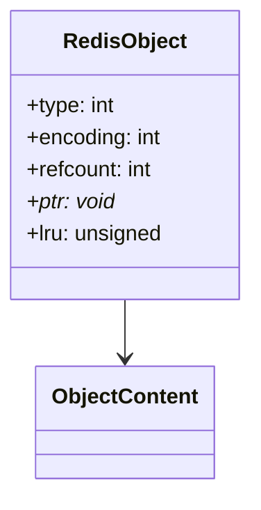
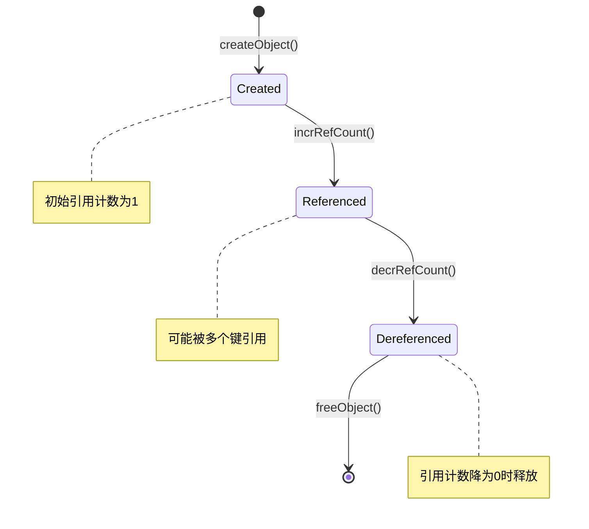
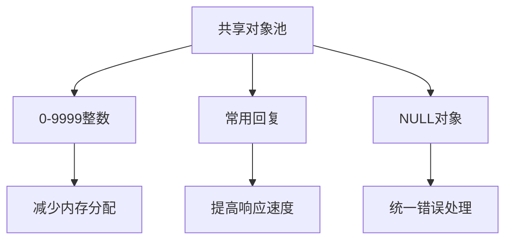
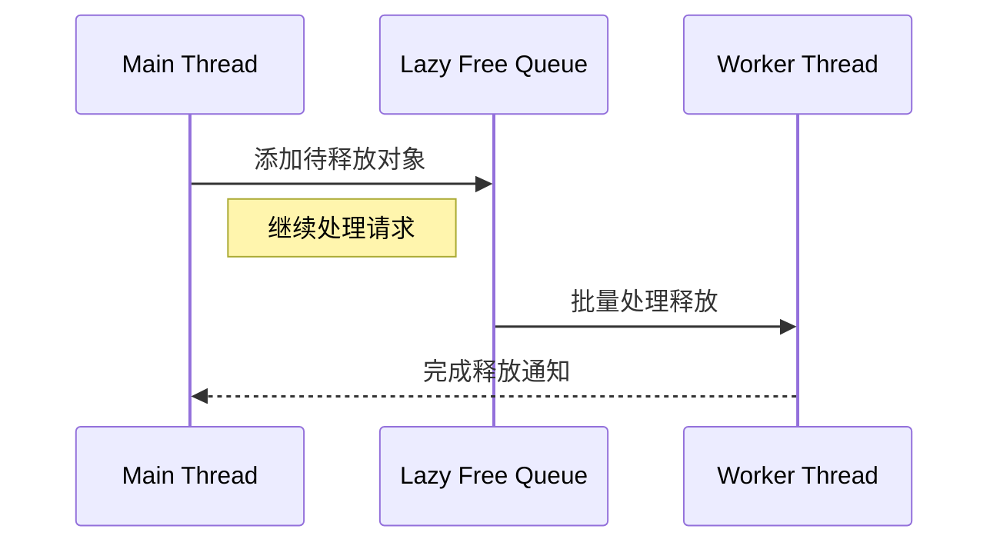
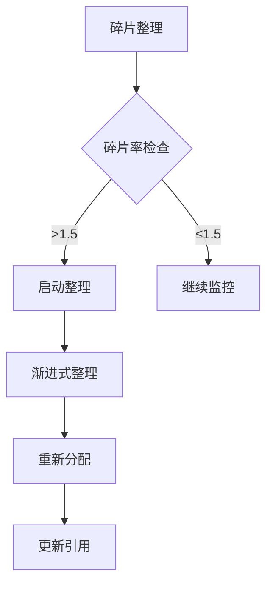
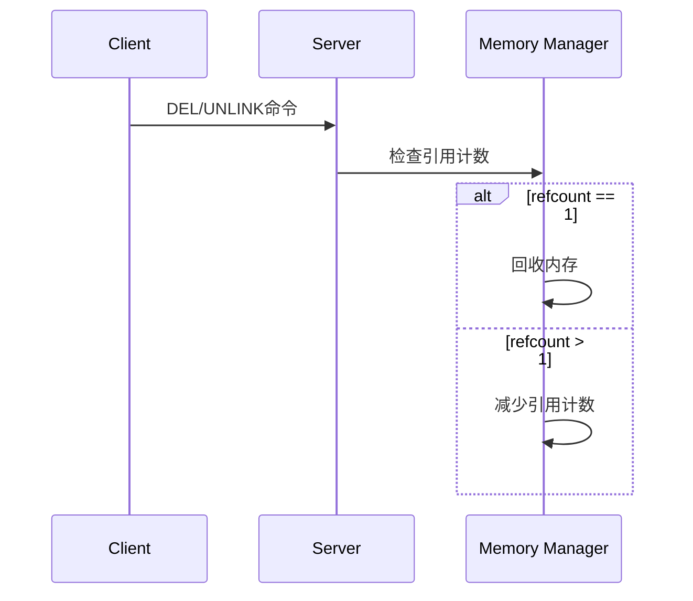
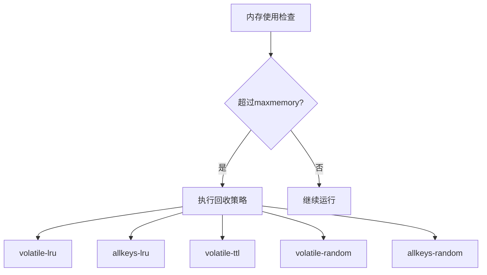

> **核心概念**：Redis采用引用计数和延迟释放相结合的方式管理内存，通过这种机制既保证了内存使用的安全性，又维持了优秀的性能特征。这种设计反映了Redis在实时性和资源管理之间寻求的精妙平衡。

# 内存管理的基础架构

## 引用计数系统

引用计数是Redis内存管理的核心机制，它通过对象头部的`refcount`字段跟踪对象的引用情况：



## 生命周期管理



# 引用计数实现机制

## 计数器操作

```c
void incrRefCount(robj *o) {
    o->refcount++;
}

void decrRefCount(robj *o) {
    if (o->refcount <= 0) return;
    if (--o->refcount == 0) {
        decrRefCountAsync(o);  // 异步释放
    }
}
```

## [[08 Redis 对象共享：优雅的内存优化艺术|共享对象池优化]]

Redis通过对象池优化小整数等常用对象的内存使用：



# 延迟释放机制

> **设计思想**：通过将内存释放操作延迟到空闲时执行，避免对主线程性能造成影响。

## 延迟队列实现



## 优化策略

延迟释放的处理策略：

$$
\text{处理时机} = \begin{cases}
\text{立即处理}, & \text{if } \text{mem\_usage} > \text{max\_memory} \\
\text{延迟处理}, & \text{if } \text{cpu\_idle} > \text{threshold} \\
\text{批量处理}, & \text{otherwise}
\end{cases}
$$

# 内存碎片处理

## 碎片率计算

```python
def get_fragmentation_ratio():
    used_memory = get_used_memory()
    rss_memory = get_rss_memory()
    return rss_memory / used_memory
```

## 碎片整理策略



# 内存回收的触发机制

## 1. 主动回收



## 2. [[01 Redis 内存淘汰策略：原理、实践与场景优化|被动回收]]

> **maxmemory策略**：当内存使用超过限制时，Redis会根据配置的策略进行回收。



# 实践建议

1. **内存配置优化**
```python
# 示例配置
maxmemory 2gb
maxmemory-policy volatile-lru
maxmemory-samples 5
```

2. **对象共享建议**
   - 适度使用共享对象
   - 注意引用计数的开销
   - 合理设置共享范围

3. **延迟释放配置**
```python
# 配置示例
lazyfree-lazy-eviction yes
lazyfree-lazy-expire yes
lazyfree-lazy-server-del yes
```

# 性能监控

## 监控指标

4. **内存使用**
   - used_memory
   - used_memory_rss
   - mem_fragmentation_ratio

5. **回收效率**
   - evicted_keys
   - expired_keys
   - lazyfree_pending_objects

# 总结

Redis的内存回收机制展现了一个成熟的内存管理系统的特点：

6. 精确的引用计数
7. 高效的延迟释放
8. 灵活的回收策略
9. 优秀的性能平衡

> **设计启示**：Redis的内存管理机制展示了如何在实时系统中平衡资源管理和性能需求。其核心思想是将不必要的开销延后处理，同时保持系统的响应性和可靠性。