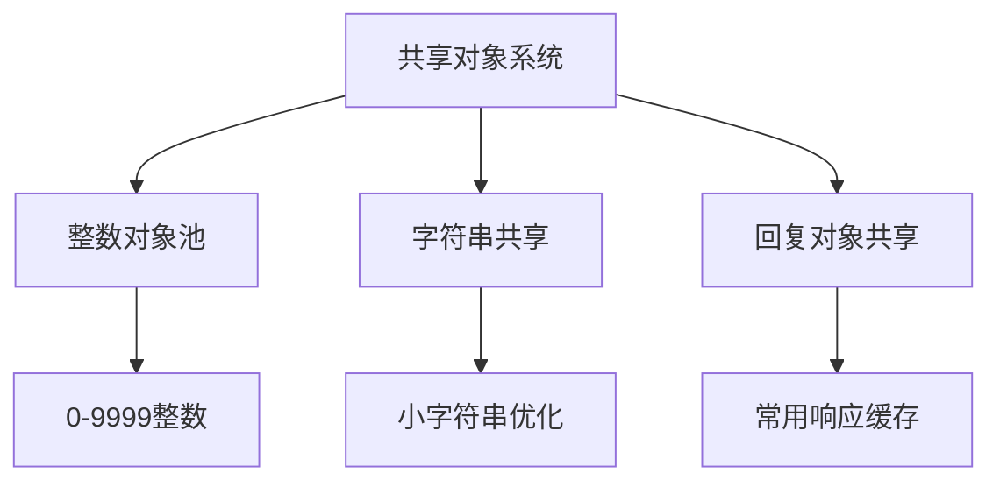
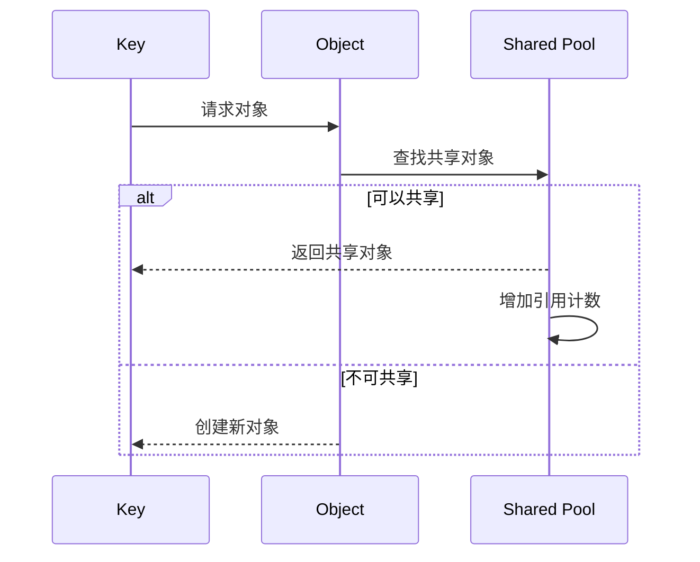
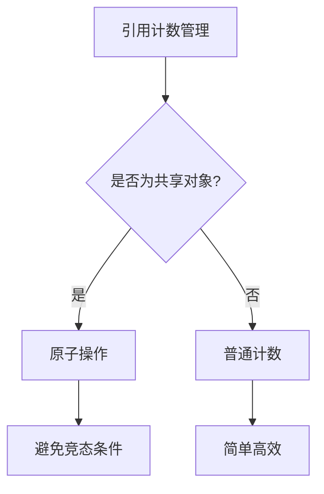
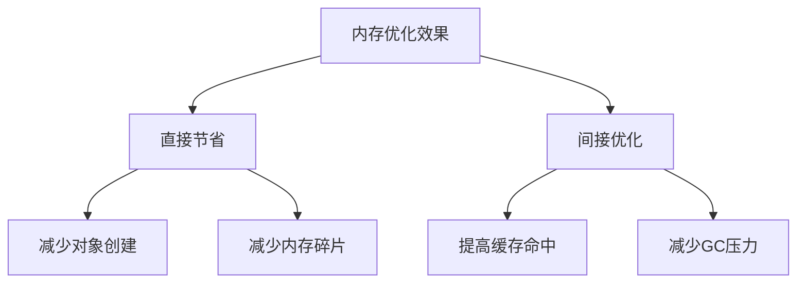

> **核心原理**：Redis的对象共享机制是一种优化内存使用的高级特性，它通过让多个键引用同一个对象来减少内存占用。这种看似简单的机制背后蕴含着对性能和复杂性的深度权衡。

# 共享对象系统设计

在Redis中，对象共享的实现围绕着一个核心问题展开：如何在内存效率和计算开销之间找到完美平衡？



## 共享策略的精妙设计

Redis采用了一种优雅的分层共享策略：

> **分层共享策略**: Redis根据对象的特征和使用频率，采用不同的共享策略
> 
> - **第一层**：静态整数池（0-9999）
> - **第二层**：常用响应对象
> - **第三层**：条件性字符串共享

# 整数对象池的实现

```c
// 初始化共享对象池
void createSharedObjects(void) {
    int j;
    // 创建0-9999的整数对象
    for (j = 0; j < REDIS_SHARED_INTEGERS; j++) {
        shared.integers[j] = createObject(REDIS_STRING, (void*)(long)j);
        shared.integers[j]->encoding = REDIS_ENCODING_INT;
    }
}
```

整数对象池的优化效果可以通过以下数学模型来理解：

$$
\text{内存节省} = N_{\text{引用}} \times (\text{对象头大小} + \text{数据大小}) - (\text{对象头大小} + \text{数据大小})
$$

其中，$N_{\text{引用}}$ 表示共享对象被引用的次数。

# 对象共享的实现机制

## 引用计数管理



## 共享条件判断

Redis在进行对象共享时会考虑以下因素：

1. **对象类型**
   ```python
   def can_share_object(obj):
       # 只有字符串对象可以共享
       if obj.type != REDIS_STRING:
           return False
           
       # 检查编码方式
       if obj.encoding == REDIS_ENCODING_INT:
           return True
           
       return False
   ```

2. **编码方式**
   ```mermaid
   graph TD
       A[检查编码] --> B{是否为整数编码?}
       B -->|是| C[可以共享]
       B -->|否| D[检查字符串长度]
       D -->|<=32字节| E[可以共享]
       D -->|>32字节| F[不共享]
   ```

# 性能优化策略

## 1. 查找优化

为了提高共享对象的查找效率，Redis采用了以下策略：

```python
def lookup_shared_object(value):
    # 整数优化
    if isinstance(value, int) and 0 <= value <= 9999:
        return shared.integers[value]
    
    # 其他类型需要额外检查
    return None
```

## 2. 引用计数管理优化



# 实践建议

## 1. 对象池配置

> **最佳实践**: 根据实际使用场景调整共享范围
> 
> - 整数范围：评估实际数据分布
> - 字符串长度：权衡内存和CPU开销
> - 共享策略：考虑访问模式

## 2. 性能监控

监控共享对象的使用情况：

```python
def monitor_shared_objects():
    stats = {
        'shared_integers': count_shared_integers(),
        'reference_all': count_all_references(),
        'memory_saved': calculate_memory_saved()
    }
    return stats
```

## 3. 优化建议

1. **合理使用整数**
   ```python
   # 推荐
   redis.set("counter", 1)  # 使用共享对象
   
   # 不推荐
   redis.set("counter", "1")  # 创建新字符串对象
   ```

2. **避免大对象共享**
   ```python
   # 对于大字符串，直接存储
   redis.set("large_key", large_value)
   ```

# 内存优化效果分析

共享对象的内存优化效果：



# 总结

Redis对象共享机制展示了一个精妙的内存优化方案：

1. 智能的共享策略
2. 高效的引用计数
3. 优秀的性能平衡
4. 实用的优化效果

> **设计启示**：Redis对象共享机制的设计展示了如何通过识别和复用常见模式来优化系统性能。这种"少即是多"的设计哲学值得在其他系统设计中借鉴。