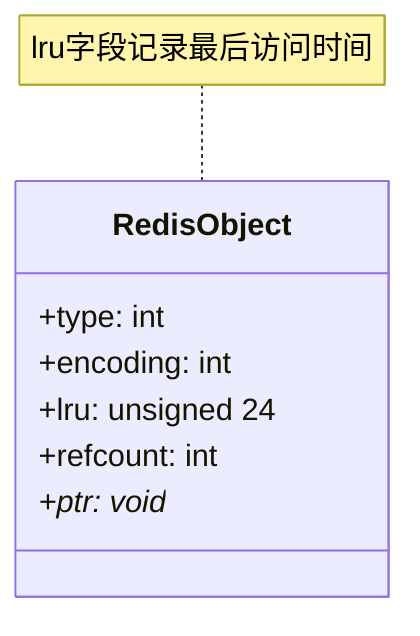
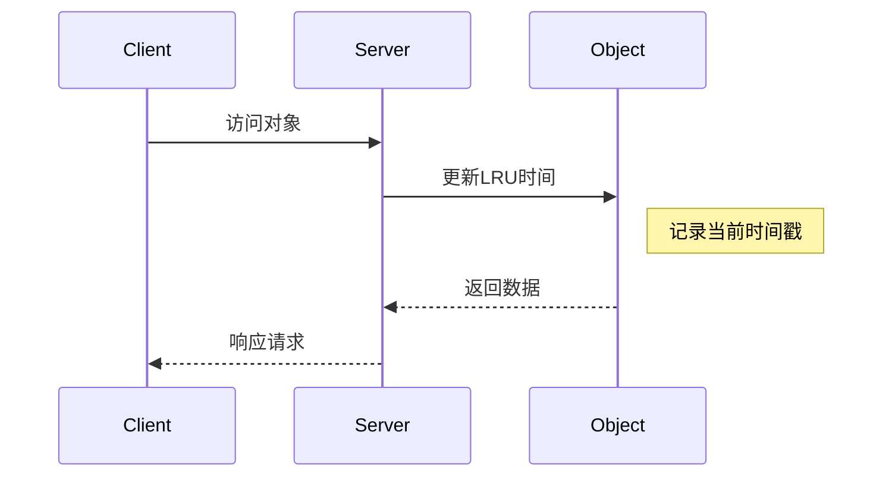
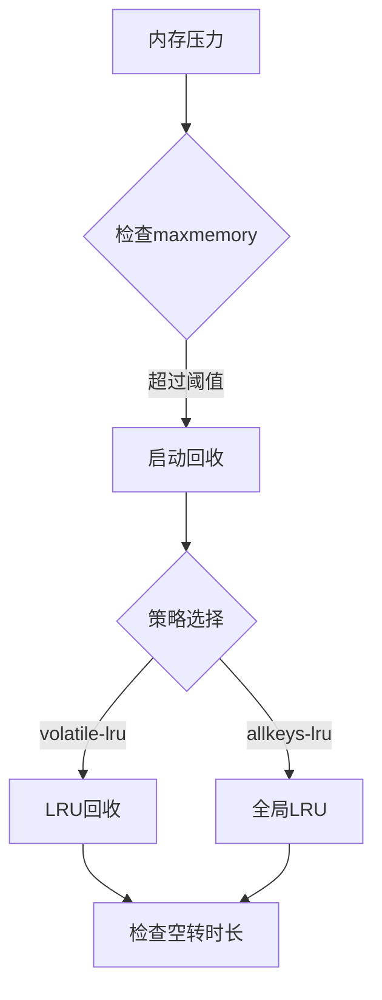
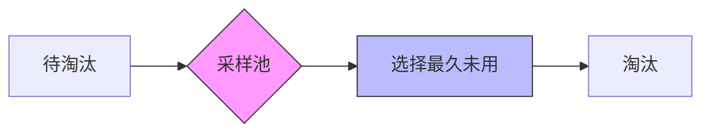

> **核心概念**：对象空转时长（Object Idleness Time）是Redis中一个优雅而强大的内存管理机制。它通过在对象头部记录最后一次访问的时间，为内存回收策略提供了精确的决策依据。这种设计体现了Redis在实时性和资源效率之间的巧妙平衡。

# 设计哲学与实现原理

在Redis的内存管理体系中，对象空转时长机制承担着"时间记录者"的角色。它通过在每个对象中嵌入一个简洁而精确的时间戳，为内存回收决策提供了可靠的事实依据。



## 时间记录的精妙设计

Redis在对象头部使用24位存储LRU信息，这个看似简单的设计背后蕴含着深思熟虑：

```c
// 对象头部结构中的LRU时间戳
typedef struct redisObject {
    unsigned type:4;
    unsigned encoding:4;
    unsigned lru:24;  // LRU时间或LFU计数器
    int refcount;
    void *ptr;
} robj;
```

> **位域优化**：通过将LRU信息压缩到24位，Redis在保证足够时间精度的同时，最小化了内存占用。这24位可以表示194天的时间范围，对于缓存场景来说绰绰有余。

# 时间更新机制



## 时间更新策略

Redis采用了一种智能的时间更新策略：

$$
P(\text{更新}) = \frac{1}{\text{REDIS\_LRU\_BITS}} \approx 0.04
$$

这种概率性更新机制有效降低了写入开销，同时保持了合理的时间精度。

# 空转时长的应用

## 1. 内存回收决策



## 2. 冷热数据分析

Redis通过对象的空转时长来识别冷热数据：

```python
def get_idle_time(key):
    # 获取对象
    obj = get_object(key)
    if obj is None:
        return None
    
    # 计算空转时长
    current_time = get_current_time()
    return current_time - obj.lru
```

# 性能优化机制

## 1. 采样优化

为了提高效率，Redis在进行LRU淘汰时采用采样机制：



采样数量的设置遵循：

$$
\text{采样效果} = 1 - \left(1 - \frac{1}{N}\right)^{n}
$$

其中：
- N 为总键数量
- n 为采样数量

## 2. 时间精度优化

```python
def update_lru(obj):
    current_time = get_current_time()
    
    # 概率性更新，降低写入压力
    if random.random() < LRU_UPDATE_PROBABILITY:
        obj.lru = current_time & ((1 << 24) - 1)  # 24位掩码
```

# 实践建议

## 1. 监控配置

```python
# 监控空转时长
def monitor_idle_objects(threshold_seconds):
    idle_stats = {
        'total': 0,
        'idle': 0
    }
    
    for key in scan_keys():
        idle_time = get_idle_time(key)
        if idle_time > threshold_seconds:
            idle_stats['idle'] += 1
        idle_stats['total'] += 1
    
    return idle_stats
```

## 2. 优化建议

1. **合理配置采样数**
```python
# redis.conf
maxmemory-samples 10  # 权衡准确性和性能
```

2. **监控空转时长分布**
```python
# 统计空转时长分布
def analyze_idle_distribution():
    ranges = [3600, 86400, 604800]  # 1小时、1天、1周
    stats = {range: 0 for range in ranges}
    
    # 统计分布
    for key in scan_keys():
        idle_time = get_idle_time(key)
        for range in ranges:
            if idle_time <= range:
                stats[range] += 1
                break
    
    return stats
```

# 总结

Redis的对象空转时长机制展现了一个精妙的系统设计：

1. **优雅的时间记录**
   - 紧凑的内存布局
   - 高效的更新策略
   - 精确的时间追踪

2. **智能的优化机制**
   - 概率性更新
   - 采样淘汰
   - 位域压缩

> **设计启示**：Redis的空转时长机制展示了如何在有限的资源约束下实现高效的功能。其核心思想是通过巧妙的概率机制和采样策略，在精度和性能之间找到最佳平衡点。这种设计思路在构建大规模系统时具有普遍的参考价值。