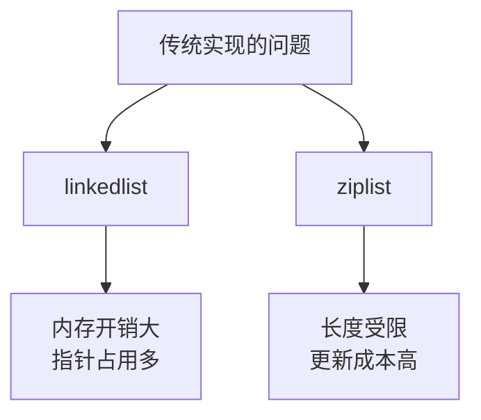
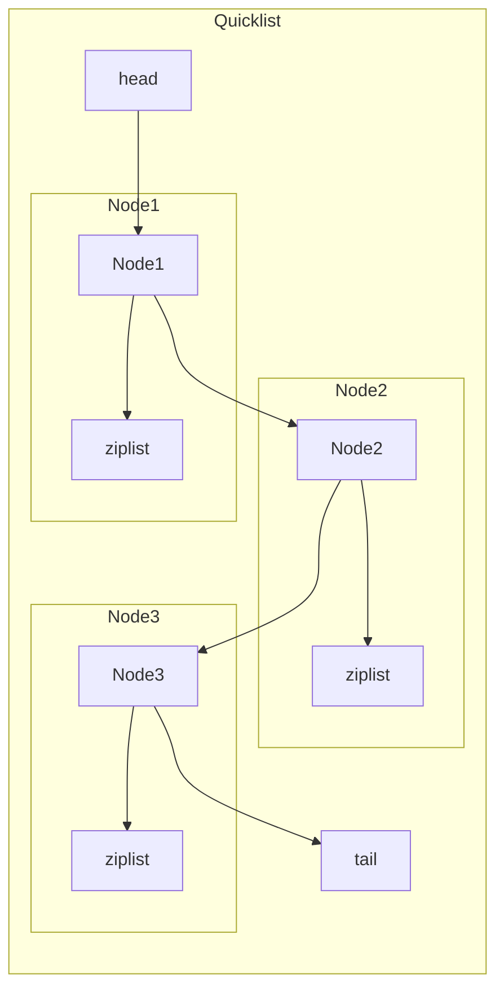
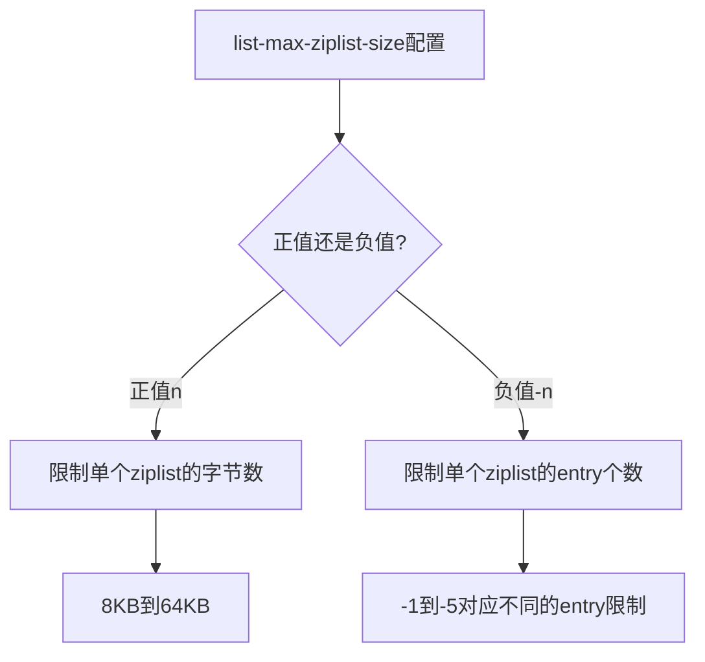
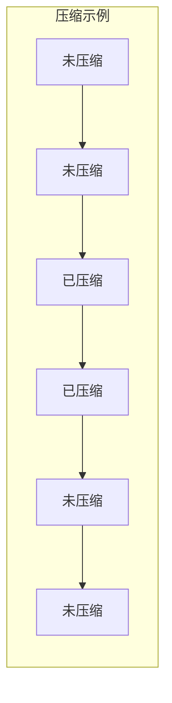
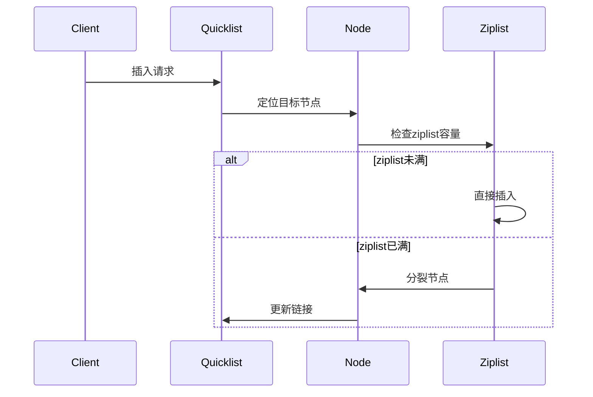

> **核心概念**：Quicklist是Redis 3.2版本后推出的列表对象底层实现，它本质上是一个由多个ziplist组成的双向链表。这种混合设计既保留了链表的灵活性，又兼顾了ziplist的内存效率。

# 为什么需要Quicklist？

在引入Quicklist之前，Redis的列表对象面临以下问题：



## 性能对比

| 特性 | 双向链表 | 压缩列表 | Quicklist |
|-----|---------|----------|-----------|
| 内存开销 | 高 | 低 | 中等 |
| 访问速度 | $O(1)$ | $O(N)$ | $O(1)$ |
| 插入删除 | 高效 | 可能需要内存重分配 | 局部高效 |
| 内存碎片 | 多 | 少 | 较少 |

# Quicklist的结构设计



## 核心数据结构

```c
// quicklist结构
typedef struct quicklist {
    quicklistNode *head;     // 头节点指针
    quicklistNode *tail;     // 尾节点指针
    unsigned long count;     // 所有ziplist中的总元素数量
    unsigned long len;       // quicklistNode节点数量
    int fill : 16;          // ziplist大小限制
    unsigned int compress : 16;  // LZF压缩深度
} quicklist;

// quicklistNode结构
typedef struct quicklistNode {
    struct quicklistNode *prev;  // 前驱节点
    struct quicklistNode *next;  // 后继节点
    unsigned char *zl;          // 指向ziplist的指针
    unsigned int sz;           // ziplist的字节大小
    unsigned int count : 16;   // ziplist中的元素数量
    unsigned int encoding : 2; // RAW=1 or LZF=2
    unsigned int container : 2;// NONE=1 or ZIPLIST=2
    unsigned int recompress : 1;// 是否需要重新压缩
    unsigned int attempted_compress : 1; // 是否尝试过压缩
    unsigned int extra : 10;   // 预留字段
} quicklistNode;
```

# 优化策略

## 1. 节点大小控制



## 2. 压缩策略

Quicklist通过list-compress-depth参数控制压缩：



压缩规则：
- depth=0：不压缩
- depth=1：首尾各1个节点不压缩
- depth=2：首尾各2个节点不压缩
- 以此类推

# 主要操作实现

## 1. 插入操作



## 2. 删除操作

```python
def quicklist_delete(quicklist, node, entry):
    # 从ziplist中删除entry
    ziplist_delete(node.zl, entry)
    
    # 检查是否需要合并
    if node.count == 0:
        # 删除空节点
        quicklist_delete_node(quicklist, node)
    elif node.count < threshold and (prev or next):
        # 尝试与相邻节点合并
        quicklist_merge_nodes(quicklist, node)
```

# 内存优化

## 1. 空间效率

对于一个包含n个元素的列表：
- 双向链表：$O(n)$个指针开销
- 纯ziplist：$O(1)$的头部开销，但有长度限制
- Quicklist：$O(n/m)$个指针开销，m为每个ziplist的平均长度

## 2. 配置优化

```python
# 优化配置示例
redis_conf = {
    'list-max-ziplist-size': -2,  # 每个节点最多8KB
    'list-compress-depth': 1      # 首尾各1个节点不压缩
}
```

# 最佳实践

1. **配置建议**
   - 小数据量：使用较大的ziplist大小限制
   - 大数据量：设置适中的压缩深度
   - 频繁访问：减少压缩比例

2. **使用场景**
   - 消息队列
   - 最新N条记录
   - 分页数据缓存

3. **性能优化**
   ```python
   # 批量操作优化
   # 不推荐
   for item in items:
       redis.lpush("mylist", item)
   
   # 推荐
   redis.lpush("mylist", *items)
   ```

# 总结

Quicklist通过结合ziplist和链表的优点，实现了一个兼具空间效率和操作灵活性的数据结构。其核心优势在于：

1. 平衡的内存使用
2. 可控的压缩策略
3. 灵活的节点管理
4. 优秀的局部性

> **设计启示**：Quicklist的设计展示了如何通过组合基本数据结构来创建更高效的复合结构。这种混合设计的思路值得在其他系统设计中借鉴。