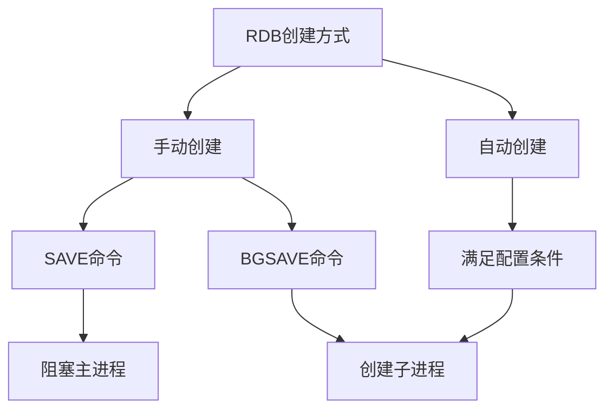
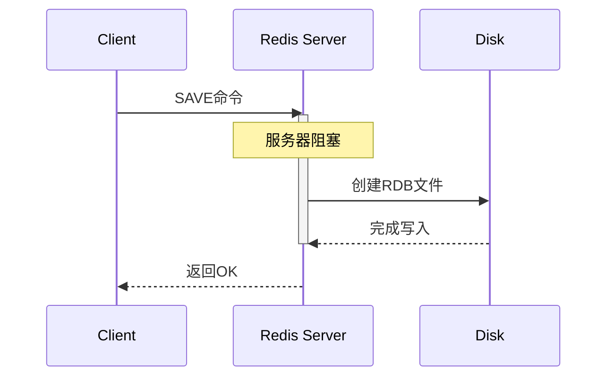
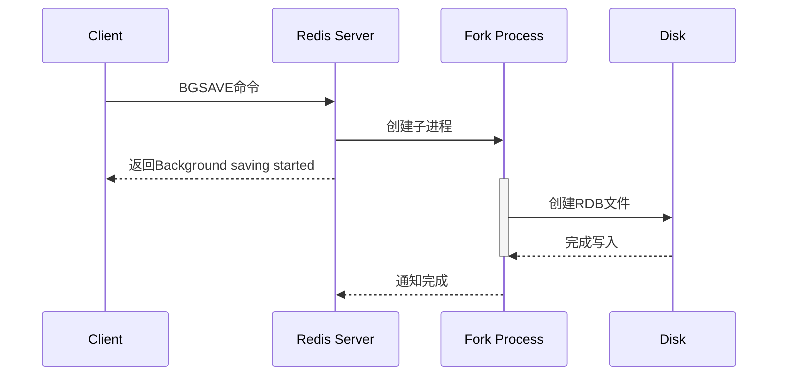
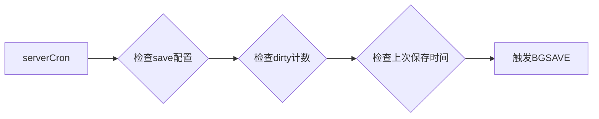
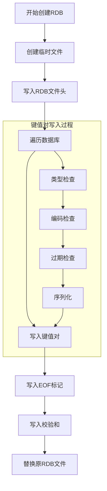
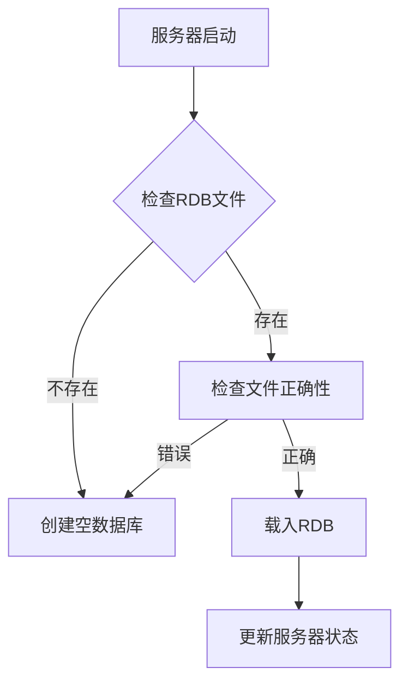
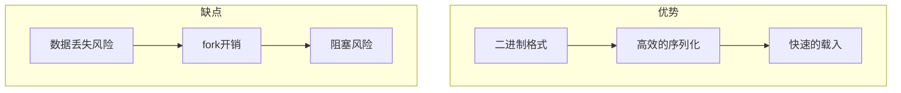

> **核心概念**：RDB（Redis Database）持久化是Redis提供的一种将内存数据保存到磁盘的机制。它通过创建数据快照（snapshot）的方式，在某个时间点将数据库的所有数据以二进制格式保存到磁盘文件中。

# 创建机制

RDB文件的创建有两种触发方式：



## 1. 手动创建

### SAVE命令


### BGSAVE命令


## 2. 自动间隔保存机制

Redis通过serverCron函数周期性执行检查，判断是否需要执行自动保存：



自动保存条件使用以下格式配置：
```
save <seconds> <changes>
```

例如常见配置：
```
save 900 1      # 900秒内至少1个key变化
save 300 10     # 300秒内至少10个key变化
save 60 10000   # 60秒内至少10000个key变化
```

## 3. RDB文件创建流程



# 载入机制

RDB文件的载入是在Redis服务器启动时自动执行的，过程如下：



## 载入流程详解

1. **文件校验**
   - 检查文件头：魔数（REDIS）
   - 版本号验证
   - 校验和验证

2. **数据解析过程**
   $$
   \text{解析步骤} = \begin{cases}
   \text{读取类型} \rightarrow \text{读取key} \rightarrow \text{读取value} & \text{if 未到EOF} \\
   \text{完成载入} & \text{if 到达EOF}
   \end{cases}
   $$

## 性能特征分析



# 最佳实践建议

1. **配置建议**
```python
# redis.conf配置示例
save 900 1       # 保守配置
save 300 10
save 60 10000

# 对于高并发场景
save 900 10      # 更宽松的条件
save 300 100
save 60 100000
```

2. **内存管理**
- 确保系统有足够的内存进行fork操作
- 预留至少与数据量相等的空闲内存

3. **监控指标**
```python
# 需要监控的关键指标
info = {
    "rdb_last_save_time": "最后一次成功保存的时间戳",
    "rdb_changes_since_last_save": "距离最后一次成功保存的变化量",
    "rdb_bgsave_in_progress": "后台保存是否正在进行",
    "rdb_last_bgsave_status": "最后一次保存是否成功",
    "rdb_last_bgsave_time_sec": "最后一次保存所耗费的时间(秒)"
}
```

# 总结

RDB持久化机制通过创建内存快照的方式实现数据持久化，其特点是：

1. **高效性**: 二进制格式，载入速度快
2. **紧凑性**: 单文件方式，便于管理和备份
3. **灵活性**: 支持多种触发方式
4. **原子性**: 通过临时文件确保一致性

> **注意事项**: 在使用RDB时，需要权衡数据安全性和性能需求，合理配置自动保存条件，并确保系统资源充足。