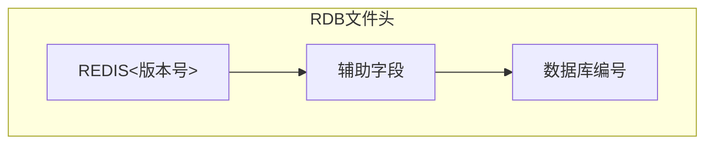
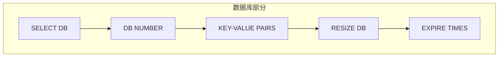
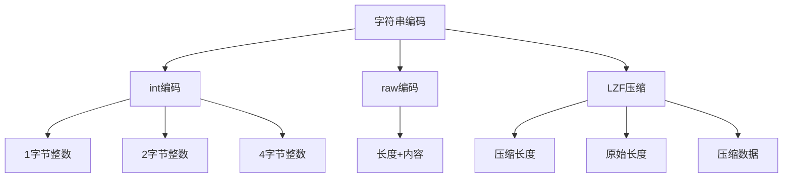
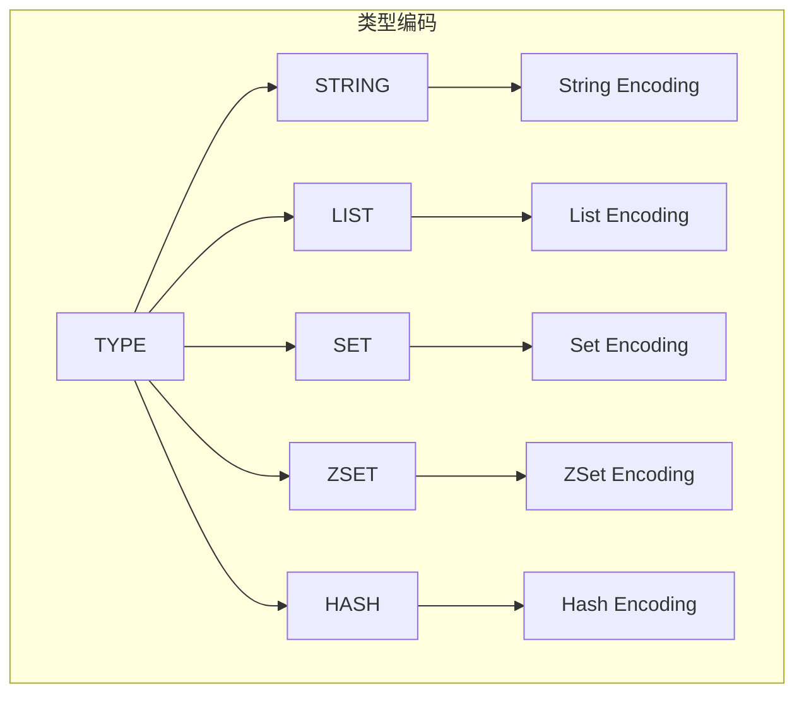

> **核心概念**：RDB文件是一个经过精心设计的二进制格式文件，它通过特定的编码方式将Redis数据库的键值对数据和元数据组织成一个紧凑的文件格式。

# RDB文件结构

## 1. 文件总体布局


## 2. 文件头部结构

文件以 "REDIS" 字符串开头，后跟版本号：



详细的字节布局：
```
+-------+-------------+---------+
| REDIS | VERSION(4B) | AUX(变长) |
+-------+-------------+---------+
   5B        4B         N bytes
```

## 3. 数据编码格式

Redis使用不同的编码类型来优化存储空间：


## 4. 数据库结构



每个键值对的存储格式：
$$
\text{Entry} = \text{ExpireTime}_{\text{optional}} + \text{Type} + \text{Key} + \text{Value}
$$

# 文件分析方法

## 1. 二进制分析工具

```python
class RDBAnalyzer:
    def __init__(self, filename):
        self.filename = filename
        self.offset = 0
        
    def read_magic(self):
        """读取魔数"""
        magic = self.read_bytes(5)
        if magic != b'REDIS':
            raise ValueError("Not a valid RDB file")
    
    def read_version(self):
        """读取版本号"""
        version = self.read_bytes(4)
        return version.decode()
    
    def read_length(self):
        """读取长度编码"""
        byte = self.read_byte()
        if byte & 0b11000000 == 0b00000000:
            return byte & 0b00111111
        elif byte & 0b11000000 == 0b01000000:
            next_byte = self.read_byte()
            return ((byte & 0b00111111) << 8) | next_byte
        # ... 其他长度编码情况
```

## 2. 字符串编码分析

字符串可能使用以下几种编码方式：



编码判断逻辑：
```python
def analyze_string(self):
    encoding = self.read_byte()
    if encoding & 0b11000000 == 0b00000000:
        # 长度编码
        length = encoding & 0b00111111
        return self.read_bytes(length)
    elif encoding & 0b11100000 == 0b11000000:
        # 整数编码
        if encoding == 0xc0:
            return int.from_bytes(self.read_bytes(1), 'little')
        elif encoding == 0xc1:
            return int.from_bytes(self.read_bytes(2), 'little')
        # ... 其他整数编码
```

## 3. 数据类型分析

不同数据类型的存储格式：



## 4. 过期时间分析

过期时间的存储格式：
```
+----------+------------------+
| EXPIRETIME_MS | 8 bytes    |
+----------+------------------+
| Key-Value Pair             |
+-----------------------------+
```

# RDB文件分析工具

## 1. 基础分析脚本

```python
def analyze_rdb(filename):
    """分析RDB文件的基本结构"""
    with open(filename, 'rb') as f:
        # 检查魔数
        magic = f.read(5)
        assert magic == b'REDIS'
        
        # 读取版本号
        version = f.read(4)
        print(f"RDB Version: {version}")
        
        # 分析数据库内容
        while True:
            byte = f.read(1)
            if byte == EOF:
                break
            if byte == SELECTDB:
                db_num = read_length(f)
                print(f"Database: {db_num}")
            # ... 继续分析
```

## 2. 统计信息收集

```python
class RDBStats:
    def __init__(self):
        self.key_count = 0
        self.type_stats = defaultdict(int)
        self.size_stats = defaultdict(int)
        
    def analyze_key(self, key, type, size):
        self.key_count += 1
        self.type_stats[type] += 1
        self.size_stats[size_range(size)] += 1
```

# 实践建议

1. **分析工具使用**
   - 使用redis-rdb-tools进行快速分析
   - 对于特定需求，编写自定义分析脚本

2. **性能优化**
   - 关注大key的分布
   - 监控不同编码类型的使用情况
   - 分析内存使用效率

3. **监控指标**
```python
monitoring_metrics = {
    "key_count": "键总数",
    "type_distribution": "类型分布",
    "size_distribution": "大小分布",
    "encoding_stats": "编码统计",
    "expire_stats": "过期统计"
}
```

# 总结

RDB文件结构是Redis持久化机制的核心，它通过精心设计的二进制格式实现了：

1. 高效的数据存储
2. 灵活的编码方式
3. 可靠的文件格式
4. 便于分析和处理

> **注意事项**：在分析RDB文件时，需要注意文件格式的版本兼容性，以及不同编码方式的处理逻辑。同时，要特别关注大key的存在，因为它们可能影响性能和内存使用。