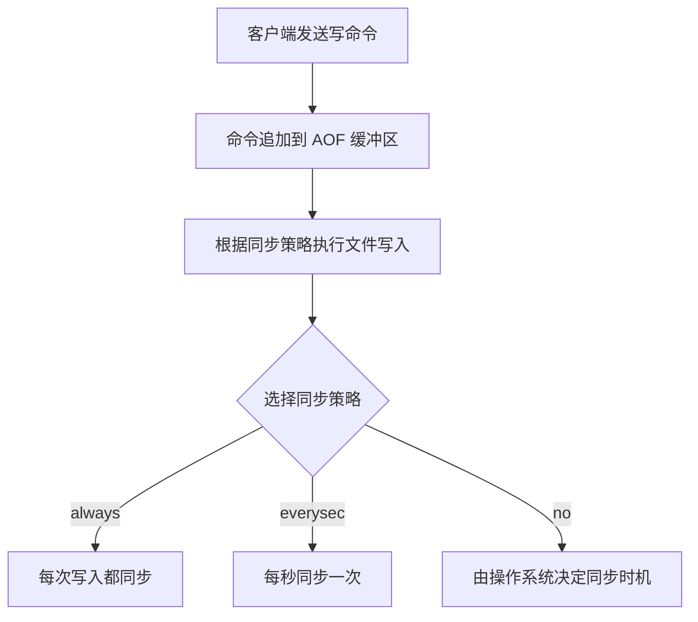
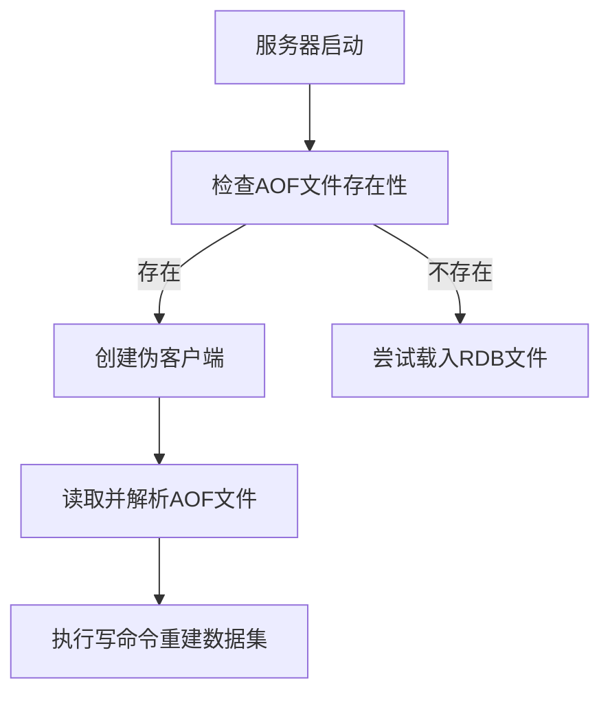
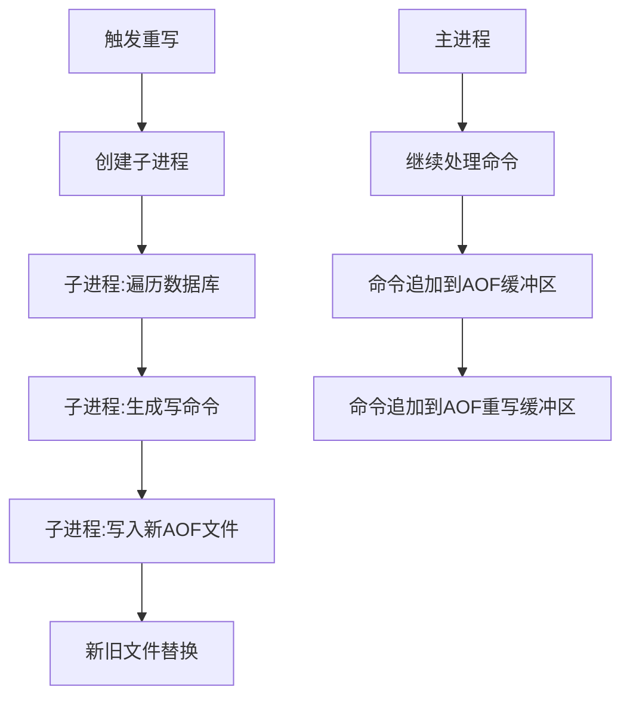
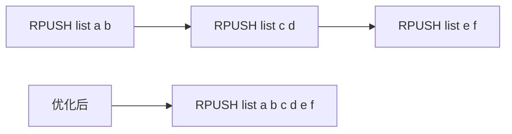
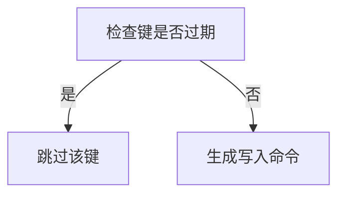

> **核心概念**：AOF (Append Only File) 持久化是 Redis 的主要持久化机制之一，它通过记录服务器执行的所有写命令来实现数据持久化，借此在服务器重启时能够重建数据集。

# 1. AOF 持久化的实现原理

AOF 持久化机制主要包含三个关键步骤：命令追加（append）、文件写入（write）和文件同步（sync）。



## 1.1 命令追加过程

```mermaid
sequenceDiagram
    participant Client as 客户端
    participant Server as Redis服务器
    participant AOF as AOF缓冲区
    participant File as AOF文件
    
    Client->>Server: SET mykey "Hello"
    Server->>Server: 执行命令
    Server->>AOF: 追加命令到缓冲区
    Note over AOF: *2\r$3\r
SET\r\n$5\r\nmykey\r\n$5\r\nHello\r\n
    AOF->>File: 根据同步策略写入文件
```

## 1.2 同步策略分析

三种同步策略的特点对比：

| 策略 | 安全性 | 性能 | 适用场景 |
|-----|-------|------|---------|
| always | 最高 | 最差 | 数据安全性要求极高 |
| everysec | 中等 | 适中 | 建议使用，平衡性能和安全性 |
| no | 最低 | 最好 | 对数据安全性要求不高 |

性能与安全性的关系可以表示为：

$$
\text{Performance} \propto \frac{1}{\text{Safety}}
$$

# 2. AOF 文件载入与数据还原

AOF 文件的载入和数据还原过程是一个复杂的步骤序列：



## 2.1 载入流程详解

1. **文件完整性检查**：
   ```mermaid
   graph LR
       A[读取AOF文件] --> B{文件是否完整}
       B -->|是| C[开始解析命令]
       B -->|否| D[尝试恢复损坏的AOF文件]
       D --> E{恢复是否成功}
       E -->|是| C
       E -->|否| F[启动失败]
   ```

2. **命令还原过程**：

命令在内存中的重建过程可以表示为：

$$
D_{final} = D_0 + \sum_{i=1}^{n} C_i
$$

其中：
- $D_{final}$ 是最终的数据集
- $D_0$ 是初始空数据集
- $C_i$ 是第 i 个命令产生的数据变更

# 3. AOF 重写机制

> **重写目的**：通过创建新的 AOF 文件来替代现有的 AOF 文件，达到压缩文件体积的目的。

## 3.1 重写触发条件

AOF 重写的触发条件可以用以下公式表示：

$$
\text{Trigger} = \begin{cases}
\text{true}, & \text{if } \frac{\text{current\_size}}{\text{base\_size}} \geq \text{growth\_rate} \\
\text{false}, & \text{otherwise}
\end{cases}
$$

## 3.2 重写流程



## 3.3 重写优化策略

1. **命令合并优化**:


2. **过期键优化**:


# 4. 最佳实践建议

1. **同步策略选择**：
   - 默认推荐使用 `everysec`
   - 如果使用 SSD，可以考虑 `always`
   - 避免使用 `no`，除非特殊场景

2. **重写参数配置**：
```bash
# 示例配置
auto-aof-rewrite-min-size 64mb
auto-aof-rewrite-percentage 100
```

3. **性能优化**：
   ```mermaid
   graph TD
       A[性能优化] --> B[合理配置同步策略]
       A --> C[调整重写触发条件]
       A --> D[使用管道压缩命令]
       B --> E[监控性能指标]
       C --> E
       D --> E
   ```

# 总结

Redis 的 AOF 持久化机制通过记录写命令来实现数据持久化，是一个兼顾数据安全性和性能的解决方案。它的实现涉及命令追加、文件同步和重写优化等多个环节，通过合理的配置可以在不同场景下获得最佳的性能表现。

> **设计思想**：AOF 机制展现了 Redis 在数据持久化方面的精心设计，通过灵活的策略配置和优化机制，让用户能够根据实际需求在数据安全性和性能之间找到最佳平衡点。