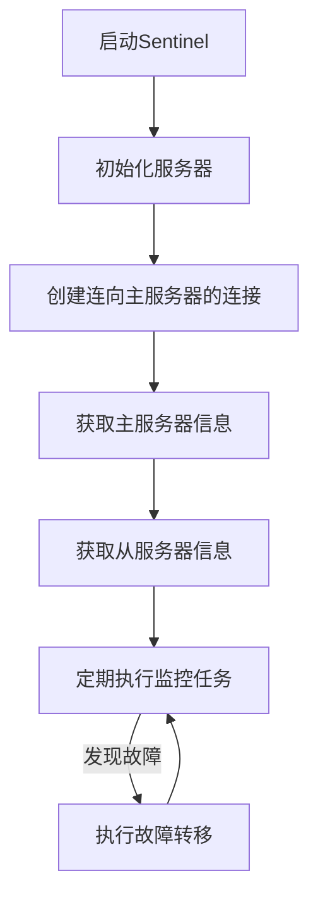
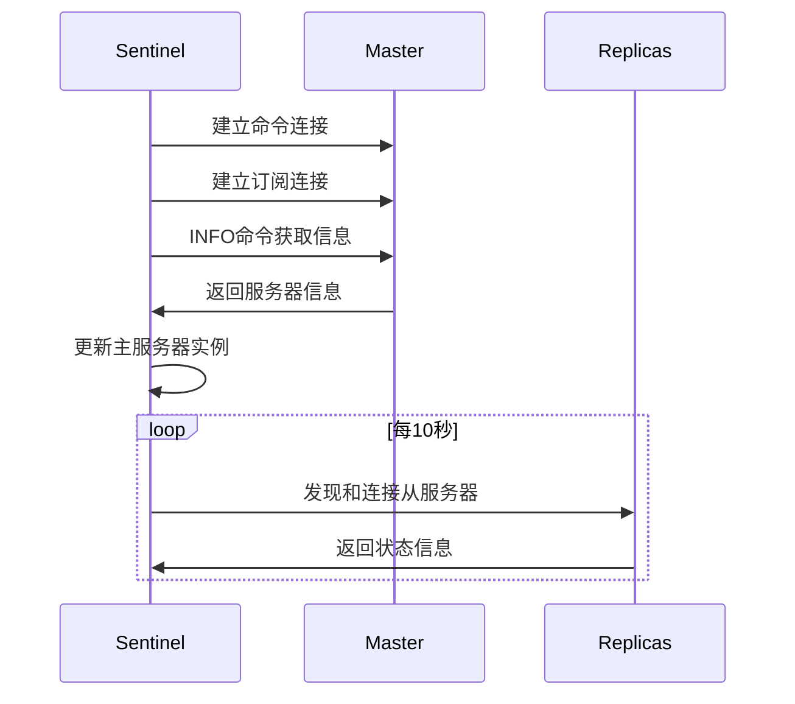
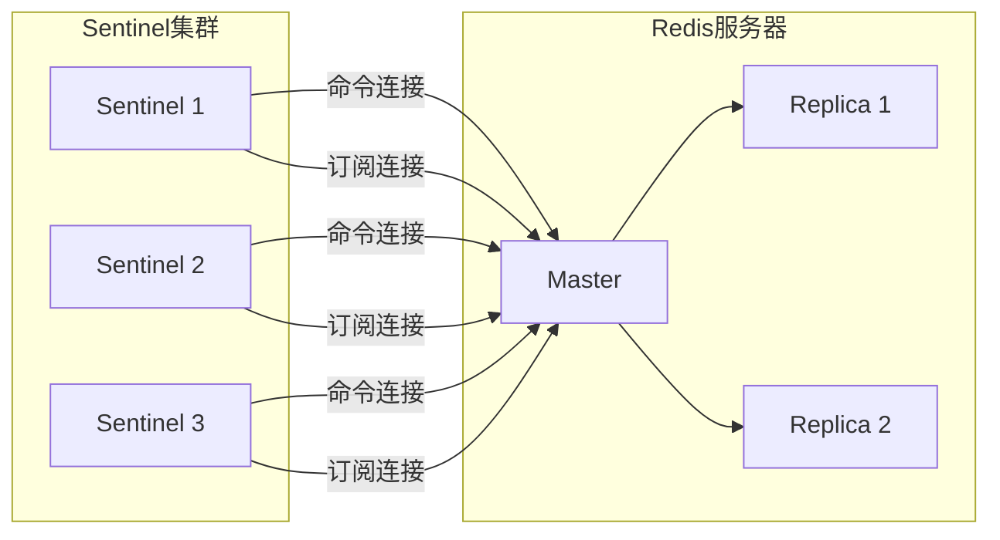
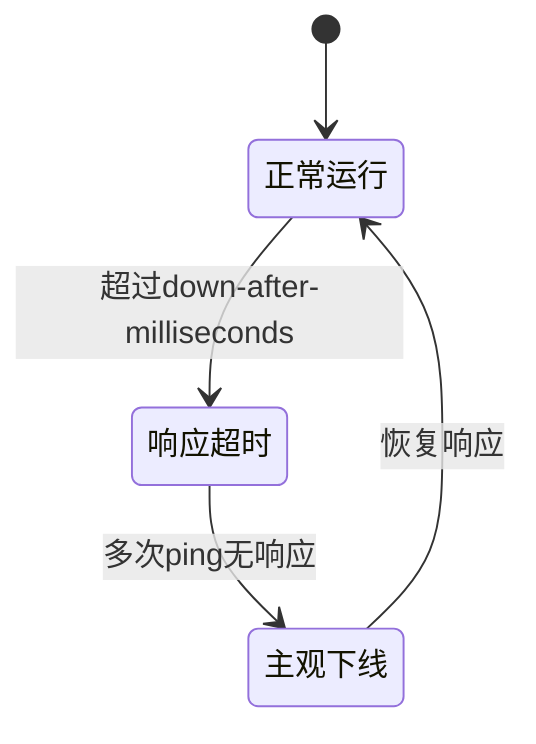
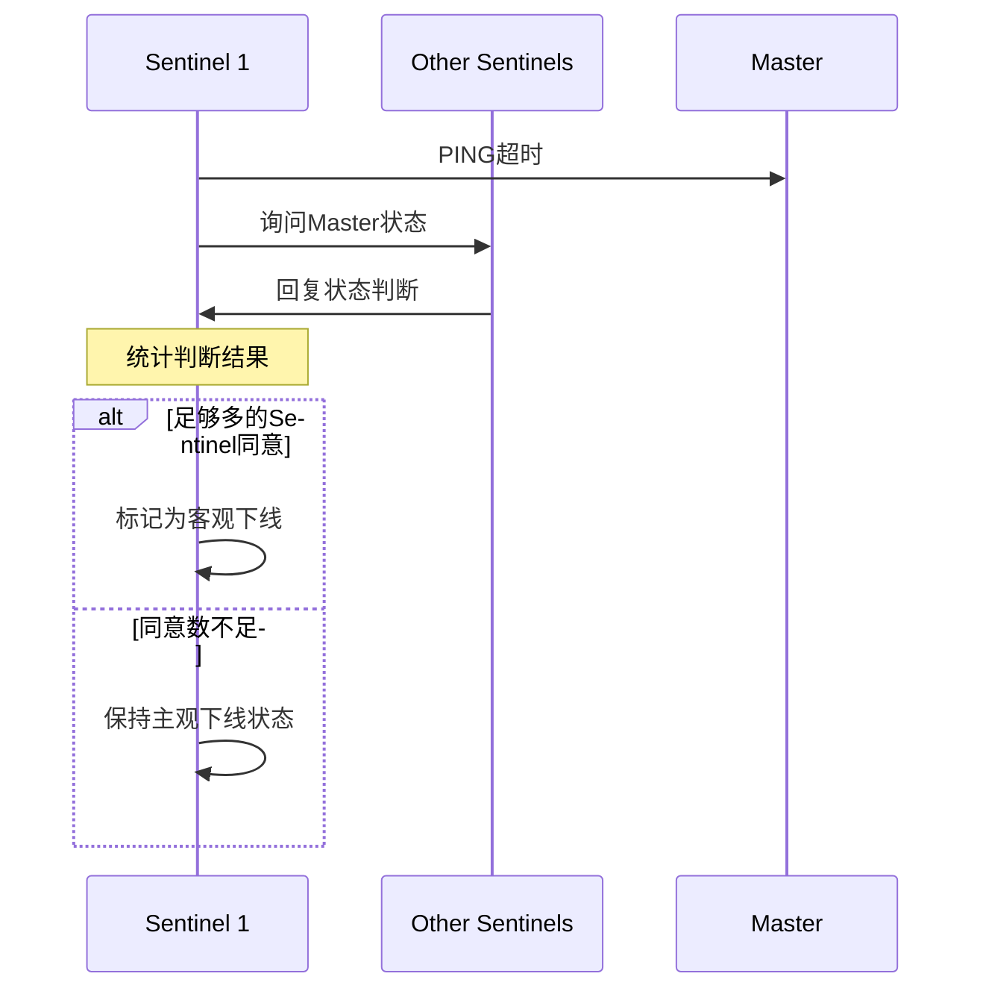
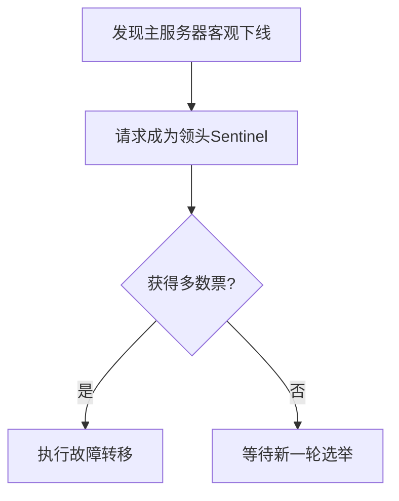
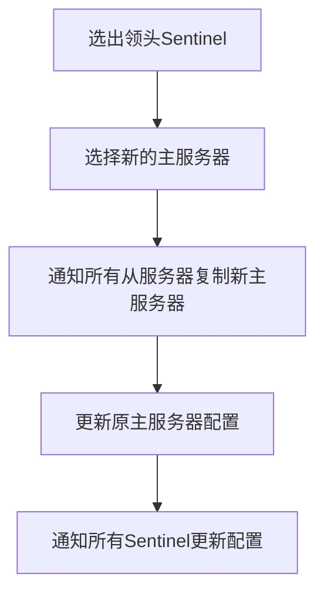
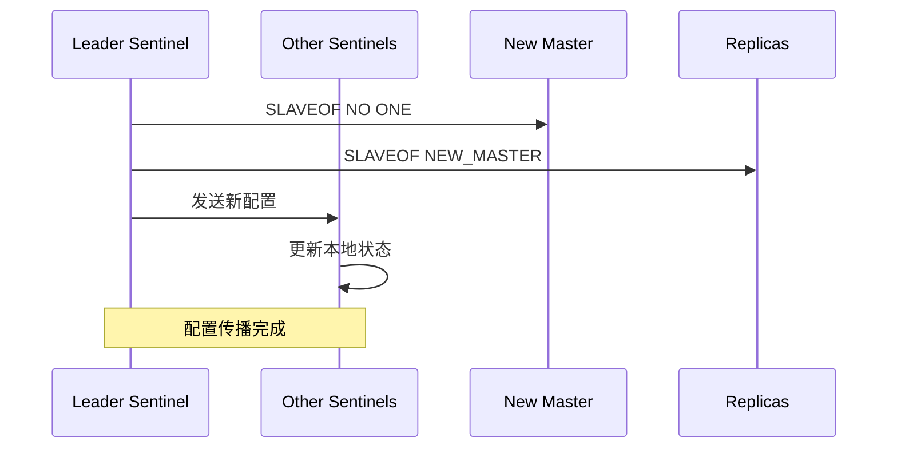

> **核心定义**: Sentinel(哨兵)是Redis的高可用性解决方案,通过监控、通知和自动故障转移功能确保Redis服务的可用性。它通过分布式架构规避单点故障,是Redis集群管理的重要工具。

# Sentinel的生命周期

让我们通过Sentinel的整个生命周期来理解它的工作原理：



# 初始化与信息获取

## 1. 启动过程



> **关键概念**: Sentinel维护的实例结构
```c
typedef struct sentinelRedisInstance {
    int flags;      // 标识实例类型与状态
    char *name;     // 实例名称
    char *runid;    // 运行时ID
    uint64_t config_epoch; // 配置纪元
    char *addr;     // 地址
    int down_after_period; // 主观下线判定时间
    struct sentinelRedisInstance *master; // 主服务器指针
} sentinelRedisInstance;
```

## 2. 信息交互机制

Sentinel通过三个关键渠道获取和维护服务器信息：

1. **命令连接**：用于发送命令和接收回复
2. **订阅连接**：监听指定的频道消息
3. **发布/订阅机制**：在Sentinel之间传递信息



# 故障检测与处理

## 1. 主观下线检测

> **主观下线(SDOWN)**: 单个Sentinel认为服务器已经下线的状态。



检测逻辑：
$$
\text{SDOWN} = \begin{cases}
\text{true}, & \text{if } \text{response\_time} > \text{down\_after\_milliseconds} \\
\text{false}, & \text{otherwise}
\end{cases}
$$

## 2. 客观下线检测

> **客观下线(ODOWN)**: 多个Sentinel一致认为服务器下线的状态。



客观下线判定条件：
$$
\text{ODOWN} = \begin{cases}
\text{true}, & \text{if } \sum_{i=1}^{n} \text{sentinel\_agree}_i \geq \text{quorum} \\
\text{false}, & \text{otherwise}
\end{cases}
$$

## 3. 领头Sentinel选举

采用Raft算法的变体进行选举：



选举规则：
1. 每个纪元(epoch)只能投票给一个Sentinel
2. 先到先得原则
3. 需要获得半数以上选票

# 故障转移流程



## 1. 新主服务器的选择标准

优先级计算公式：
$$
\text{Priority}_\text{final} = \text{Priority}_\text{config} \times \frac{1}{\text{Lag}_\text{replication}}
$$

选择标准按优先级：
1. 在线且连接正常的从服务器
2. 复制偏移量最大的从服务器
3. 较小运行ID的从服务器

## 2. 配置传播



# 最佳实践与优化建议

1. **部署建议**
   - 至少部署3个Sentinel实例
   - Sentinel实例应分布在不同物理机器上
   - 合理设置判断主观下线的超时时间

2. **监控指标**
   ```python
   # 关键监控指标
   sentinel_masters = redis.sentinel_masters()  # 主服务器状态
   sentinel_slaves = redis.sentinel_slaves()    # 从服务器状态
   sentinel_sentinels = redis.sentinel_sentinels()  # Sentinel状态
   ```

3. **配置优化**
   - quorum值设置：建议为`(n/2)+1`
   - down-after-milliseconds：根据网络状况调整
   - parallel-syncs：控制并行复制的从服务器数量

> **高可用保障**: Sentinel系统通过分布式的监控和自动故障转移机制,为Redis提供了强大的高可用性保障。理解和正确配置Sentinel是构建可靠Redis服务的关键。