> **核心思想**：Redis Cluster通过分片(sharding)将数据分散到多个节点上，同时通过主从复制保证高可用性。这种设计既实现了数据的水平扩展，又保证了服务的可靠性。

# 架构设计精要

Redis Cluster采用无中心的分布式架构，每个节点都平等地参与集群操作。这种设计带来了较高的可扩展性和可用性，但同时也增加了系统的复杂度。

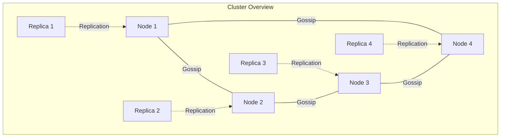

# 数据分片机制

## 1. 哈希槽分配

> **哈希槽**：Redis Cluster使用16384个哈希槽来分配数据，每个键通过CRC16算法计算所属的槽位。

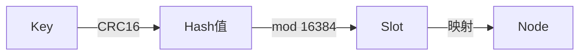

槽位计算公式：
$$
\text{slot} = CRC16(\text{key}) \bmod 16384
$$

## 2. 节点槽位分配

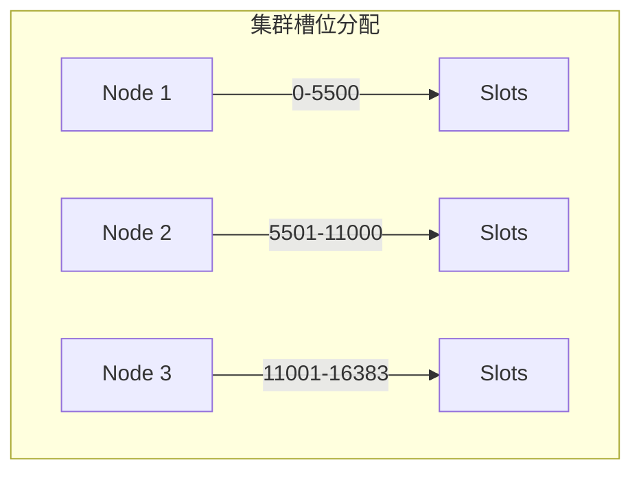

# 请求路由机制

## 1. MOVED错误重定向

当客户端请求的键不在当前节点的槽位范围内时，节点会返回MOVED错误：

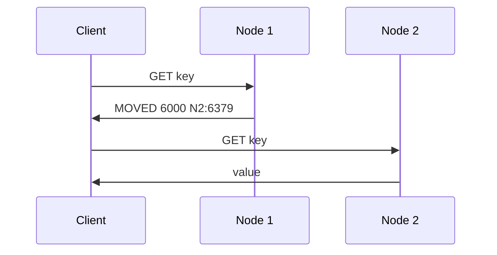

## 2. ASK错误与槽位迁移

当槽位正在迁移时，使用ASK错误处理请求重定向：

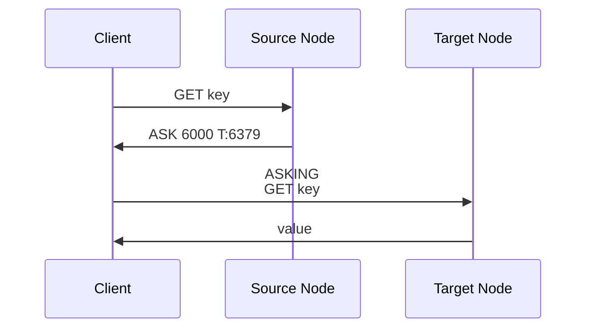

迁移过程中的槽位状态转换：
$$
\text{Status} = \begin{cases}
\text{MIGRATING}, & \text{源节点} \\
\text{IMPORTING}, & \text{目标节点} \\
\text{STABLE}, & \text{正常状态}
\end{cases}
$$

# 节点通信协议

## 1. 集群消息

节点间通过Gossip协议交换以下信息：

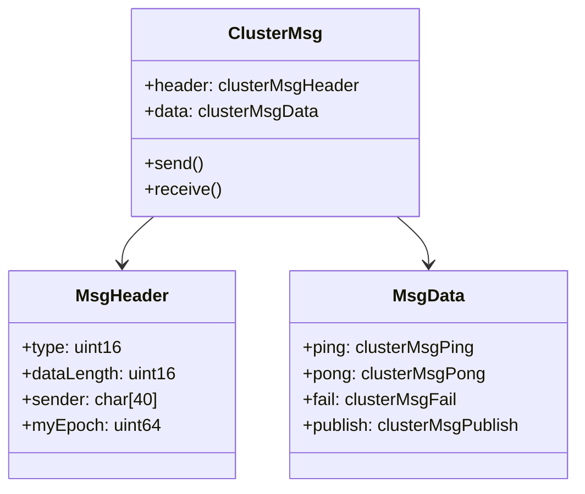

## 2. 心跳机制

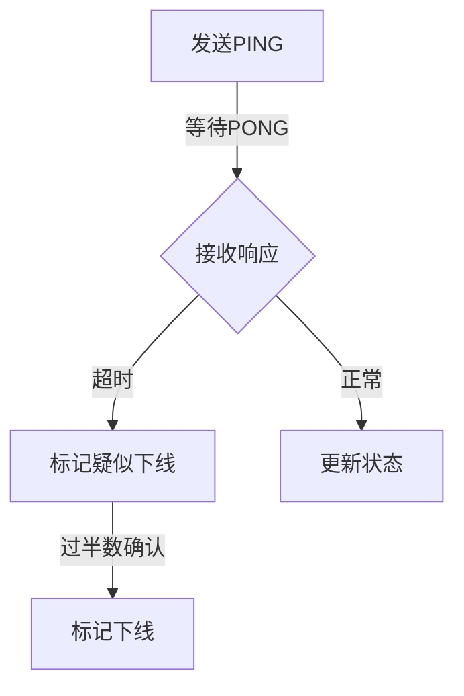

心跳超时计算：
$$
\text{timeout} = \text{node\_timeout} + \text{network\_delay} \times 2
$$

# 故障转移流程

## 1. 故障检测

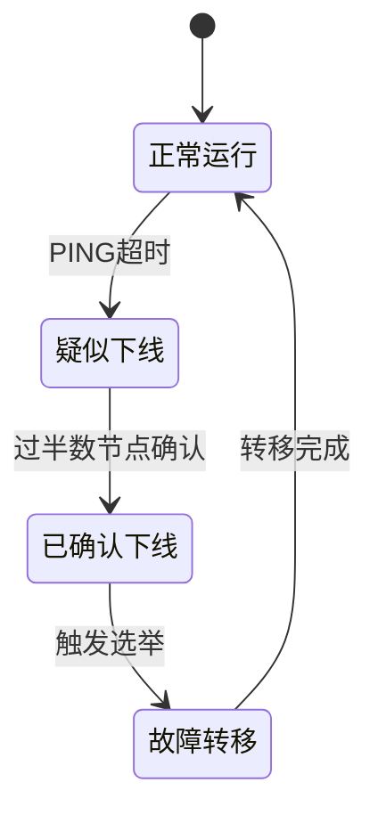

## 2. 自动故障转移

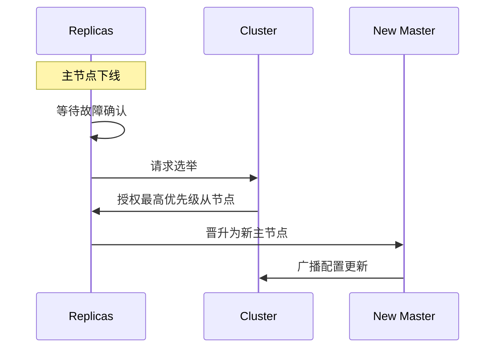

选举权重计算：
$$
\text{Priority} = \text{Rank} \times \frac{\text{Replication\_Offset}}{\text{Max\_Offset}}
$$

# 集群扩展与收缩

## 1. 添加新节点

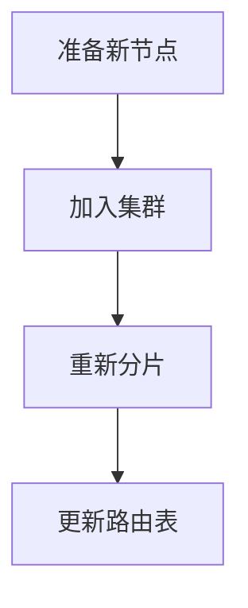

## 2. 重新分片过程

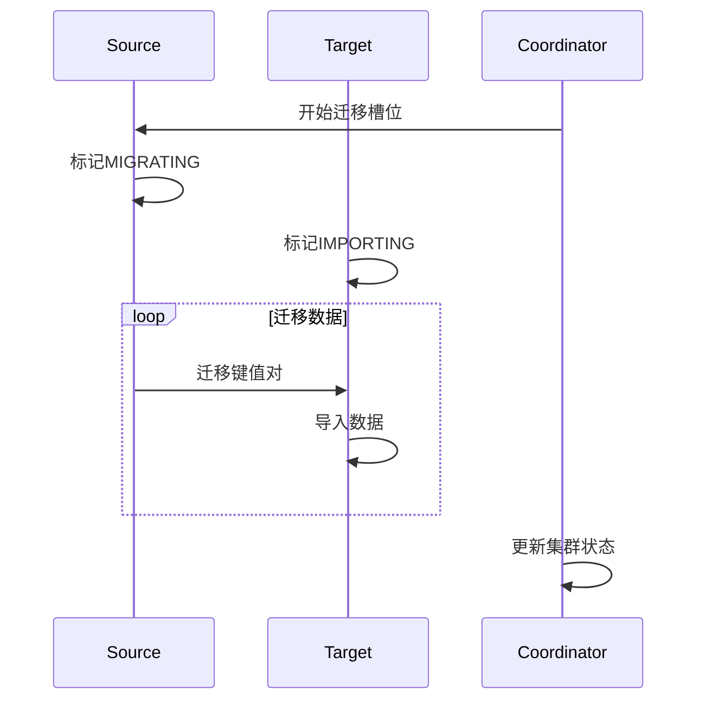

# 性能优化建议

1. **槽位分配优化**
   - 均匀分配槽位
   - 考虑节点硬件差异
   - 避免频繁迁移

2. **网络优化**
   ```python
   # 关键配置参数
   cluster-node-timeout: 15000    # 节点超时时间
   cluster-slave-validity-factor: 10    # 从节点有效因子
   cluster-migration-barrier: 1    # 迁移屏障
   ```

3. **监控指标**
   - 槽位分布均衡度
   - 节点间通信延迟
   - 重定向请求比例

> **设计哲学**: Redis Cluster通过无中心的分布式设计、灵活的数据分片机制和可靠的故障转移流程，为大规模Redis应用提供了完整的解决方案。理解其内部机制对于构建高性能、高可用的分布式系统至关重要。