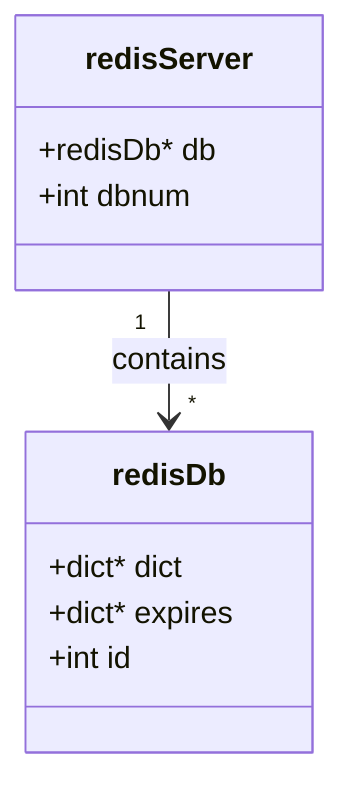
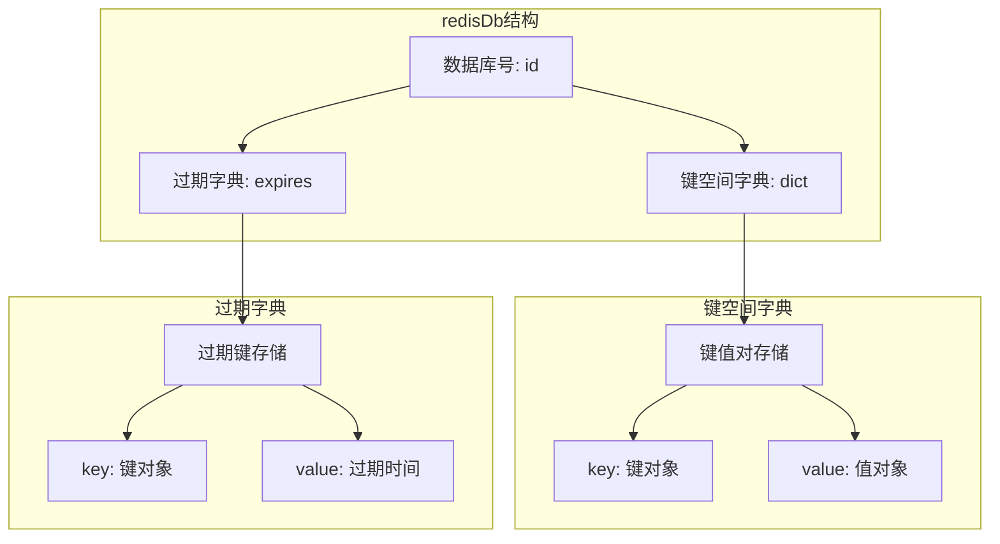
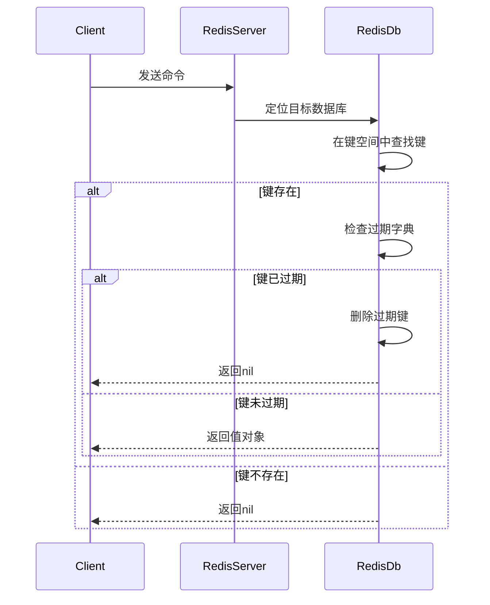

> **核心概念**：Redis服务器将所有数据库都保存在服务器状态 `redisServer` 结构的 `db` 数组中，每个数据库都由一个 `redisDb` 结构表示。

# 服务器中的数据库结构

Redis服务器的核心数据结构如下:



## redisServer 结构详解

1. **dbnum属性**
   - 服务器的数据库数量
   - 默认值为16
   - 可通过配置文件的databases选项修改

2. **db数组**
   - 数组长度为dbnum
   - 保存着服务器中的所有数据库
   - 每个数组项都是一个redisDb结构

# 数据库的内部实现

## redisDb 结构的组成



1. **dict字典(键空间)**
   - 保存数据库中所有键值对
   - 每个键都是一个字符串对象
   - 值可以是任何类型的Redis对象

2. **expires字典(过期字典)**
   - 保存所有键的过期时间
   - 键是指向键空间中的键对象指针
   - 值是毫秒精度的UNIX时间戳

## 数据库的基本操作



# 内存管理与优化

## 内存占用分析

对于一个包含 $n$ 个键值对的数据库，其内存占用可以概略表示为：

$$
\text{Memory} = \sum_{i=1}^n (\text{size}_{\text{key}_i} + \text{size}_{\text{value}_i} + \text{overhead})
$$

其中：
- $\text{size}_{\text{key}_i}$ 表示第i个键的大小
- $\text{size}_{\text{value}_i}$ 表示第i个值的大小
- $\text{overhead}$ 表示每个键值对的额外开销

## 优化策略

1. **内存碎片优化**
   ```c
   config set activedefrag yes
   config set active-defrag-ignore-bytes 100mb
   config set active-defrag-threshold-lower 10
   config set active-defrag-threshold-upper 100
   ```

2. **键过期优化**
   - 惰性删除与定期删除相结合
   - maxmemory配置限制最大内存使用

# 性能特征

## 时间复杂度

| 操作 | 复杂度 | 说明 |
|-----|--------|------|
| 查找键 | $O(1)$ | 基于哈希表实现 |
| 添加键 | $O(1)$ | 平均情况 |
| 删除键 | $O(1)$ | 包括过期检查 |
| 数据库切换 | $O(1)$ | 直接数组索引 |

# 实践建议

1. **合理使用数据库**
   - 避免过多数据库
   - 合理规划键的分布

2. **监控与维护**
   ```bash
   # 监控数据库大小
   INFO keyspace
   
   # 查看内存使用
   INFO memory
   ```

3. **性能优化**
   - 使用合适的数据结构
   - 及时清理过期键
   - 控制单个数据库大小

# 总结

Redis服务器通过精心设计的数据库结构，实现了:

1. 高效的键值存储
2. 灵活的过期机制
3. 良好的内存管理
4. 出色的访问性能

> **设计启示**：Redis数据库的实现展现了如何在内存数据库中平衡性能、灵活性和资源使用。通过合理的数据结构选择和优化策略，可以在有限的资源下实现优秀的性能。