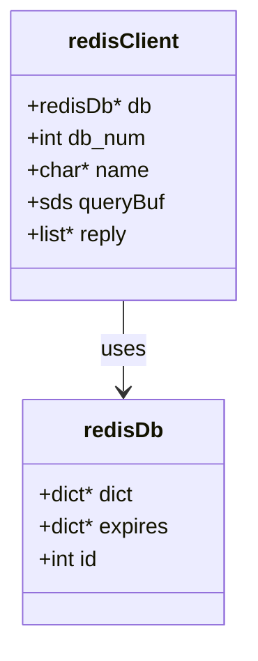
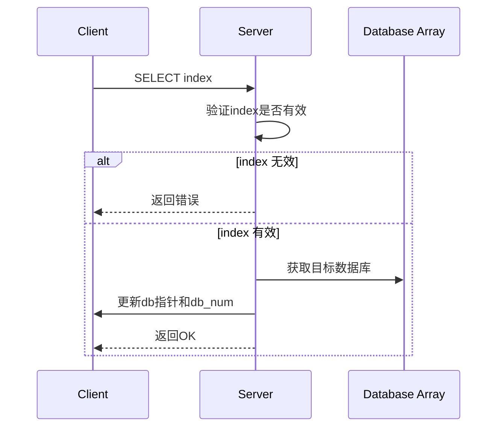
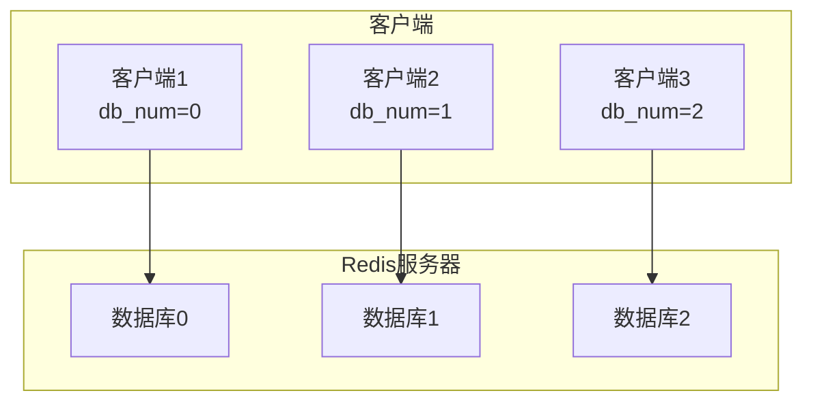
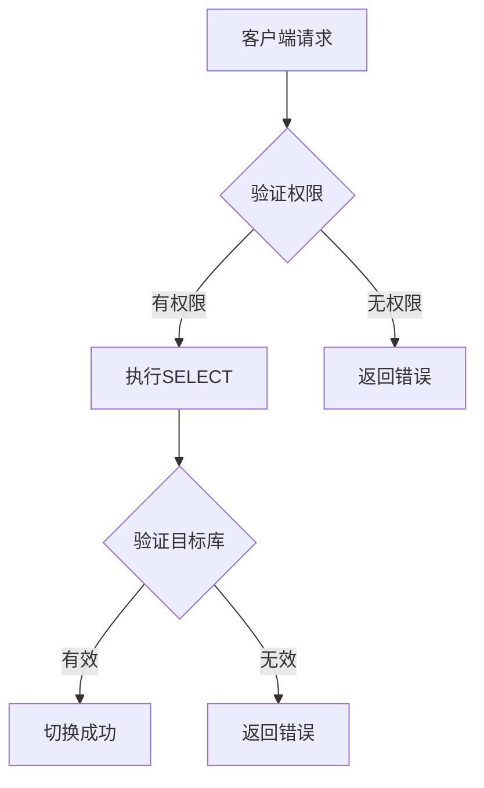
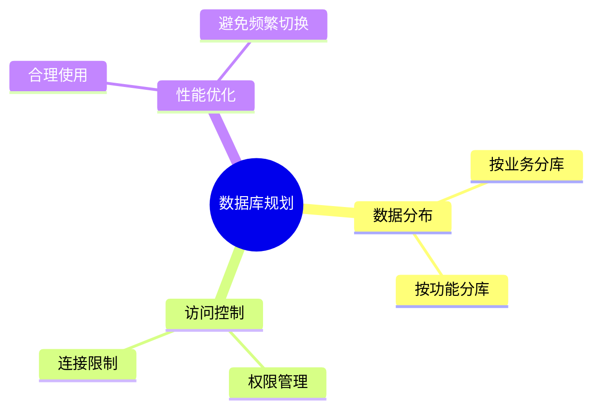

> **核心概念**: Redis 客户端通过 SELECT 命令来切换数据库。每个Redis客户端都会有一个记录当前所用数据库的状态变量 `db_num`，服务器根据这个变量来定位目标数据库。

# 数据库切换的基本原理

## 客户端连接状态



1. **db指针**
   - 指向当前正在使用的数据库
   - 由服务器初始化时设置

2. **db_num变量**
   - 记录当前数据库号码
   - 范围：0 到 dbnum-1
   - 默认为0

# SELECT 命令的执行流程



## 命令处理过程

1. **参数验证**
   ```c
   /* 伪代码展示 */
   void selectCommand(redisClient *c) {
       int id = atoi(c->argv[1]->ptr);
       if (id < 0 || id >= server.dbnum) {
           addReplyError(c, "invalid DB index");
           return;
       }
       c->db = &server.db[id];
       c->db_num = id;
       addReply(c, shared.ok);
   }
   ```

2. **状态更新**
   - 设置客户端的db指针
   - 更新db_num变量
   - 返回操作结果

# 多客户端数据库访问



## 并发访问控制

1. **隔离性**
   - 每个客户端都有独立的db_num
   - 互不影响的数据库切换

2. **原子性**
   - SELECT命令是原子操作
   - 切换过程中不会出现中间状态

# 安全性考虑

## 访问控制



1. **权限验证**
   ```c
   /* 权限检查示例 */
   if (requireAuth && !clientAuthenticated) {
       return REDIS_ERR;
   }
   ```

2. **参数验证**
   - 检查数据库索引范围
   - 验证数据库可用性

# 性能特征

## 时间复杂度分析

$$
T_{\text{switch}} = O(1)
$$

切换操作的时间复杂度是常数级的，因为：
- 数据库数组是连续内存
- 索引访问是直接寻址
- 不需要额外的数据处理

## 内存影响

1. **客户端状态**
   - db指针：8字节（64位系统）
   - db_num：4字节
   - 总额外开销：12字节/客户端

2. **服务器状态**
   - 数据库数组：$\text{size}_{\text{redisDb}} \times \text{dbnum}$

# 实践建议

## 1. 数据库规划



## 2. 最佳实践

1. **避免过度使用多数据库**
   - 合理规划数据分布
   - 避免无意义的切换

2. **监控和维护**
   ```bash
   # 监控数据库使用情况
   INFO keyspace
   
   # 查看客户端连接
   CLIENT LIST
   ```

3. **性能优化**
   - 减少不必要的数据库切换
   - 使用合适的数据库数量

# 总结

Redis的数据库切换机制具有以下特点：

1. **高效性**: $O(1)$ 时间复杂度
2. **隔离性**: 客户端之间互不影响
3. **安全性**: 完善的权限控制
4. **简单性**: 易于使用和维护

> **设计启示**: Redis数据库切换机制的设计展示了如何在多客户端环境下实现高效且安全的数据库访问控制。通过简单的索引机制和状态管理，实现了复杂的多数据库支持功能。