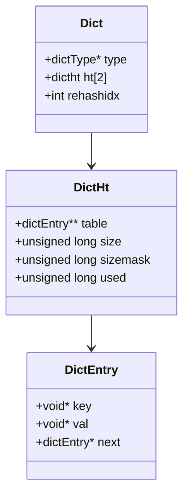
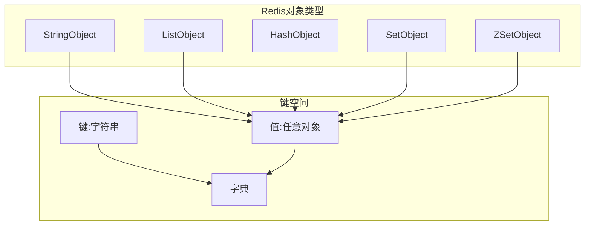
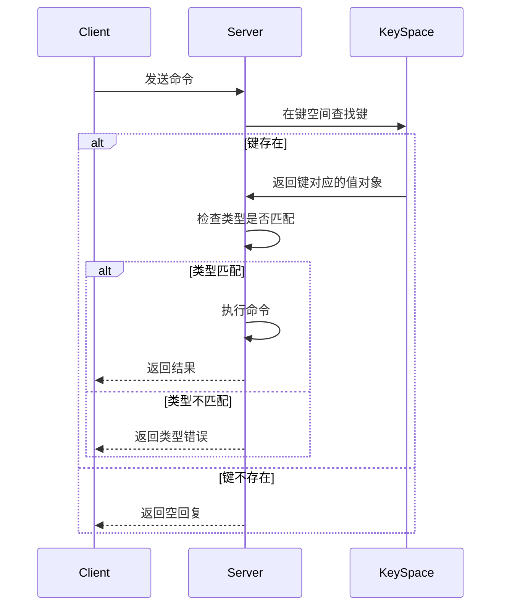
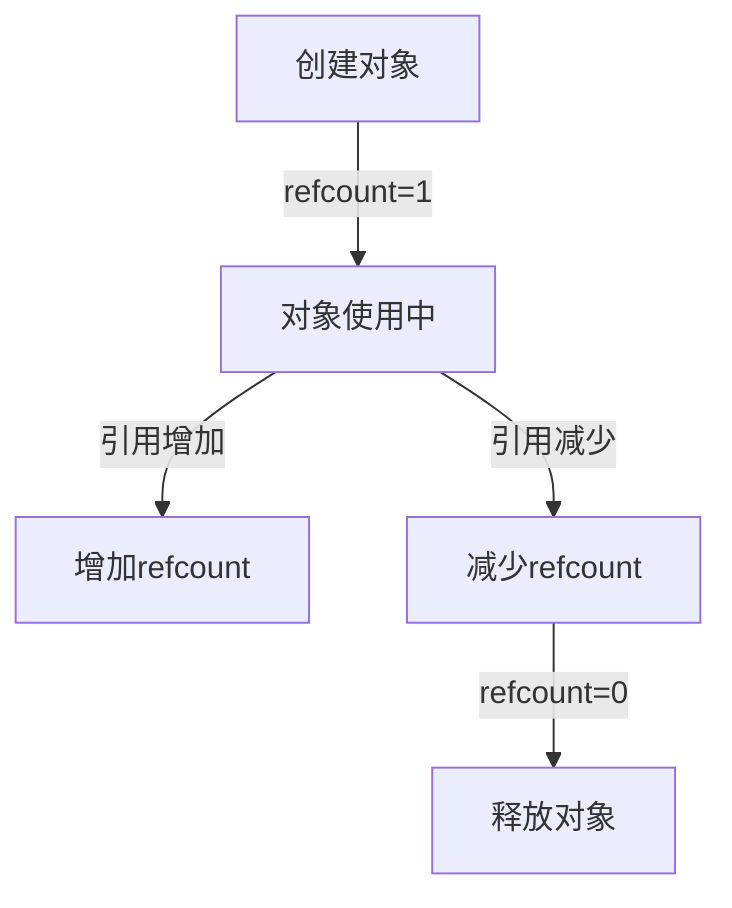
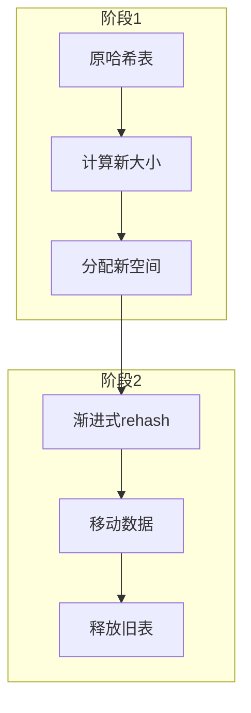
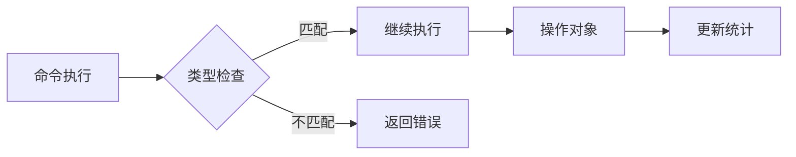
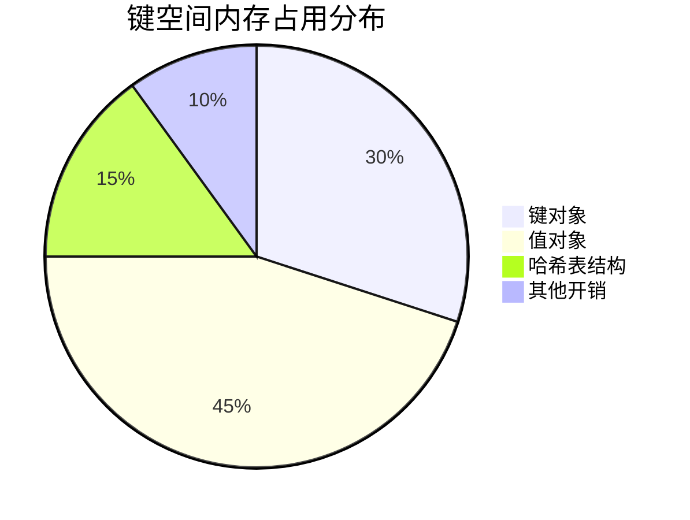

> **核心概念**：键空间(key space)是Redis数据库中用于保存所有键值对的字典结构。数据库中的所有键值对都被保存在这个字典里，其中字典的键是一个字符串对象，值则可以是任意一种Redis对象。

# 键空间的基本结构

## 字典结构设计



## 对象系统支持



# 键空间操作实现

## 1. 基本操作流程



## 2. 命令的实现原理

```python
def generic_command(client, key, operation):
    # 获取键空间
    keyspace = client.db.dict
    
    # 查找键
    value = keyspace.find(key)
    
    # 检查类型
    if value and check_type(value, required_type):
        # 执行操作
        result = operation(value)
        
        # 更新相关统计信息
        update_stats(key)
        
        return result
    else:
        return error_reply()
```

# 键空间维护机制

## 1. 引用计数管理



## 2. 内存回收机制

$$
\text{可回收内存} = \sum_{i=1}^n (\text{size}_{\text{object}_i}) \times [\text{refcount}_i = 0]
$$

其中：
- $\text{size}_{\text{object}_i}$ 是第i个对象的大小
- $[\text{refcount}_i = 0]$ 是引用计数为0的判断条件

# 性能优化机制

## 1. 哈希表rehash过程



## 2. 负载因子控制

$$
\text{load\_factor} = \frac{used}{size}
$$

- 扩展条件：$\text{load\_factor} > 1$
- 收缩条件：$\text{load\_factor} < 0.1$

# 数据一致性保证

## 1. 类型检查机制



## 2. 原子性保证

1. **命令执行原子性**
   - 单个命令要么完全执行，要么完全不执行
   - 不会出现部分完成状态

2. **事务支持**
   ```python
   # 事务示例
   MULTI
   SET key1 value1
   SET key2 value2
   EXEC
   ```

# 监控与统计

## 1. 键空间统计信息

```python
# 获取键空间统计信息
INFO keyspace

# 输出示例
db0:keys=1,expires=0,avg_ttl=0
db1:keys=10,expires=5,avg_ttl=3600
```

## 2. 内存使用分析



# 实践建议

## 1. 键的命名规范

```python
# 推荐的命名方式
user:1000:profile
order:2000:items
session:3000:data
```

## 2. 性能优化建议

1. **控制键的数量**
   - 合理使用数据结构
   - 及时清理无用键

2. **内存优化**
   - 使用合适的数据类型
   - 避免大键值对

3. **访问模式优化**
   - 使用合适的命令
   - 批量操作优化

# 总结

Redis键空间的实现具有以下特点：

4. **高效性**: 基于哈希表的快速访问
5. **灵活性**: 支持多种数据类型
6. **可靠性**: 完善的类型检查和内存管理
7. **可维护性**: 丰富的监控和统计功能

> **设计启示**: Redis键空间的设计展示了如何在内存数据库中实现高效且可靠的键值存储。通过合理的数据结构选择和优化机制，在保证性能的同时实现了强大的功能支持。