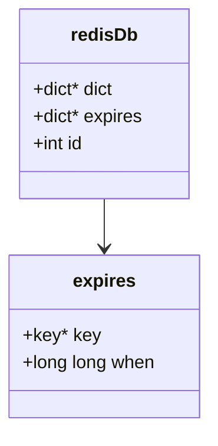
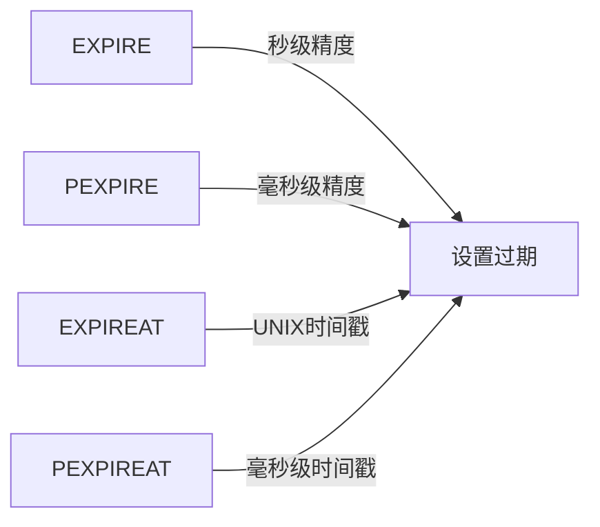
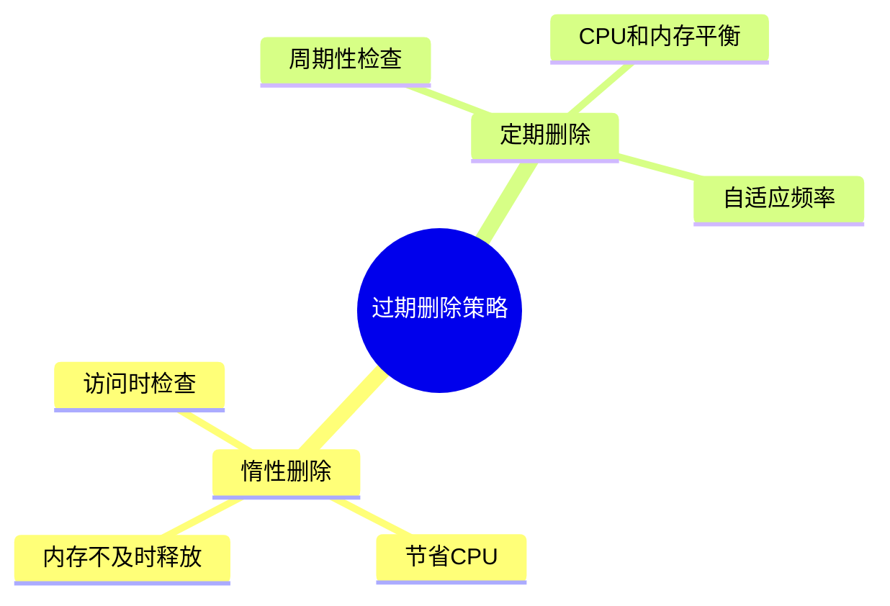
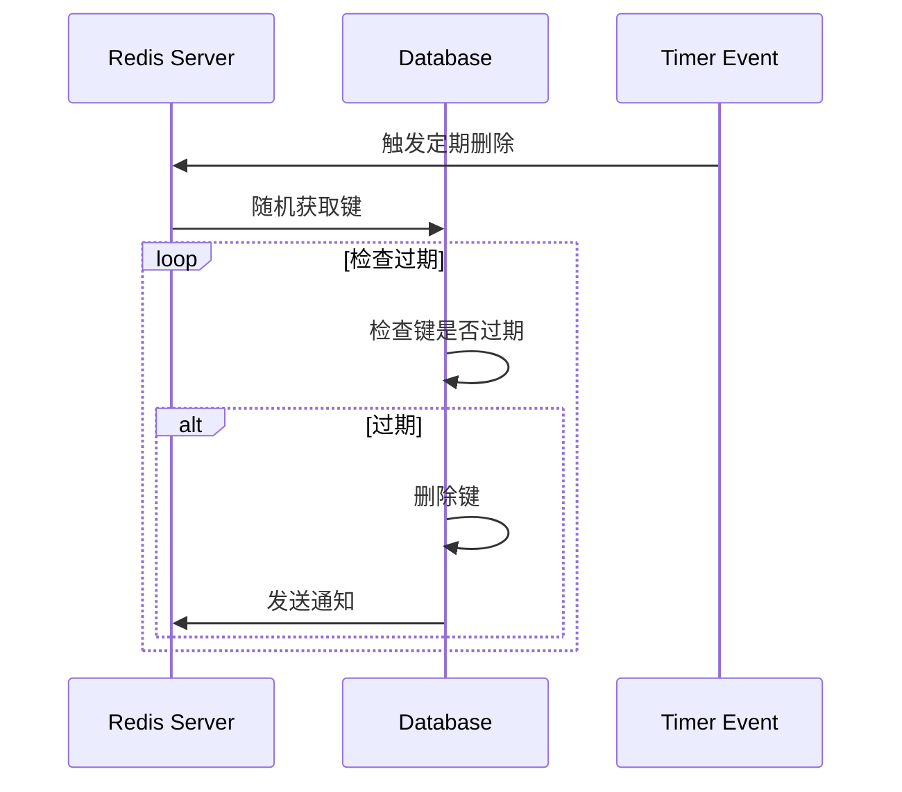
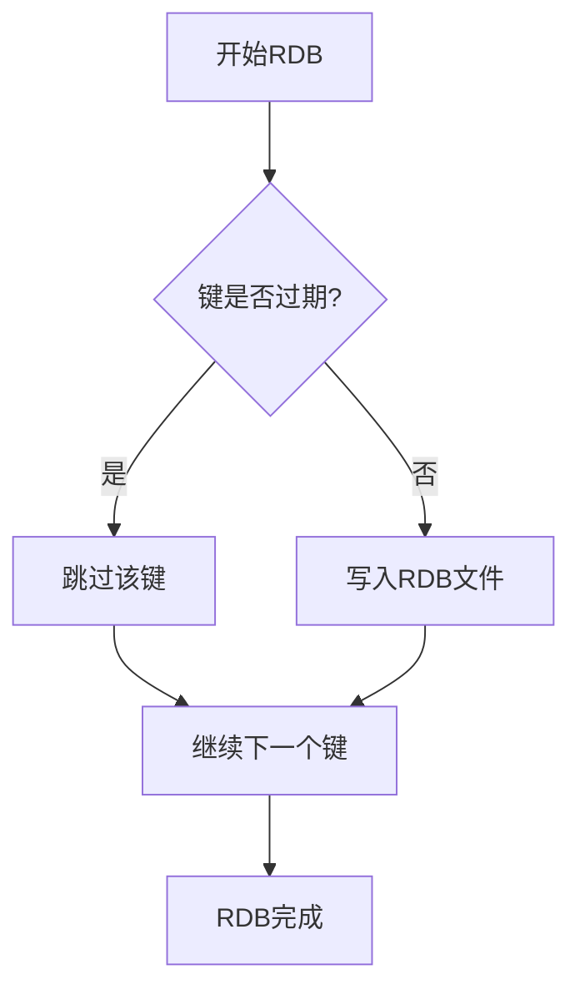
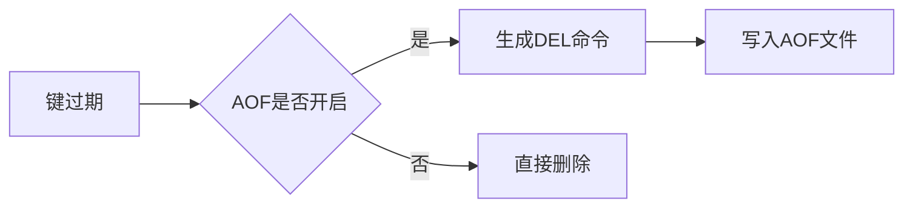
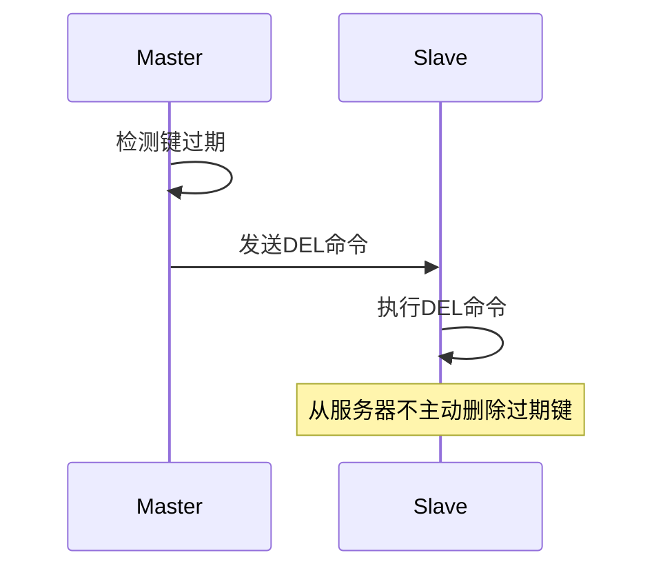
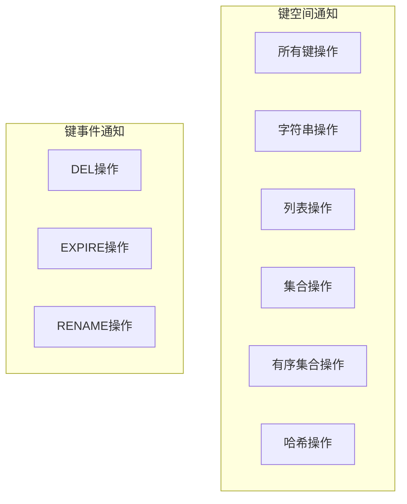
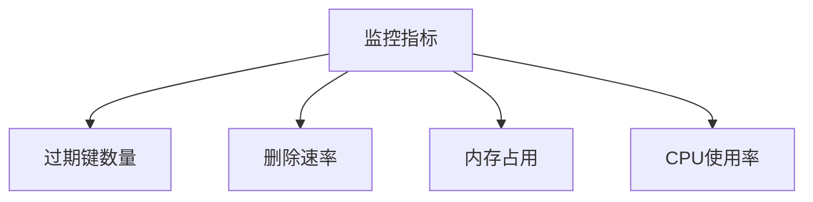

> **核心概念**：Redis通过过期字典(expires)来保存键的过期时间，并采用惰性删除和定期删除两种策略来删除过期键。同时，通过数据库通知机制来告知客户端数据库中键的变化。

# 一、过期时间的设置与管理

## 1.1 过期数据结构



## 1.2 设置过期时间的命令



实现示例：
```python
def setExpire(key, timestamp):
    # 保存过期时间到expires字典
    expires[key] = timestamp
    
    # 返回设置结果
    return 1
```

# 二、过期键删除策略

## 2.1 策略概述



## 2.2 删除策略实现

### 惰性删除

```python
def lazy_free(key):
    # 获取过期时间
    expire_time = expires.get(key)
    
    if expire_time is not None:
        # 检查是否过期
        if current_time() > expire_time:
            # 删除过期键
            delete_key(key)
            # 触发键空间通知
            notify_keyspace_event("expired", key)
            return None
            
    return key_value
```

### 定期删除



# 三、持久化和复制处理

## 3.1 RDB持久化



## 3.2 AOF持久化



## 3.3 主从复制



# 四、数据库通知系统

## 4.1 通知类型



## 4.2 通知机制实现

```python
def notify_keyspace_event(event_type, key, command):
    if is_keyspace_notification_enabled(event_type):
        # 发送键空间通知
        publish_message(f"__keyspace@{db_id}__:{key}", command)
        # 发送键事件通知
        publish_message(f"__keyevent@{db_id}__:{command}", key)
```

## 4.3 通知配置

配置示例：
```bash
# 启用所有通知
notify-keyspace-events AKE

# 只启用过期和删除事件
notify-keyspace-events Ex
```

# 五、性能优化与监控

## 5.1 过期键性能优化

1. **内存优化**
   $$
   \text{内存占用} = \text{基础数据} + \text{过期字典} + \text{通知开销}
   $$

2. **CPU优化**
   - 定期删除的频率控制
   - 每次扫描的时间限制

## 5.2 监控指标



# 六、实践建议

## 6.1 过期策略使用建议

1. **合理设置过期时间**
   - 避免集中过期
   - 使用随机过期时间

2. **定期删除优化**
   ```python
   # 分散过期时间
   expire_time = base_time + random.randint(0, 300)
   ```

## 6.2 通知系统使用建议

1. **选择性订阅**
   - 只订阅需要的事件
   - 避免过多通知影响性能

2. **错误处理**
   - 实现可靠的通知处理
   - 添加超时机制

# 总结

Redis的过期删除和通知机制具有以下特点：

1. **灵活性**：多种过期时间设置方式
2. **效率性**：惰性删除和定期删除的结合
3. **可靠性**：完善的持久化和复制支持
4. **实时性**：及时的事件通知机制

> **设计启示**：Redis通过组合使用多种策略，在实现功能的同时保持了系统的高性能。通知机制的设计则展示了如何在分布式系统中实现高效的事件传播。