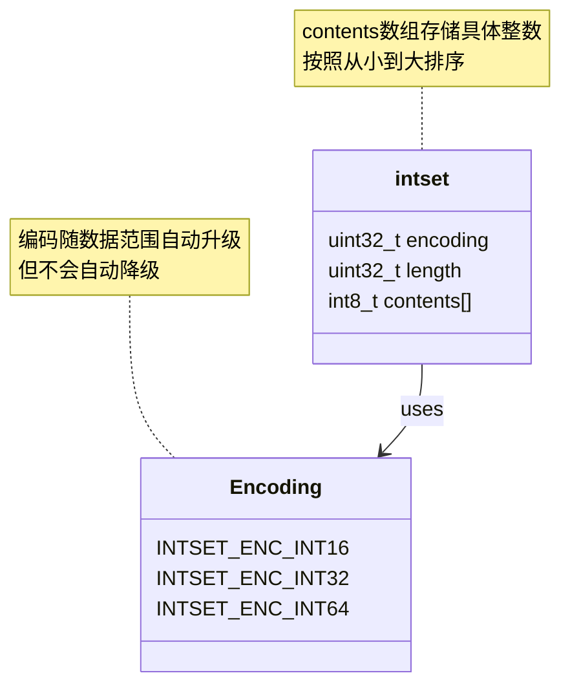
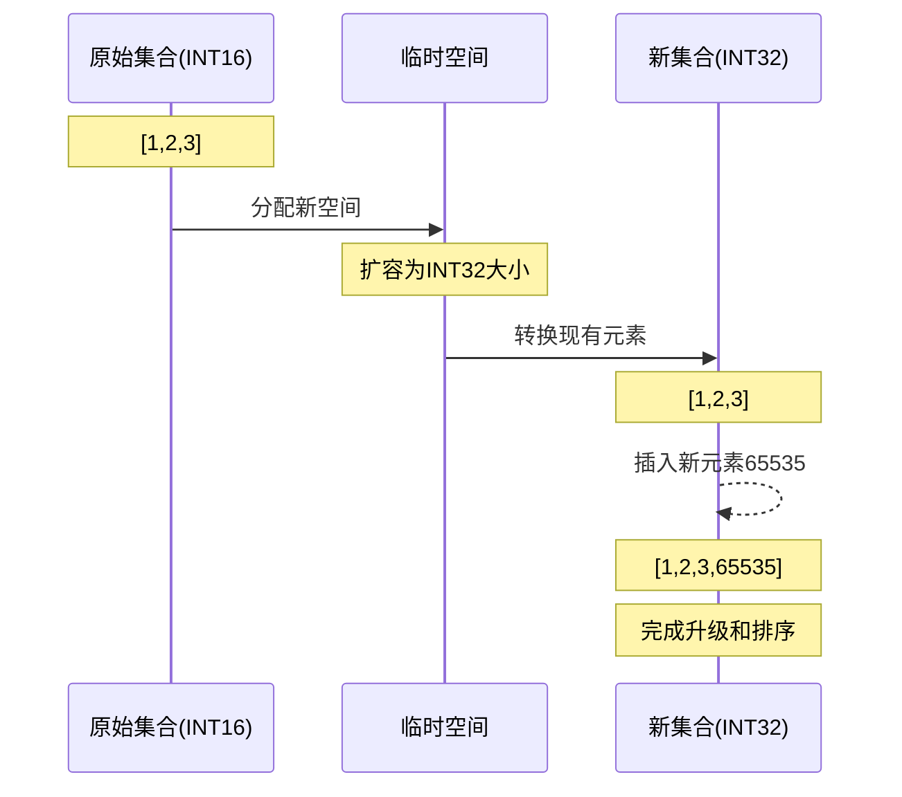

让我们开始详细探讨整数集合的实现。整数集合(intset)是Redis用于保存整数值的集合抽象数据结构，它具有空间效率高和支持自动升级的特点。

> **核心特征**: 整数集合是Redis中的一个特殊数据结构，专门用于存储整数值集合，具有以下特点：
> - 所有元素都是整数
> - 元素无重复
> - 元素在内部有序存储
> - 支持自动升级编码方式

**整数集合的实现**

整数集合的底层实现使用了一个名为`intset`的结构体：

```c
typedef struct intset {
    uint32_t encoding;  // 编码方式
    uint32_t length;    // 集合包含的元素数量
    int8_t contents[];  // 保存元素的数组
} intset;
```

虽然`contents`数组声明为`int8_t`类型，但这只是一个虚拟的声明。实际上，Redis会根据存储的整数大小动态选择以下三种编码之一：

- INTSET_ENC_INT16: 16位整数编码
- INTSET_ENC_INT32: 32位整数编码
- INTSET_ENC_INT64: 64位整数编码

**整数集合的升级**

当我们向整数集合添加一个新元素时，如果新元素的类型（所需的位数）超过了当前编码方式，就会触发升级操作。升级过程包括：

1. 根据新元素的类型，扩展底层数组的空间
2. 将现有所有元素转换为新编码
3. 将新元素添加到集合中
4. 维护有序性




**升级的好处**

整数集合的升级机制带来了几个重要优势：

1. **节约内存**: 通过动态选择最小的可用编码方式，确保内存使用效率
2. **灵活性**: 可以同时存储不同类型的整数，而无需预先指定
3. **向后兼容**: 升级操作对用户完全透明

**关于降级**

> **重要说明**: Redis的整数集合不支持自动降级操作。即使删除了那些导致集合升级的元素，编码方式也不会降回原来的水平。

这个设计决策基于以下考虑：
- 避免频繁的内存重新分配
- 降低实现复杂度
- 防止可能的性能抖动

**整数集合API**

整数集合提供了以下主要操作接口：

```c
intset *intsetNew(void);
intset *intsetAdd(intset *is, int64_t value, uint8_t *success);
intset *intsetRemove(intset *is, int64_t value, int *success);
uint8_t intsetFind(intset *is, int64_t value);
int64_t intsetRandom(intset *is);
uint8_t intsetGet(intset *is, uint32_t pos, int64_t *value);
uint32_t intsetLen(const intset *is);
size_t intsetBlobLen(intset *is);
```

**重点回顾**

1. 整数集合是Redis用于存储整数的特殊数据结构，具有空间效率高的特点
2. 支持三种不同的编码方式（16位、32位、64位），根据需要自动升级
3. 升级操作是不可逆的，一旦升级就不会降级
4. 所有元素都保持有序存储，这使得查找操作的复杂度为O(log N)
5. 整数集合的设计体现了Redis "简单但高效" 的设计理念

您对整数集合的具体实现细节有任何疑问吗？或者您想深入了解某个特定方面？