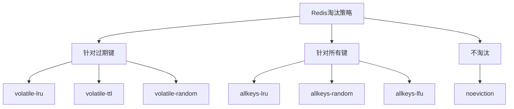
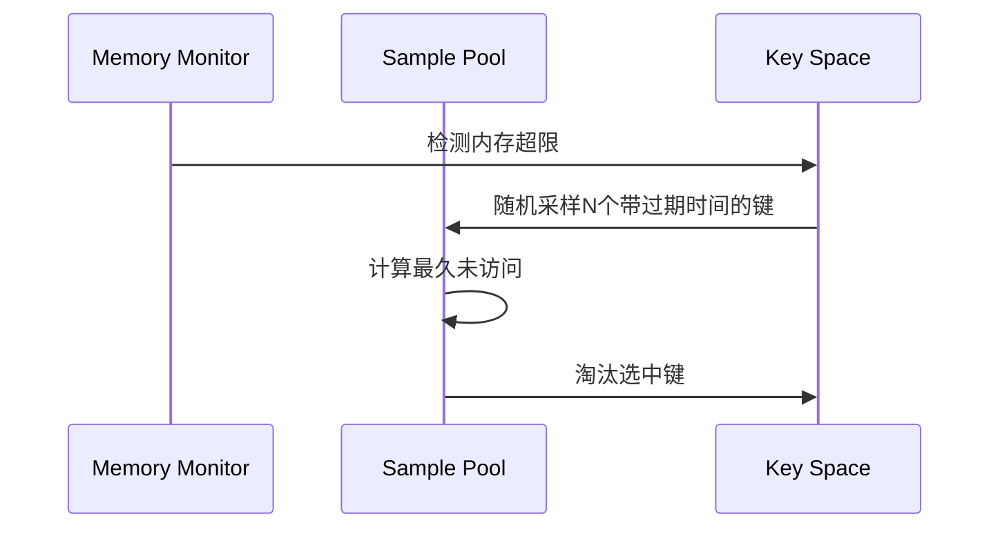
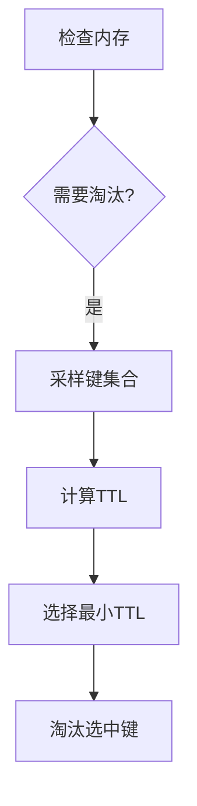
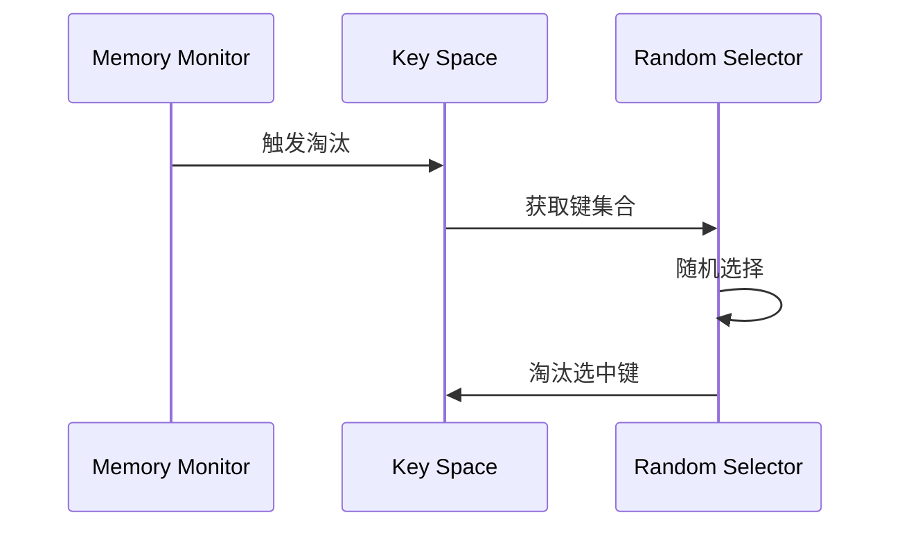
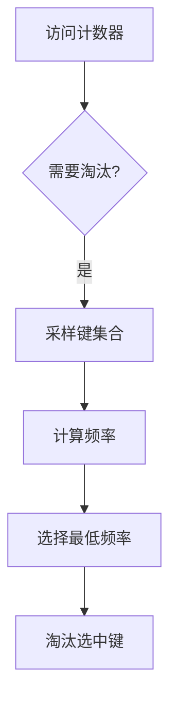

> **核心概念**：Redis的内存淘汰（eviction）机制是一个自动化的内存管理系统，当内存使用达到maxmemory限制时，会根据配置的策略自动淘汰一些键来释放内存。这个机制保证了Redis在内存受限的环境中能够持续稳定运行。

# 淘汰策略概览

在深入每个策略之前，让我们先看看整体的策略分类：



# 详细策略解析

## 1. volatile-lru（移除最近最少使用的过期键）

> **核心算法**：LRU（Least Recently Used）算法的近似实现，仅针对设置了过期时间的键。



适用场景：
- 缓存系统，特别是有明确过期时间的缓存
- 访问模式具有时间局部性的应用
- 需要精确控制缓存生命周期的系统

性能特征：
$$
\text{命中率} \approx \frac{\text{热点数据大小}}{\text{可用内存大小}} \times (1 - \text{采样误差})
$$

## 2. allkeys-lru（移除最近最少使用的键）

> **扩展实现**：与volatile-lru类似，但作用于所有键，不仅限于设置了过期时间的键。

适用场景：
- 通用缓存系统
- 对过期时间不敏感的应用
- 需要最大化内存利用率的场景

优势分析：
- 更大的选择空间
- 更好的内存利用率
- 更高的缓存命中率

## 3. volatile-ttl（移除即将过期的键）



适用场景：
- 时间敏感的缓存系统
- 需要优先保留长期有效数据的应用
- 基于时间的业务逻辑系统

TTL选择策略：
$$
\text{优先级} = \frac{1}{\text{remaining\_ttl} + \epsilon}
$$
其中ε是一个小常数，防止除零。

## 4. volatile-random/allkeys-random（随机移除）

> **随机算法**：通过随机选择来避免计算开销，在某些场景下表现出意想不到的效果。



适用场景：
- 数据访问概率均匀的系统
- 计算资源受限的环境
- 简单且需要快速响应的系统

性能特征：
- 最小的CPU开销
- 可预测的性能表现
- 无状态操作

## 5. allkeys-lfu（移除最少使用的键）

> **频率计数**：通过记录访问频率而不是最近访问时间来进行淘汰决策。



适用场景：
- 访问模式稳定的系统
- 需要精确识别热点数据的应用
- 长期运行的缓存系统

频率计算：
$$
\text{频率衰减} = \text{当前频率} \times 0.99^{\Delta t}
$$

## 6. noeviction（禁止淘汰）

> **严格策略**：当内存达到限制时，拒绝写入新数据。

适用场景：
- 数据完整性要求高的系统
- 固定大小的数据集
- 需要显式错误处理的应用

# 策略选择指南

选择合适的淘汰策略需要考虑以下因素：

1. **数据特征分析**
   - 数据大小分布
   - 访问模式特征
   - 过期时间需求

2. **系统需求评估**
   - 性能要求
   - 内存限制
   - 可用计算资源

3. **业务场景匹配**
   ```python
   def select_eviction_policy(scenario):
       if scenario.requires_time_based_eviction:
           return "volatile-ttl"
       elif scenario.has_clear_access_pattern:
           return "allkeys-lfu"
       elif scenario.needs_guaranteed_writes:
           return "noeviction"
       else:
           return "allkeys-lru"
   ```

# 性能优化建议

4. **采样率优化**
```python
# 配置示例
maxmemory-samples 10  # 默认值
# 增加采样数可提高准确性，但会增加CPU开销
```

5. **监控指标**
   - 淘汰次数
   - 命中率变化
   - 内存使用趋势

6. **实践策略**
```python
# Redis配置示例
maxmemory 2gb
maxmemory-policy allkeys-lru
maxmemory-samples 10
```

# 最佳实践总结

根据不同场景的特征，我们可以总结出以下选择建议：

| 场景特征 | 推荐策略 | 原因 |
|---------|---------|------|
| 通用缓存 | allkeys-lru | 最佳的通用性能 |
| 会话存储 | volatile-lru | 自然过期机制 |
| 排行榜系统 | allkeys-lfu | 准确的热点识别 |
| 消息队列 | noeviction | 数据完整性保证 |
| 计数系统 | volatile-ttl | 时间敏感性 |

> **设计思考**：Redis的淘汰策略设计展示了如何在实际系统中平衡多个competing concerns：内存使用、计算开销、数据新鲜度、访问性能等。这种多维度的权衡思路值得在其他系统设计中借鉴。