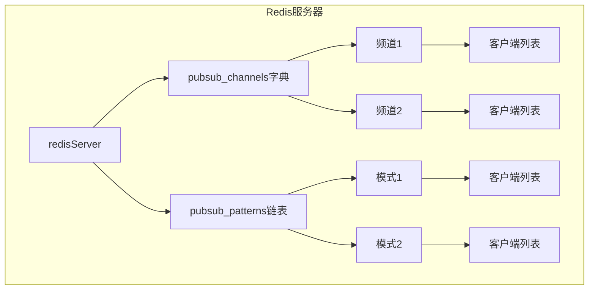
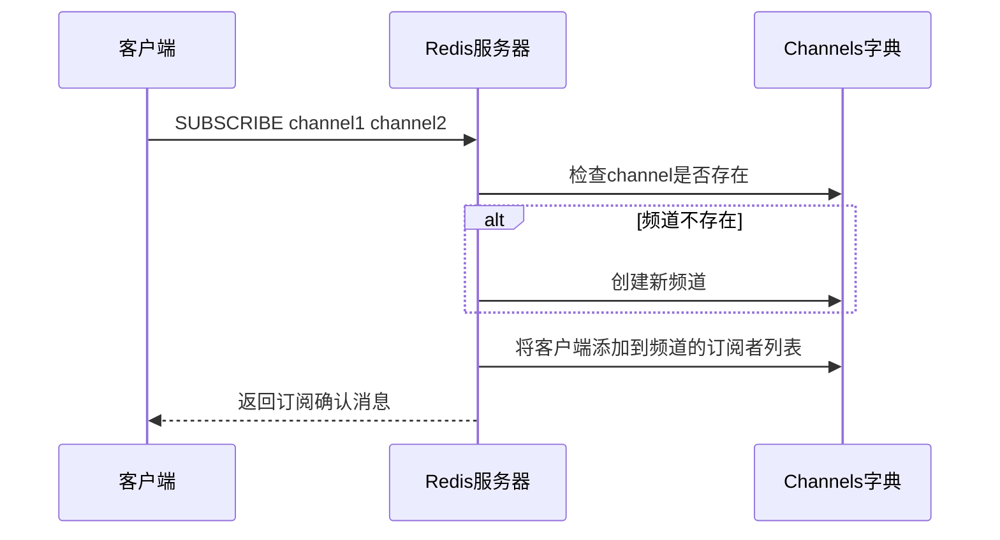
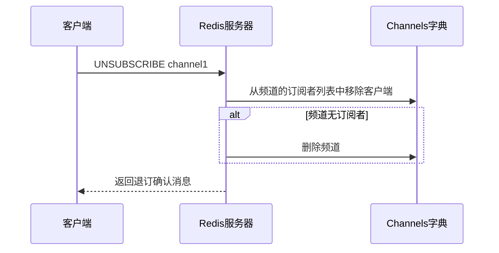
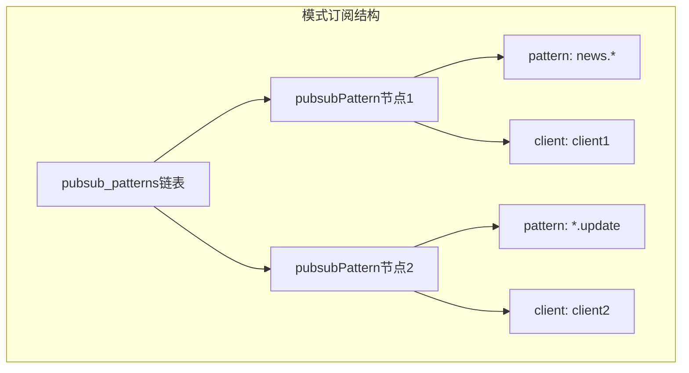
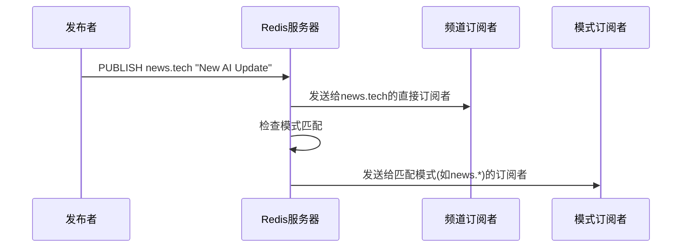
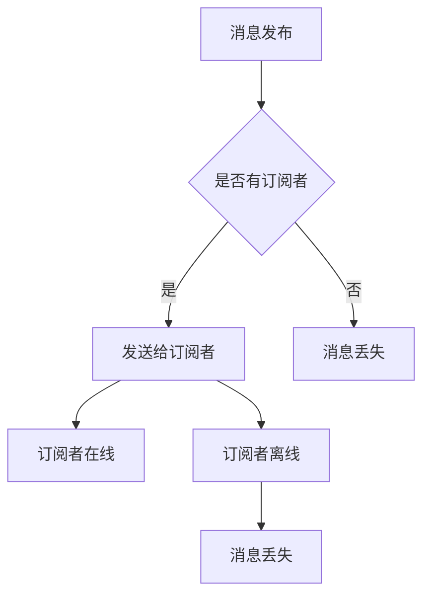

> **核心概念**: Redis的发布订阅(pub/sub)是一种消息通信范式，发送者(发布者)不会直接将消息发送给特定的接收者(订阅者)，而是将消息分为不同的频道，订阅者可以订阅一个或多个频道，从而接收感兴趣的消息。

# 一、基础架构



# 二、频道的订阅与退订

## 2.1 订阅频道实现



订阅频道的核心数据结构：

```c
struct redisServer {
    // 保存所有频道的订阅关系
    dict *pubsub_channels;  
    // 字典的键为频道名，值为链表
    // 链表中保存了所有订阅该频道的客户端
};
```

## 2.2 退订频道实现



# 三、模式的订阅与退订

> **模式(Pattern)**: Redis的模式订阅支持使用glob风格的通配符，如 `news.*` 可以匹配所有以news.开头的频道。

## 3.1 模式订阅实现



模式订阅的数据结构：
```c
typedef struct pubsubPattern {
    client *client;               // 订阅模式的客户端
    robj *pattern;               // 被订阅的模式
} pubsubPattern;
```

# 四、消息发布实现

> **发布流程**: 当发布消息时，Redis会同时将消息发送给频道订阅者和匹配的模式订阅者。



发布消息的复杂度分析：
$$
\text{时间复杂度} = O(N + M)
$$
其中：
- $N$ 为频道订阅者数量
- $M$ 为模式订阅者数量

# 五、订阅信息查询

Redis提供了以下命令来查询订阅信息：

1. **PUBSUB CHANNELS [pattern]**
   ```mermaid
   graph LR
       A[PUBSUB CHANNELS] --> B[遍历pubsub_channels字典]
       B --> C[返回匹配pattern的频道列表]
   ```

2. **PUBSUB NUMSUB [channel-1 ... channel-N]**
   ```mermaid
   graph LR
       A[PUBSUB NUMSUB] --> B[查找指定频道]
       B --> C[统计订阅者数量]
   ```

3. **PUBSUB NUMPAT**
   ```mermaid
   graph LR
       A[PUBSUB NUMPAT] --> B[返回pubsub_patterns链表长度]
   ```

# 六、实现要点

## 6.1 消息的可靠性

> **重要说明**: Redis的发布订阅模式不保证消息的可靠性，具有以下特征：

1. 无消息队列
2. 不保存历史消息
3. 客户端断线不会自动重连



## 6.2 性能考虑

订阅者处理性能：
$$
\text{单个订阅者处理时间} = O(1)
$$

模式匹配性能：
$$
\text{模式匹配时间} = O(N \times M)
$$
其中：
- $N$ 为注册的模式数量
- $M$ 为平均模式字符串长度

# 七、最佳实践

1. **合理使用模式订阅**
   ```python
   # 不推荐
   PSUBSCRIBE *  # 订阅所有频道
   
   # 推荐
   PSUBSCRIBE news.*  # 订阅特定前缀
   ```

2. **异常处理**
   ```python
   def subscribe_with_retry(redis_client, channel):
       while True:
           try:
               pubsub = redis_client.pubsub()
               pubsub.subscribe(channel)
               for message in pubsub.listen():
                   process_message(message)
           except ConnectionError:
               time.sleep(1)  # 断线重连
   ```

# 八、应用场景

1. **实时通知系统**
   ```python
   # 发布者
   redis.publish('notifications', json.dumps({
       'type': 'alert',
       'message': 'System update required'
   }))
   ```

2. **聊天室功能**
   ```python
   # 群组消息
   redis.publish('chatroom:general', json.dumps({
       'user': 'Alice',
       'message': 'Hello everyone!'
   }))
   ```

# 总结

Redis的发布订阅机制通过简单而优雅的设计，为实时消息传递提供了高效的解决方案。虽然不保证消息的可靠性，但在实时性要求高、可以容忍消息丢失的场景下，它是一个理想的选择。

> **设计启示**: Redis的发布订阅实现展示了如何在保持简单性的同时提供强大的功能。通过清晰的数据结构设计和高效的算法实现，它能够支持大规模的消息传递需求。