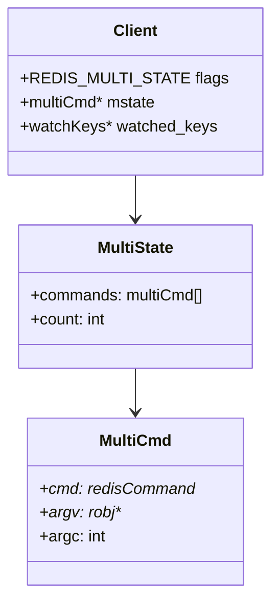
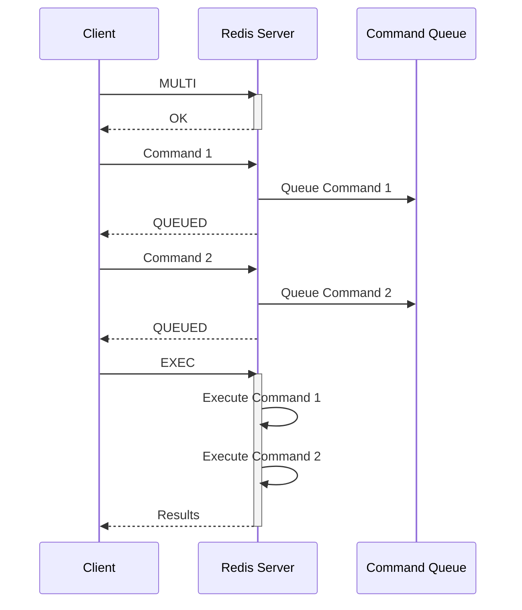
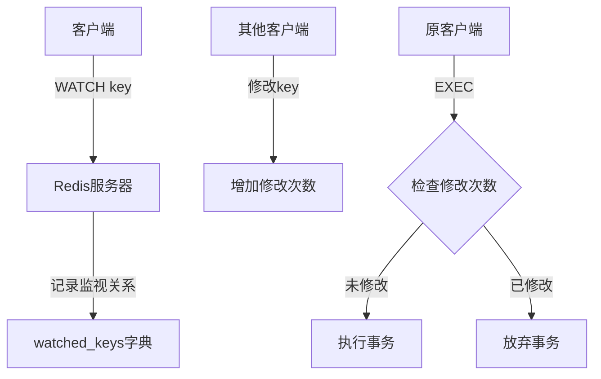
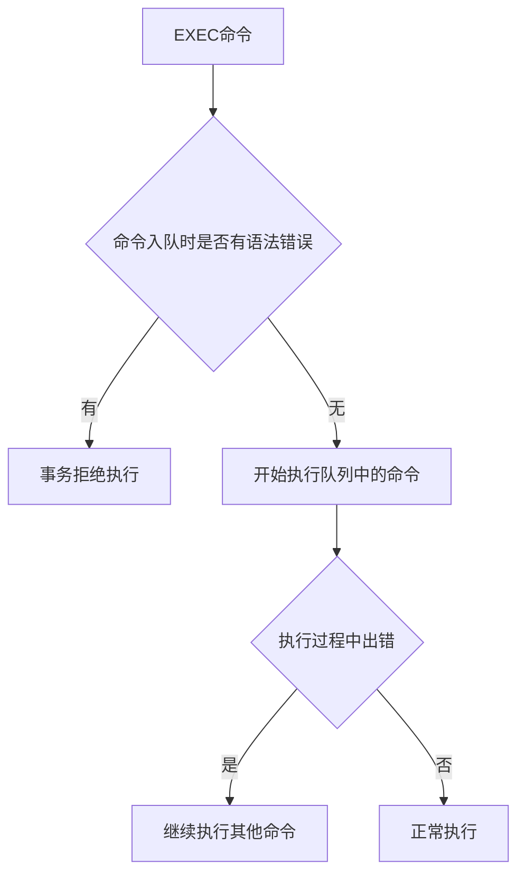
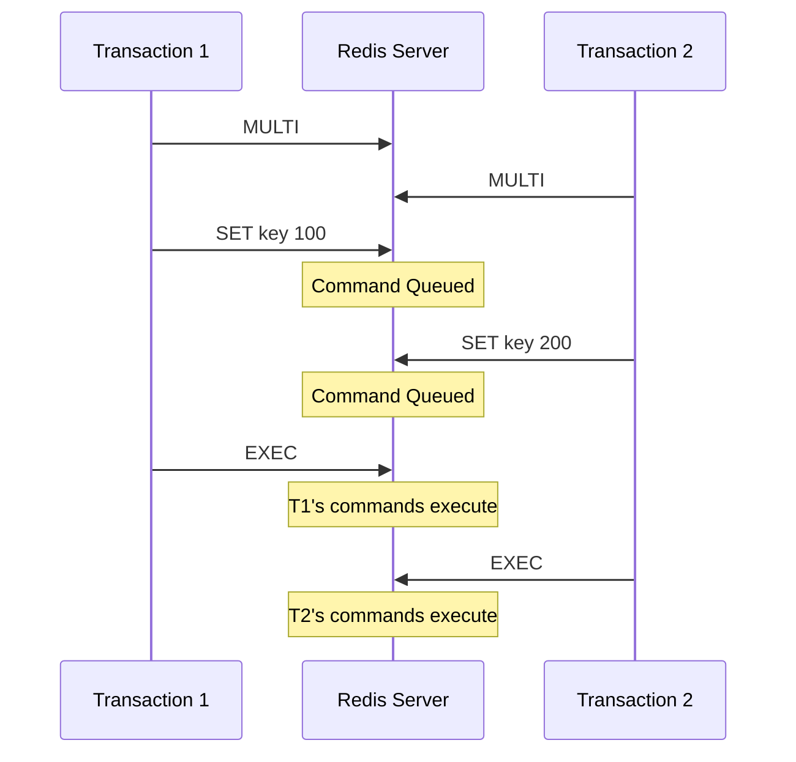

> **核心定义**：Redis事务提供了一种将多个命令打包，然后按顺序执行的机制。它通过**MULTI**, **EXEC**, **WATCH**和**DISCARD**等命令来保证命令的原子性执行，但其实现方式与传统的关系型数据库事务有很大不同。

# 一、事务的实现原理

Redis事务的实现建立在其基础架构之上，让我们从底层开始理解这个精妙的设计。

## 1.1 事务的数据结构



当客户端处于事务状态时，其核心数据结构如下：

```c
typedef struct multiCmd {
    robj **argv;         /* 命令参数 */
    int argc;           /* 参数数量 */
    struct redisCommand *cmd;  /* 命令指针 */
} multiCmd;

typedef struct multiState {
    multiCmd *commands;     /* 事务队列 */
    int count;             /* 命令计数器 */
} multiState;
```

## 1.2 事务的生命周期



# 二、WATCH命令与乐观锁实现

> **核心机制**：WATCH命令实现了乐观锁（Optimistic Locking）机制，它允许事务在执行之前监控一个或多个键的变化。

## 2.1 WATCH的工作原理



WATCH命令的实现涉及以下关键数据结构：

```c
typedef struct redisDb {
    // ...
    dict *watched_keys;    /* WATCH keys -> watched clients */
    // ...
} redisDb;
```

## 2.2 乐观锁的实现机制

乐观锁的核心是使用版本号（在Redis中是修改次数）来追踪变化：

$$
\text{事务执行条件} = \begin{cases}
\text{执行}, & \text{if } \sum_{k \in \text{watched}} \text{modifications}(k) = 0 \\
\text{放弃}, & \text{otherwise}
\end{cases}
$$

# 三、事务的ACID特性分析

Redis事务与传统数据库事务的ACID特性有显著区别：

## 3.1 原子性（Atomicity）



> **特性说明**：Redis事务保证命令的"全执行"或"全不执行"，但不支持回滚操作。

## 3.2 一致性（Consistency）

Redis通过以下机制保证一致性：

1. **入队时检查**：
```python
def enqueue_command(client, cmd):
    if syntax_error(cmd):
        return REDIS_ERR
    client.mstate.commands.append(cmd)
    return REDIS_OK
```

2. **执行时保护**：
```python
def exec_transaction(client):
    for cmd in client.mstate.commands:
        try:
            execute_command(cmd)
        except:
            # 记录错误但继续执行
            continue
```

## 3.3 隔离性（Isolation）

Redis的隔离性实现：



## 3.4 持久性（Durability）

持久性由Redis的持久化配置决定：

1. **AOF模式**：
```conf
appendonly yes
appendfsync always|everysec|no
```

2. **RDB模式**：
```conf
save 900 1      # 900秒内有1个修改
save 300 10     # 300秒内有10个修改
save 60 10000   # 60秒内有10000个修改
```

# 四、实践建议与优化策略

## 4.1 事务使用模式

1. **基本事务模式**：
```redis
MULTI
SET user:1:balance 100
INCR user:1:operation_count
EXEC
```

2. **带监视的事务模式**：
```redis
WATCH account:balance
MULTI
SET account:balance 100
EXEC
```

## 4.2 性能优化建议

1. **批量操作优化**：
```python
def batch_update(redis_client, updates):
    pipe = redis_client.pipeline(transaction=True)
    for key, value in updates.items():
        pipe.set(key, value)
    return pipe.execute()
```

2. **WATCH键的选择**：
```python
def transfer_money(redis, from_acc, to_acc, amount):
    # 只监视必要的键
    redis.watch(f"account:{from_acc}:balance")
    
    # 开始事务
    pipe = redis.pipeline(transaction=True)
    pipe.multi()
    pipe.decrby(f"account:{from_acc}:balance", amount)
    pipe.incrby(f"account:{to_acc}:balance", amount)
    
    try:
        pipe.execute()
        return True
    except redis.WatchError:
        return False
```

# 五、总结

Redis事务通过其独特的实现方式，在保证基本的ACID特性的同时，实现了极高的性能：

1. **简单性**：命令的线性执行避免了复杂的调度
2. **高性能**：无锁设计减少了系统开销
3. **实用性**：WATCH命令提供了足够的并发控制能力

> **设计启示**：Redis事务的设计展示了如何在分布式系统中通过简化来获得更好的性能和可靠性。它不追求完美的ACID特性，而是在实际应用场景中寻找最优的平衡点。