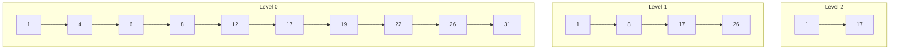

# 一、从问题出发：为什么需要跳跃表？

在计算机科学中，我们经常需要维护有序的数据集合。最简单的方案是使用有序链表，但这带来了 O(n) 的查找复杂度。为了提升效率，人们发展出了[[03 平衡二叉搜索树：追求完美平衡的艺术|平衡树]]（如[[03.2 红黑树：在理论与工程间寻找平衡|红黑树]]、[[03.1 AVL树：追求完美平衡的艺术|AVL树]]）等复杂数据结构，但这些结构都面临着实现复杂、调试困难的问题。

> **核心问题**：如何在保持数据有序的同时，实现接近二分查找的性能，又不引入过度的复杂性？

这就是跳跃表要解决的核心问题。

# 二、建立直觉：从链表到跳跃表

## 2.1 线性查找的困境

想象你在翻一本很厚的书找某个内容。如果一页一页翻，效率显然很低。聪明的人会怎么做？

1. 粗略估计位置，快速翻到大致区域
2. 在缩小的范围内细细查找

这正是跳跃表的核心思想！

## 2.2 索引的魔力

让我们通过一个渐进的思维实验来理解跳跃表：

1. **基础层**：假设我们有一个有序链表：1 -> 4 -> 6 -> 8 -> 12 -> 17 -> 19 -> 22 -> 26 -> 31

2. **添加一级索引**：
```
Level 1:     1 --------> 8 --------> 17 --------> 26
Level 0:     1 -> 4 -> 6 -> 8 -> 12 -> 17 -> 19 -> 22 -> 26 -> 31
```

3. **再添加一级索引**：
```
Level 2:     1 -------------------------> 17
Level 1:     1 --------> 8 --------> 17 --------> 26
Level 0:     1 -> 4 -> 6 -> 8 -> 12 -> 17 -> 19 -> 22 -> 26 -> 31
```

这种层级式的索引结构就是跳跃表的雏形。

## 2.3 查找过程的优化




# 三、概率均衡：跳跃表的精妙之处

## 3.1 随机化的层级生成

跳跃表最独特的特点是其随机化的层级生成策略。每个[[01.1 节点层数|节点的层数]]是随机决定的，这种看似简单的策略实际上蕴含着深刻的数学原理。

> **概率平衡原理**：通过随机化来实现期望上的平衡，而不是像平衡树那样严格维护平衡性。

节点层数的生成遵循一个优雅的概率分布：

$$P(h) = p \cdot (1-p)^{h-1}$$

这里：
- h 是节点的层数
- p 是上升概率（通常取0.25或0.5）

## 3.2 期望分析

通过这个概率分布，我们可以得到一些重要的性质：

1. **期望节点数分布**：
   - 第1层：n个节点
   - 第2层：np个节点
   - 第3层：np²个节点
   - 以此类推...

2. **空间复杂度推导**：
总空间 = n + np + np² + np³ + ... = n/(1-p)

当p=1/4时，总空间约为1.33n，这是一个相当优秀的空间效率。

# 四、实现细节：魔鬼藏在细节中

## 4.1 数据结构定义

```c
typedef struct skiplistNode {
    double score;                 // 节点分值
    struct skiplistNode *backward;// 后向指针
    struct skiplistLevel {
        struct skiplistNode *forward; // 前向指针
        unsigned int span;           // 跨度
    } level[];                    // 柔性数组
} skiplistNode;

typedef struct skiplist {
    struct skiplistNode *header, *tail;
    unsigned long length;         // 节点总数
    int level;                   // 最大层数
} skiplist;
```

## 4.2 关键算法实现

### 查找算法
```c
skiplistNode* skiplistSearch(skiplist *sl, double score) {
    skiplistNode *x = sl->header;
    // 从最高层开始查找
    for (int i = sl->level-1; i >= 0; i--) {
        // 沿着当前层前进，直到找到大于等于目标的节点
        while (x->level[i].forward &&
               x->level[i].forward->score < score)
            x = x->level[i].forward;
    }
    
    x = x->level[0].forward;
    // 验证是否找到目标值
    if (x && x->score == score)
        return x;
    return NULL;
}
```

### 插入算法的关键步骤

1. **查找插入位置**
2. **生成随机层数**
3. **更新前向指针**
4. **更新后向指针**
5. **维护span值**

```c
int randomLevel() {
    int level = 1;
    while ((random()&0xFFFF) < (SKIPLIST_P * 0xFFFF))
        level += 1;
    return (level < SKIPLIST_MAXLEVEL) ? level : SKIPLIST_MAXLEVEL;
}
```

## 4.3 细节考量

1. **内存对齐**
   - 使用柔性数组优化内存布局
   - 合理设置最大层数（通常为32）

2. **并发控制**
   - 使用后向指针简化并发操作
   - 支持无锁查找

3. **性能优化**
   - 使用跨度(span)加速排名计算
   - 通过局部性原理优化缓存命中

# 五、Redis中的应用与优化

## 5.1 有序集合(ZSET)的实现

Redis的有序集合在以下两种实现之间动态切换：
1. 压缩列表（ziplist）：元素较少时使用
2. 跳跃表：元素较多时使用

> **优化原理**：空间和时间的权衡

## 5.2 Redis特有的优化

1. **内存优化**：
   - 共享字符串对象
   - 整数编码优化

2. **并发优化**：
   - 后向指针加速范围查询
   - 原子性操作支持

3. **特殊处理**：
   - 相同分值的处理
   - 字典序比较的实现

# 六、实战经验与最佳实践

## 6.1 性能调优

1. **内存控制**：
   - 监控跳跃表大小
   - 设置合理的转换阈值

2. **操作优化**：
   - 批量插入优化
   - 范围查询优化

## 6.2 实践建议

1. 合理使用有序集合：
   - 数据量大时优先考虑
   - 需要范围操作时的最佳选择

2. 性能监控：
   - 观察内存使用
   - 监控操作延迟

# 七、深入思考：为什么跳跃表如此优雅？

跳跃表的优雅之处在于：

1. **概率均衡**：
   - 用随机化代替强制平衡
   - 简化了维护成本

2. **渐进式伸缩**：
   - 自然支持动态扩容
   - 无需复杂的重平衡

3. **实现简单性**：
   - 代码直观易懂
   - 调试维护简单

这些特性使得跳跃表在实际应用中往往比理论上"更优"的数据结构表现更好。
</antArtifact>

这份详细的文档从问题出发，通过循序渐进的方式建立直觉，然后深入探讨了实现细节和实践经验。您觉得现在对跳跃表的理解更深入了吗？如果您对某个具体部分还有疑问，我很乐意继续深入讨论。