节点层数是跳跃表中最关键的概念之一，它直接决定了跳跃表的结构和性能。让我们通过一个具体的例子来理解：

> **节点层数定义**：每个节点的层数表示该节点在跳跃表中"向上"延伸的高度，即该节点在多少个层级中存在索引。层数越高，这个节点就会在越多的索引层中出现。

让我用一个视觉化的例子来说明：

```mermaid
graph TD
    subgraph "Level 3"
        L3_1["1"] --> L3_17["17"]
    end
    subgraph "Level 2"
        L2_1["1"] --> L2_8["8"] --> L2_17["17"] --> L2_26["26"]
    end
    subgraph "Level 1"
        L1_1["1"] --> L1_4["4"] --> L1_8["8"] --> L1_12["12"] --> L1_17["17"] --> L1_22["22"] --> L1_26["26"]
    end
    subgraph "Level 0（基础层）"
        L0_1["1"] --> L0_4["4"] --> L0_6["6"] --> L0_8["8"] --> L0_10["10"] --> L0_12["12"] --> L0_14["14"] --> L0_17["17"] --> L0_19["19"] --> L0_22["22"] --> L0_26["26"]
    end

    style L3_17 fill:#f9f,stroke:#333,stroke-width:4px
    style L2_17 fill:#f9f,stroke:#333,stroke-width:4px
    style L1_17 fill:#f9f,stroke:#333,stroke-width:4px
    style L0_17 fill:#f9f,stroke:#333,stroke-width:4px

```



在这个例子中，让我们关注值为17的节点（用粉色突出显示）：
- 这个节点的层数是4，因为它在四个层级（Level 0到Level 3）中都存在
- 而节点10的层数是1，因为它只在基础层（Level 0）存在

**层数的决定机制**：

跳跃表使用一个优雅的随机化策略来决定每个新节点的层数。这个策略可以用一个抛硬币的比喻来理解：

> **层数生成过程**：当我们插入一个新节点时，就像抛硬币一样：
> - 先给节点一个基础层（Level 0）
> - 然后抛硬币，如果是正面，就再加一层
> - 继续抛，直到遇到反面或达到最大层数限制

在实际实现中，这个过程通过以下代码实现：

```c
int randomLevel() {
    int level = 1;  // 从第一层开始
    while (random() < SKIPLIST_P * RAND_MAX)  // SKIPLIST_P 通常是 0.25
        level++;
    return (level < MAXLEVEL) ? level : MAXLEVEL;
}
```

**层数的意义**：

节点的层数直接影响了跳跃表的性能特征：
1. 层数越高的节点越"重要"，因为它们作为快速通道的"索引点"
2. 较高层数的节点能够帮助快速跨越大量的数据，加速查找过程
3. 随机化的层数分配确保了跳跃表在统计意义上的平衡

**实际应用中的考量**：

在Redis中，跳跃表的层数还有一些特殊的优化：
- 最大层数限制为32层
- 根据实际数据量动态调整有效层数
- 通过层数的随机分配实现了自然的负载均衡

通过这种方式，跳跃表在维持了对数级查找复杂度的同时，避免了传统平衡树复杂的平衡维护操作。这种优雅的设计使得跳跃表特别适合需要频繁插入、删除操作的场景。

您对节点层数的这种设计方式有什么想法或疑问吗？我们可以进一步探讨任何具体的实现细节。